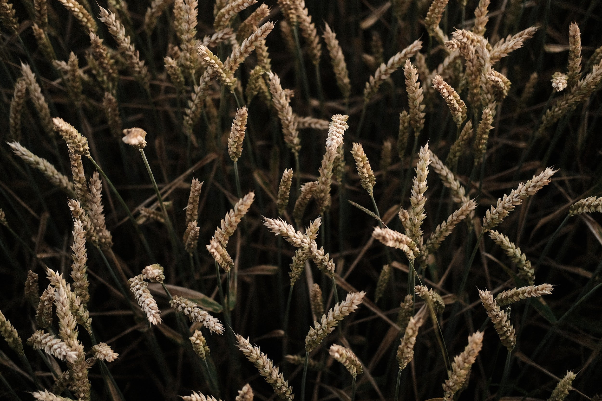
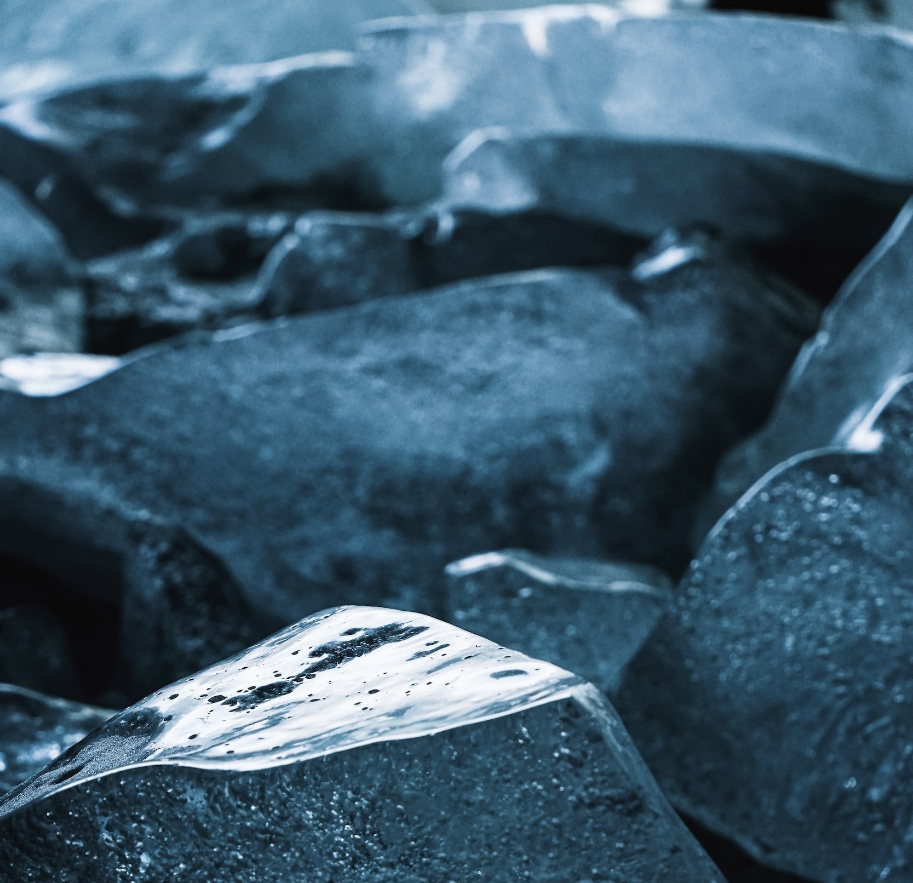
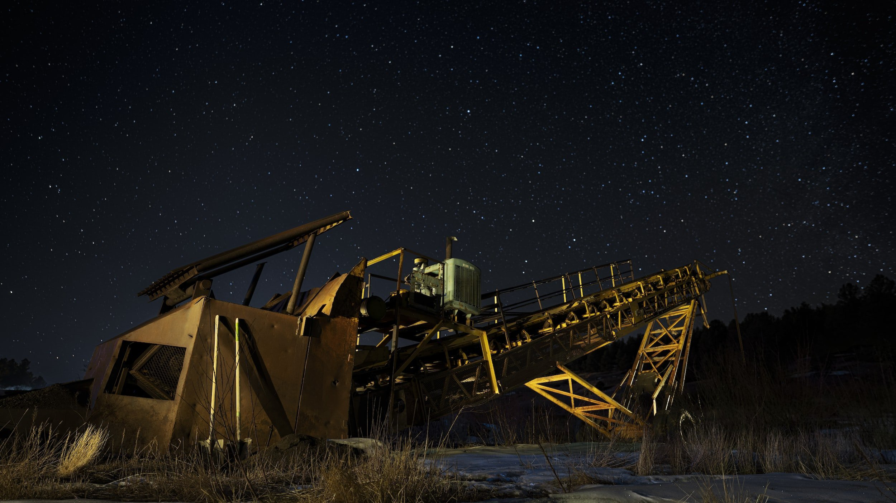

# Weekly Insights Review

**Date:** September 04, 2022  
**Publisher:** Breakwave Advisors | **Category:** Market Insights  
**Original URL:** [https://www.breakwaveadvisors.com/insights/2022/9/4/weekly-insights-review](https://www.breakwaveadvisors.com/insights/2022/9/4/weekly-insights-review)  

---

## Welcome to Our Weekly Insights Review

## Read Here Everything You Need to Know

> **Figure 1: Unsplash Image Wayfwx0hlhc**  
> **Interactive Data & Source:** [Breakwave Advisors Market Insights](https://www.breakwaveadvisors.com/insights/2022/8/29/more-grain-expected-to-be-exported) | [Local Asset](file:///C:/Users/Dell/Github/Shipping/corpus/03-breakwave/insights/2022/assets/2022-09-04_weekly-insights-review_img_unsplash-image-wayfwx0hlhc_c43d892e6d91.jpg)

## More Grain Expected to Be Exported

## Million Tons of Exports Are Now Expected

Waste-based biofuels could be a key driver of the energy transition transforming today’s limited supply of low-carbon transportation fuels and creating a local, circular economy, according to a new report by research and consultancy group Wood Mackenzie.
[Read More](https://www.breakwaveadvisors.com/insights/2022/8/29/more-grain-expected-to-be-exported)

## It’s Not the Equity Volatility. It’s What’s Coming Next

## A Lot Can Happen in Eight Minutes

A lot can happen in eight minutes. You can boil an egg. You can read eight pages of a novel. You can brew a coffee. You can wait for the sun’s light to reach you. Apparently, you can also wipe $78 billion out of existence.
[Read More](https://www.breakwaveadvisors.com/insights/2022/8/29/its-not-the-equity-volatility-its-whats-coming-next)

> **Figure 2: Unsplash Image Jkflck60vak**  
> **Interactive Data & Source:** [Breakwave Advisors Market Insights](https://www.breakwaveadvisors.com/insights/2022/8/31/global-market-update) | [Local Asset](file:///C:/Users/Dell/Github/Shipping/corpus/03-breakwave/insights/2022/assets/2022-09-04_weekly-insights-review_img_unsplash-image-jkflck60vak_3681e6b64405.jpg)

## Global Market Update

## The Path to a Recession Is Rarely a Straight Line

There will be data releases pointing towards a recovery rather than a further weakening of the business cycle, providing the temptation to signal the all-clear.
[Read More](https://www.breakwaveadvisors.com/insights/2022/8/31/global-market-update)

> **Figure 3: Unsplash Image P7dmfrpybto**  
> **Interactive Data & Source:** [Breakwave Advisors Market Insights](https://www.breakwaveadvisors.com/insights/2022/8/31/metals-slump-as-fears-of-weak-demand-in-china-linger) | [Local Asset](file:///C:/Users/Dell/Github/Shipping/corpus/03-breakwave/insights/2022/assets/2022-09-04_weekly-insights-review_img_unsplash-image-p7dmfrpybto_d76f3fb2c0d0.jpg)

## Metals Slump As Fears of Weak Demand in China Linger

> **Figure 4: Unsplash Image U 28go0nl A**  
> **Interactive Data & Source:** [Breakwave Advisors Market Insights](https://www.breakwaveadvisors.com/insights/2022/8/31/metals-slump-as-fears-of-weak-demand-in-china-linger) | [Local Asset](file:///C:/Users/Dell/Github/Shipping/corpus/03-breakwave/insights/2022/assets/2022-09-04_weekly-insights-review_img_unsplash-image-u-28go0nl-a_9caeaa78a64d.jpg)

## A Risk Off Tone Across Markets Saw Commodity Markets Come Under Pressure

This was exacerbated by worsening outbreaks of COVID-19 in China, raising fears of further lockdowns weakening demand.
[Read More](https://www.breakwaveadvisors.com/insights/2022/8/31/metals-slump-as-fears-of-weak-demand-in-china-linger)

## China Buying Even More Russia Coal

> **Figure 5: Unsplash Image E2o9lhzxjwa**  
> **Interactive Data & Source:** [Breakwave Advisors Market Insights](https://www.breakwaveadvisors.com/insights/2022/9/1/china-buying-even-more-russia-coal) | [Local Asset](file:///C:/Users/Dell/Github/Shipping/corpus/03-breakwave/insights/2022/assets/2022-09-04_weekly-insights-review_img_unsplash-image-e2o9lhzxjwa_e80badff51e9.jpg)

## Imports From Indonesia Have Remained the Primary Source of Imports and Russia the Second Largest Source

China's coal import data for July by origin was recently released and shows that imports from Indonesia have remained the primary source of imports and Russia the second largest source.

### Read More

## Brs Dry Bulk Weekly Newsletter

## China Sufferd Power Shortage Amid Extreme Weather Conditions

There had been a shortage of power supply caused by high temperatures and worsened by sparse rains in major Chinese provinces including Sichuan, Chongqing, Zhejiang, Anhui and Jiangsu.
[Read More](https://www.breakwaveadvisors.com/insights/2022/9/2/brs-dry-bulk-weekly-newsletter)

> **Figure 6: Unsplash Image Zkaj Kur3ks**  
> **Interactive Data & Source:** [Breakwave Advisors Market Insights](https://www.breakwaveadvisors.com/insights/2022/8/31/where-are-diesel-cracks-heading-to) | [Local Asset](file:///C:/Users/Dell/Github/Shipping/corpus/03-breakwave/insights/2022/assets/2022-09-04_weekly-insights-review_img_unsplash-image-zkaj-kur3ks_5beb34d7adb2.jpg)

.

## Where Are Diesel Cracks Heading To?

We try to put some structure to this highly complex question, comparing the evident upside for diesel from power and heat generation to already obvious supply and demand-side adjustments
[Read More](https://www.breakwaveadvisors.com/insights/2022/8/31/where-are-diesel-cracks-heading-to)

> **Figure 7: Unsplash Image Zpx0k6hdbc4**  
> [Local Asset](file:///C:/Users/Dell/Github/Shipping/corpus/03-breakwave/insights/2022/assets/2022-09-04_weekly-insights-review_img_unsplash-image-zpx0k6hdbc4_8f2e71035deb.jpg)
