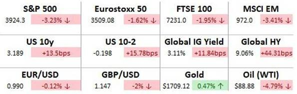
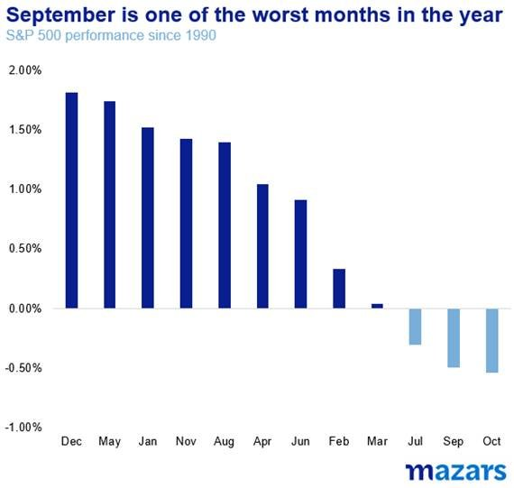

# Weekly comment: Enter the Fall

**Date:** September 05, 2022  
**Publisher:** Breakwave Advisors | **Category:** Market Insights  
**Original URL:** [https://www.breakwaveadvisors.com/insights/2022/9/5/weekly-comment-enter-the-fall](https://www.breakwaveadvisors.com/insights/2022/9/5/weekly-comment-enter-the-fall)  

---

*By*[*George Lagarias*](https://www.linkedin.com/in/george-lagarias-mba-3baa769/)

## Week

> **Figure 1: Week**  
> [Local Asset](file:///C:/Users/Dell/Github/Shipping/corpus/03-breakwave/insights/2022/assets/2022-09-05_weekly-comment-enter-the-fall_img_image003_a1f2ddcc0b61.jpg)

One thing school children and traders have in common? They dread September.

Last week saw the further retrenchment of the S&P 500 below the 4000-point mark as markets continued to digest more hawkish comments by the Fed. Meanwhile, the US 10y bond is back above 3.1% as the sell-off was wide.

It is a good time to remind investors that In bear markets rallies happen, but portfolio managers ‘sell on strength’.

Thus, the modest low-volume bear-market rally has ended. Adding to the negative sentiment, September is traditionally one of the worst months for equity returns.

> **Figure 2: Market Chart 2**  
> [Local Asset](file:///C:/Users/Dell/Github/Shipping/corpus/03-breakwave/insights/2022/assets/2022-09-05_weekly-comment-enter-the-fall_img_image00428129_474d9b00e810.jpg)

Adding to worries, markets now turn their attention towards energy-starved Europe, as Russia is squeezing energy supplies in a bid to curb the continent’s support of Ukraine. The European continent is preparing for one of the most difficult winters post-World War II.

Exacerbating the situation is the usual European decision-making difficulty, aggravated by previous debt-related tensions. In a dramatic reversal of roles, the energy-hungry North must now seek help from the, usually sunny, South to curb and share energy supplies as best as possible. Southern nations remember how many sacrifices were asked of them and the humiliation they suffered during the recent debt crises and are ready with a list of demands of their own. It has always been the dream of EU’s founders, that a true union between former enemies, speaking different languages and believing in different gods, can only be forged in crisis. True as it may be, crises can break families apart as much as they can bring them together. The combination of high inflation, energy shortages, populist governments, the American retrenchment and sclerotic policy reflexes may well subject Europe to its harshest test since Field Marshal Wilhelm Keitel signed the end of World War II in 1945.

With its largest trading partner tested the most in four generations, Britain is preparing to appoint a new Prime Minister. Additional to a global energy crisis, war, inflation, volatile markets and an ever-dangerous pandemic, the new PM will have to face burning Brexit issues and combat the country’s price-rising skill shortage. Elections may be all about principle, but once a new tenant enters No 10, they find themselves fighting fires, leaving little time for Blue-Sky thinking and policy re-designing. At the distance, the prospect of an early general election is growing.

In the words of French philosopher Bernard Williams, “September tries its best to have us forget summer”.
