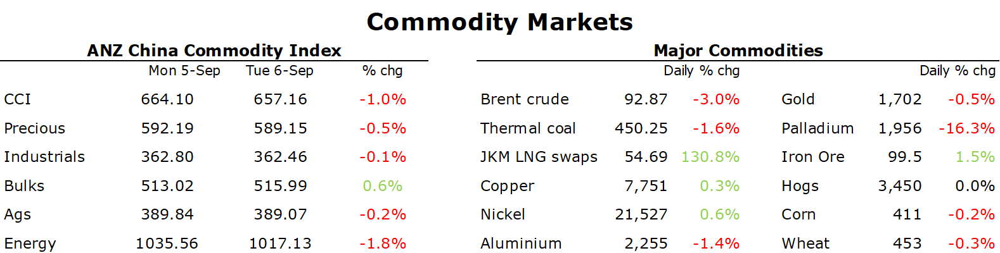

# Commodity markets fall as the economic backdrop deteriorates

**Date:** September 07, 2022  
**Publisher:** Breakwave Advisors | **Category:** Market Insights  
**Original URL:** [https://www.breakwaveadvisors.com/insights/2022/9/7/commodity-markets-fall-as-the-economic-backdrop-deteriorates](https://www.breakwaveadvisors.com/insights/2022/9/7/commodity-markets-fall-as-the-economic-backdrop-deteriorates)  

---

*By*[*Daniel Hynes*](https://www.linkedin.com/in/dahynes/)

Worsening economic conditions in China and Europe created a risk-off tone across markets. Commodities came under pressure, with energy leading the complex lower. A stronger USD also weighed on investor appetite.

> **Figure 1: 1662501561333**  
> **Interactive Data & Source:** [Linkedin](https://www.linkedin.com/newsletters/commodities-wrap-6692196755876012032/?fbclid=IwAR3kiXJqZdxmp9ZcRwBNI7FsBySI-XSC0pfPur1qzjt7OZp7PTE59Tsl1QI) | [Local Asset](file:///C:/Users/Dell/Github/Shipping/corpus/03-breakwave/insights/2022/assets/2022-09-07_commodity-markets-fall-as-the-economic-backdrop-deteriorates_img_1662501561333_603a871294c3.png)

**Crude oil**fell as concerns over demand weighed on sentiment. The city of Guiyang joined Chengdu in restricting movement by the public amid renewed outbreaks of COVID-19. More infectious strains of the virus are raising concerns that authorities will be forced to more frequently lockdown areas as China persists with a zero-COVID strategy. The tone in today’s market was in stark contrast to yesterday, after OPEC unexpectedly cut output at its monthly meeting. The 100kb/d cut in output for October sends a signal to the market that OPEC doesn’t see the current move as representative of the fundamentals in the market.

**European natural gas**eased as countries looked to implement measures to avoid shortages over the coming Northern Hemisphere winter. Talk of price caps on gas and electricity futures gathered pace despite pushback from markets. Governments also outlaid measures to reduce consumption as they stare down the prospect of empty storage facilities in coming months. Italy aims to reduce gas demand by as much as 8.2bcm between now and March 2023. This involves increasing power generation from coal and other power stations. Indoor temperatures will be capped at 19oC. In Germany, two nuclear power plants will be kept on standby over the winter. Demand destructions is also on the cards, with energy intensive industries voluntary cutting back as sky-high electricity prices make them unprofitable.**North Asian LNG**futures edged lower as exporters offered to release more LNG cargoes onto the spot market. Australian, Malaysian and Egyptian exporters all released LNG sell tenders to be delivered in September and October.

**European carbon**posted a third day of losses to reach a new six-month low as sentiment continued to weaken. EU ministers are in discussions to provide more permits to raise funds to assist the transition away from Russian fuels. The move also mirrored the pullback in energy markets as traders appeared reassured by supply-boosting efforts. EUA’s have fallen more than 13% over the past week to trade below EUR70/t.

**Base metals**were mixed as traders weighed up weakening economic backdrop against ongoing supply side issues.**Aluminium**fell after stockpiles at LME warehouses rose 11%. After steady declines over the past 12 months, this is the first sign that demand may be weakening. Nevertheless, the industry is facing further disruptions as high energy prices force uneconomic smelters to close.**Copper**found some support after data highlighted the supply issues the industry is facing. Copper output in Peru fell 6.6% y/y in July. In Chile, output at Anglo American’s Sur unit tumbled 38%. Codelco saw production slide 6.5%. BHP’s Escondida and the Collahuasi mine also registered y/y declines.

**Iron ore****and steel**futures gained in China amid signs of stronger demand. Inventories of steel dropped 8% to 15,3mt, the lowest since January, according to China Iron & Steel Association. Daily crude steel production rose 4.6% over the same period.

**Gold**edged lower as the stronger USD weighed on investor demand. The prospect of further interest rates hikes also impacted sentiment.

Data source:[Commodities Wrap](https://www.linkedin.com/newsletters/commodities-wrap-6692196755876012032/?fbclid=IwAR3kiXJqZdxmp9ZcRwBNI7FsBySI-XSC0pfPur1qzjt7OZp7PTE59Tsl1QI)
