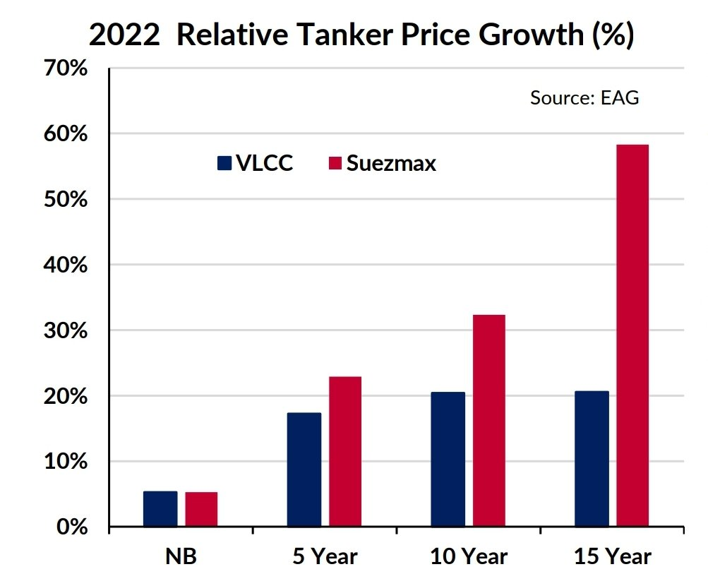

# Gibson's Tanker Market Report

**Date:** September 07, 2022  
**Publisher:** Breakwave Advisors | **Category:** Market Insights  
**Original URL:** [https://www.breakwaveadvisors.com/insights/2022/9/7/weekly-tanker-market-report](https://www.breakwaveadvisors.com/insights/2022/9/7/weekly-tanker-market-report)  

---

Amidst widespread price increases, it is not surprising that tanker asset values have also been rising. Our data shows a strong appreciation in VLCC and Suezmax values, with a significant divergence between newbuild and second hand price increases. Even more interesting is the difference in growth rates between newbuilds and 5 year old vessels and older 10 and 15 year old tonnage. Gibson asset value data shows newbuild VLCC and Suezmax values both increased by 5% respectively YTD, whilst over the last 12 months they increased by 17% and 13%. This has been driven by rising raw material costs, shrinking yard availability and relative pricing of other vessel types such as container carriers. Although, these increases have likely been capped by a lack of actual ordering given the difficulty in securing both yard slots and design hesitation. With overall producer price inflation averaging approximately 8-10% across most advanced economies, newbuild prices have also felt the pressure but the rate of increases this year may be slowing compared to gains we saw in the second half of 2021.

> **Figure 1: Screenshot 20220907 135545 Drive**  
> **Interactive Data & Source:** [Gibsons Co](https://www.gibsons.co.uk/market-reports) | [Local Asset](file:///C:/Users/Dell/Github/Shipping/corpus/03-breakwave/insights/2022/assets/2022-09-07_weekly-tanker-market-report_img_screenshot-20220907-135545-drive_33efc7d96bc6.jpg)

However, it is a very different story in terms of second hand tankers, prices have increased much faster, with 5 year old VLCCs and Suezmaxes jumping by 17% and 23% respectably YTD, reflecting relative value compared to newbuild vessels. For example, the order price of a VLCC is estimated to be $120 million versus $85 million for a 5 year old unit, which offers a comparatively good ratio of youth and prompter availability; with more favourable retrofitting economics compared to a newbuild vessel at a much higher price and with a longer lead time.

Perhaps the most interesting asset price developments have been in the 10 year old and older age bracket, where gains have far exceeded broader measures of inflation. The biggest gains have been in 15 year old Suezmaxes which have jumped an impressive 58.5% this year, whilst 10 year old VLCCs have increased 20.5%. This has been driven by increased enquiry from mostly Middle Eastern, Russian, and Asian buyers, looking to build a fleet of older tankers to carry Russian crude. Such price rises also offer an attractive asset play opportunity for owners looking to dispose of older units ahead of a potentially tougher sales environment once EU sanctions on Russian oil fully take hold. It is also an opportunity to pursue more favourable fleet renewal by disposing of older vessels during a spike in values and reinvesting the proceeds into younger tonnage.

Within this development there also has been an increase in sales and enquiry for Ice class Suezmaxes and Aframaxes, capable of trading during the Russian ice season. Also propping up older tanker values is the persistence of the illicit fleet, which continues to absorb older scrapping candidates to engage in sanctioned trade. Although, should sanctions relief come to Iran, then this would increase scrapping pressure on older vessels operating in the shadow fleet and reduce their market value as the commercial opportunity to engage in this trade recedes. Instead, legitimate trading opportunities would re-emerge for younger, more efficient vessels to take on the trade of these cargoes.

Fundamentally, this all feeds into the growing positive outlook for crude tankers. Stronger earnings should theoretically support these higher asset values as the cashflow generating capacity of larger crude tankers improves, although growing economic uncertainty and the risk of a global downturn indicate the need for caution in terms of investment timing. Overall, the investment prospects for the tanker market have improved relative to the protracted market slump of the last 20 months and this is catching the eye of potential investors, whilst tanker owners are likely to be considering their next moves…

Data source:[Gibson Shipbrokers](https://www.gibsons.co.uk/market-reports)
