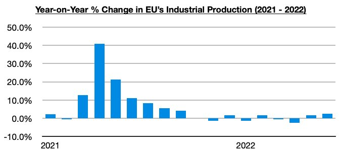

# Ongoing Weakness Outside of China

**Date:** September 08, 2022  
**Publisher:** Breakwave Advisors | **Category:** Market Insights  
**Original URL:** [https://www.breakwaveadvisors.com/insights/2022/9/8/ongoing-weakness-outside-of-china](https://www.breakwaveadvisors.com/insights/2022/9/8/ongoing-weakness-outside-of-china)  

---

*By*[*Jeffrey Landsberg*](https://www.linkedin.com/in/jeffrey-landsberg-70ab957/)

Back in January, we first started stressing in our Weekly Dry Bulk Reports that there was a very real chance that both global iron ore and global coal trade volume could contract this year due to supply issues alone. Later in March (after the onset of the war in Ukraine), we also started stressing that global grain trade volume could end up easily contracting this year due to supply issues as well. From early into the year, major dry bulk commodity trade flow was showing a real chance of actually contracting on a year-on-year basis with the headwinds due simply to supply. Demand prospects outside of China then started weakening beginning in March as well.

While Chinese steel production has long remained in a contraction (it has now contracted on a year-on-year basis each month since July 2021), global steel production outside of China has contracted on a year-on-year basis each month since March 2022. We detailed the most recent contraction in our Weekly Dry Bulk Report two weeks ago and highlighted how steel production outside of China most recently contracted on a year-on-year basis by the largest amount since 2020. The problems in the global steel market outside of China continue to intensify, and we remain of our view that it is only in China where there is a chance of growth returning at some point this year. We also continue to stress that the issues outside of China are relatively new and unlikely to end soon. Before March, global steel production outside of China had grown on a year-on-year basis for twelve consecutive months.

Industrial production is also a key metric we have continued to monitor in our Weekly Dry Bulk Reports, and only Europe has shown any real improvement since our last industrial production update was published in our August 1st report. As we discussed in this week's Weekly Dry Bulk Report, the European Union’s industrial production most recently managed to grow on a year-on-year basis by 2.4%. The European Union’s industrial production has grown on a year-on-year basis for two consecutive months.

> **Figure 1: Chart 1 (47)**  
> [Local Asset](file:///C:/Users/Dell/Github/Shipping/corpus/03-breakwave/insights/2022/assets/2022-09-08_ongoing-weakness-outside-of-china_img_chart1284729_1a231aa4b539.jpg)

We are not at all bullish for Europe for the upcoming months however. We remain of our view that the global energy crisis is only in its infancy, and we expect that Europe will be hit particularly hard this winter. Also highlighted in this week's Weekly Dry Bulk Report have been the industrial production contractions continuing to occur in Japan, Russia, South Africa, and Brazil. Overall, the weakness in the global economy outside of China will remain an issue that the dry bulk market has to continue to contend with.
