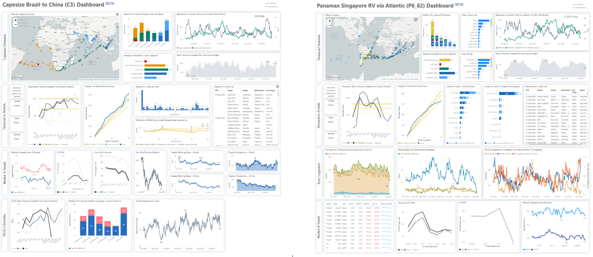
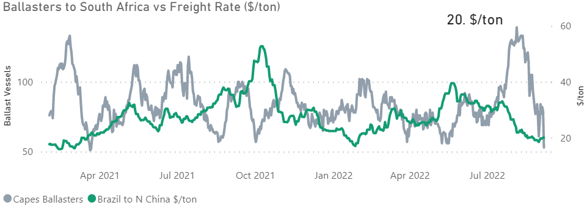
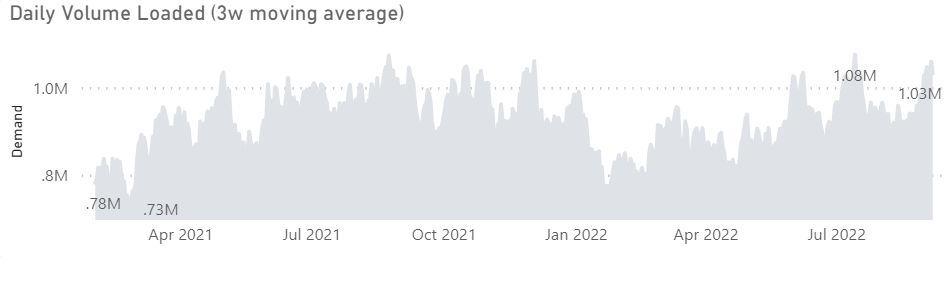
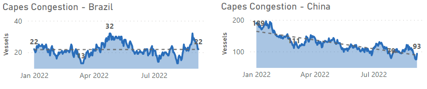
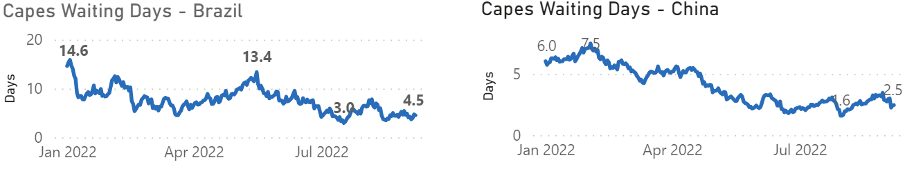
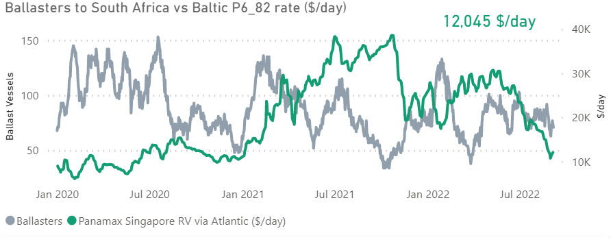
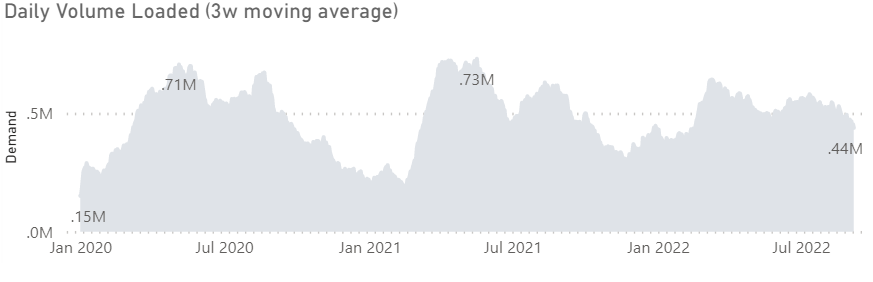
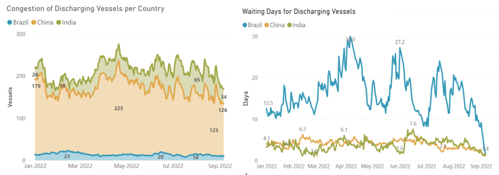

# Signal Dry Bulk Weekly Report

**Date:** September 08, 2022  
**Publisher:** Breakwave Advisors | **Category:** Market Insights  
**Original URL:** [https://www.breakwaveadvisors.com/insights/2022/9/8/signal-dry-bulk-weekly-report](https://www.breakwaveadvisors.com/insights/2022/9/8/signal-dry-bulk-weekly-report)  

---

The dry bulk market remains in the doldrums, with signs of recovery in the Capesize segment. Towards the end of the third quarter, the Baltic Dry Index saw an upswing at the end of week 35, driven by large ship segments. The Capesize and Panamax Freight Indexes posted gains, while the Supramax Freight Index continued to decrease. In the first Weekly Dry Market Monitor of September, we look at supply/demand trends for the**Capesize C3**from Brazil to China route and**Panamax P6**Singapore RV, which could trigger an upswing in the performance of the dry freight index.

For this weekly monitor, we have used the brand new[C3](https://go.signalocean.com/e/983831/dry-reports-c3/2j8tsc/271683412?h=Zj3GNXMVMW54fogm8wkyIdveX1C17EhLQYtAqZTPGUg)and[P6_82 Dashboards](https://go.signalocean.com/e/983831/dry-reports-p6/2j8tsg/271683412?h=Zj3GNXMVMW54fogm8wkyIdveX1C17EhLQYtAqZTPGUg)(now available to all Signal clients for a limited period) to view the latest trends on freight rates, supply/demand, and port congestion.

> **Figure 1: Market Chart 1**  
> **Interactive Data & Source:** [Signal Ocean Platform](https://go.signalocean.com/e/983831/dry-reports-c3/2j8tsc/271683412?h=Zj3GNXMVMW54fogm8wkyIdveX1C17EhLQYtAqZTPGUg) | [Local Asset](file:///C:/Users/Dell/Github/Shipping/corpus/03-breakwave/insights/2022/assets/2022-09-08_signal-dry-bulk-weekly-report_img_unnamed285829_3bbf5af231dc.png)

Looking at commodity trends, the outlook for iron ore prices remains bearish due to concerns over new Covid 19 restrictions and the real estate sector depressing Chinese demand for ferrous metals. Prices for iron ore cargoes with an iron content of 63.5% for delivery to Tianjin fell to $98/tonne in early September, a level not seen in nearly 10 months, as power outages at Chinese manufacturers and construction companies reduced capacity for steel production and demand for steel inputs. Iron demand from steel producers has also been depressed by decarbonization requirements that cities must implement. Authorities in Tangshan, China's largest steel-producing city, met with steel mills to discuss capacity for the rest of the year, with the goal of reducing output by 8.3 million tonnes per year.

## Capesize-Brazil to China (C3)

## I. Supply: Ballasters View vs Freight Rate ($/Ton) Firmer

> **Figure 2: I. Supply: Ballasters View vs Freight Rate ($/Ton) Firmer**  
> **Interactive Data & Source:** [Signal Ocean Platform](https://go.signalocean.com/e/983831/dry-reports-c3/2j8tsc/271683412?h=Zj3GNXMVMW54fogm8wkyIdveX1C17EhLQYtAqZTPGUg) | [Local Asset](file:///C:/Users/Dell/Github/Shipping/corpus/03-breakwave/insights/2022/assets/2022-09-08_signal-dry-bulk-weekly-report_img_unnamed285929_8a552c5049e3.png)

Data Source:[C3 Dashboard](https://go.signalocean.com/e/983831/dry-reports-c3/2j8tsc/271683412?h=Zj3GNXMVMW54fogm8wkyIdveX1C17EhLQYtAqZTPGUg), (Last Update 6 September)

Fewer than 100 ballast ships have sailed to South Africa since August 24, resulting in firmer freight rates from Brazil to China in the first days of September. The number of Capesize ballast vessels is now at its lowest level since January 2022, and rates for the Brazil- North China route have risen to $20/tonne. Overall, the average number of ballast vessels has dropped to 79 in the last 12 days from 131 vessels in the first half of August.

## Ii. Demand: Daily Volume Loaded Increasing

Daily volumes shipped have risen to 1 million tons since the end of August, a level not seen since July 18, 2022, and there are signs of a further increase in the coming days of September, which could support the recent upward trend given the lower number of ballast vessels.

> **Figure 3: Market Chart 3**  
> **Interactive Data & Source:** [Signal Ocean Platform](https://go.signalocean.com/e/983831/dry-reports-c3/2j8tsc/271683412?h=Zj3GNXMVMW54fogm8wkyIdveX1C17EhLQYtAqZTPGUg) | [Local Asset](file:///C:/Users/Dell/Github/Shipping/corpus/03-breakwave/insights/2022/assets/2022-09-08_signal-dry-bulk-weekly-report_img_unnamed286029_bd0e9ec5183a.png)

Data Source:[C3 Dashboard](https://go.signalocean.com/e/983831/dry-reports-c3/2j8tsc/271683412?h=Zj3GNXMVMW54fogm8wkyIdveX1C17EhLQYtAqZTPGUg), (Last Update 6 September)

The current trend in daily volume loaded (3w moving average) appears to be one of the highest since the beginning of the year after the last highs were reached in the first 20 days of July.

## Iii. Capes Congestion: Per Discharging Country & Waiting Days​​​​

The number of congested ships in both Brazil and China has declined, but there are signs of an increase in waiting days for unloading in Brazil, which could lead to an escalation of congestion in the coming weeks of September.

> **Figure 4: Brazil - China: Capes Congestion Decreasing**  
> **Interactive Data & Source:** [Signal Ocean Platform](https://go.signalocean.com/e/983831/dry-reports-c3/2j8tsc/271683412?h=Zj3GNXMVMW54fogm8wkyIdveX1C17EhLQYtAqZTPGUg) | [Local Asset](file:///C:/Users/Dell/Github/Shipping/corpus/03-breakwave/insights/2022/assets/2022-09-08_signal-dry-bulk-weekly-report_img_unnamed286129_9013cf555a02.png)

Data Source:[C3 Dashboard](https://go.signalocean.com/e/983831/dry-reports-c3/2j8tsc/271683412?h=Zj3GNXMVMW54fogm8wkyIdveX1C17EhLQYtAqZTPGUg), (Last Update 6 September)

### Waiting Days for Discharging: Per Country

> **Figure 5: Brazil: Increasing - China: Decreasing**  
> **Interactive Data & Source:** [Signal Ocean Platform](https://go.signalocean.com/e/983831/dry-reports-c3/2j8tsc/271683412?h=Zj3GNXMVMW54fogm8wkyIdveX1C17EhLQYtAqZTPGUg) | [Local Asset](file:///C:/Users/Dell/Github/Shipping/corpus/03-breakwave/insights/2022/assets/2022-09-08_signal-dry-bulk-weekly-report_img_unnamed286529_3dfe6fd314db.png)

Data Source:[C3 Dashboard](https://go.signalocean.com/e/983831/dry-reports-c3/2j8tsc/271683412?h=Zj3GNXMVMW54fogm8wkyIdveX1C17EhLQYtAqZTPGUg), (Last Update 6 September)

The number of congested ships in Brazil dropped to 22 in the first week of September, 10 fewer than the last peak on August 28. The latest number of capes congestion in Brazil is similar to the low level of January this year.

In China, the number is now 93, a 50% decrease from the congested status we observed earlier this year, with the current trend pointing steeply downward. Recent estimates of congestion in China suggest that freight rates from Brazil to North China are more likely to improve in the third quarter due to fewer ballast vessels and stronger demand for daily cargo volumes.

## Panamax-Singapore Rv (P682)

## Iv. Supply: Ballasters View vs Freight Rate ($/Ton) Firmer

Ballast shipments are averaging about 70 vessels, 16 vessels below the August 22, 2022 peak (~86 vessels), while P6_82 prices have risen to $12/tonne. The first few days of September indicate an upswing in freight rates, although ballast vessels have not yet reached the lows last recorded in the second week of June.

> **Figure 6: Market Chart 6**  
> **Interactive Data & Source:** [Signal Ocean Platform](https://go.signalocean.com/e/983831/dry-reports-p6/2j8tsg/271683412?h=Zj3GNXMVMW54fogm8wkyIdveX1C17EhLQYtAqZTPGUg) | [Local Asset](file:///C:/Users/Dell/Github/Shipping/corpus/03-breakwave/insights/2022/assets/2022-09-08_signal-dry-bulk-weekly-report_img_unnamed286629_dc69a12c681f.png)

Data Source:[P6 Dashboard](https://go.signalocean.com/e/983831/dry-reports-p6/2j8tsg/271683412?h=Zj3GNXMVMW54fogm8wkyIdveX1C17EhLQYtAqZTPGUg), (Last Update 6 September)

### V. Demand: Daily Volume Loaded Decreasing

In the first days of September, the growth of daily shipped volume slowed down compared to the earlier stronger levels in the second quarter. We see daily volume loaded (3w moving average) at 0.44 million, while the current level is still below the July 2021 peak of 0.73 million. However, the current trend is still higher than the lows at the beginning of the year, which should be a positive sign for overall annual demand and the potential recovery of freight rates in the coming days.

> **Figure 7: Market Chart 7**  
> **Interactive Data & Source:** [Signal Ocean Platform](https://go.signalocean.com/e/983831/dry-reports-p6/2j8tsg/271683412?h=Zj3GNXMVMW54fogm8wkyIdveX1C17EhLQYtAqZTPGUg) | [Local Asset](file:///C:/Users/Dell/Github/Shipping/corpus/03-breakwave/insights/2022/assets/2022-09-08_signal-dry-bulk-weekly-report_img_unnamed286729_51681c91ec25.png)

Data Source:[P6 Dashboard](https://go.signalocean.com/e/983831/dry-reports-p6/2j8tsg/271683412?h=Zj3GNXMVMW54fogm8wkyIdveX1C17EhLQYtAqZTPGUg), (Last Update 6 September)

### Vi. Panamax Congestion: Per Discharging Country & Waiting Days

### Brazil - China - India: Decreasing

The number of congested vessels has decreased significantly since the last peak on August 27, 2022. The number of congested Panamax vessels decreased to 126 vessels in China (~40 fewer compared to the previous peak), 34 in India (~10 fewer), and 11 in Brazil (~2fewer).

> **Figure 8: Market Chart 8**  
> **Interactive Data & Source:** [Signal Ocean Platform](https://go.signalocean.com/e/983831/dry-reports-p6/2j8tsg/271683412?h=Zj3GNXMVMW54fogm8wkyIdveX1C17EhLQYtAqZTPGUg) | [Local Asset](file:///C:/Users/Dell/Github/Shipping/corpus/03-breakwave/insights/2022/assets/2022-09-08_signal-dry-bulk-weekly-report_img_unnamed286829_ba738c36af8d.png)

Data Source:[P6 Dashboard](https://go.signalocean.com/e/983831/dry-reports-p6/2j8tsg/271683412?h=Zj3GNXMVMW54fogm8wkyIdveX1C17EhLQYtAqZTPGUg), (Last Update 6 September)

A look at the latest weekly trends in waiting days for discharging shows that the downward trend is expected to continue in the next few days in September, with Brazil showing the lowest waiting days since the beginning of this year.

### Supply / Demand Summary: Capesize & Panamax

Overall, September supply/demand trends indicate that freight rates for the C3 and P6_82 routes are very likely to continue to increase, while demand for Panamax vessels has not yet peaked. It is clear that the number of ballast vessels in the Capesize route from Brazil to China has reached a level that could sustain the recent revival of rates($/ton) and lead to a significant increase in the overall dry cargo index at the end of this quarter.

You can monitor the upcoming trends in freight rates, supply/demand and port congestion rates in the[C3](https://go.signalocean.com/e/983831/dry-reports-c3/2j8tsc/271683412?h=Zj3GNXMVMW54fogm8wkyIdveX1C17EhLQYtAqZTPGUg)and[P6_82 Dashboards](https://go.signalocean.com/e/983831/dry-reports-p6/2j8tsg/271683412?h=Zj3GNXMVMW54fogm8wkyIdveX1C17EhLQYtAqZTPGUg).

Data Source:[Signal Ocean Platform](https://www.thesignalgroup.com/signal-ocean-platform)
