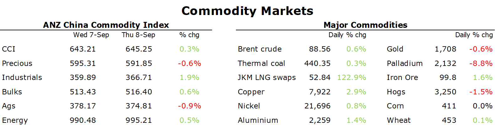

# Metals gain as tightness in physical markets comes into focus

**Date:** September 09, 2022  
**Publisher:** Breakwave Advisors | **Category:** Market Insights  
**Original URL:** [https://www.breakwaveadvisors.com/insights/2022/9/9/metals-gain-as-tightness-in-physical-markets-comes-into-focus](https://www.breakwaveadvisors.com/insights/2022/9/9/metals-gain-as-tightness-in-physical-markets-comes-into-focus)  

---

*By*[*Daniel Hynes*](https://www.linkedin.com/in/dahynes/)

Commodity markets shrugged off a stronger USD and hawkish central bankers to focus on tightness in physical markets. Falling inventories and strong premiums helped boost sentiment.

> **Figure 1: 1662674300334**  
> **Interactive Data & Source:** [Publications Anz](https://publications.anz.com/SingletrackCMS__DownloadDocument?docRef=4f48d4fa-ca83-417e-b505-b24c3cd70e50&uid=bd219b92-f5cc-400e-9646-4178791864b7&jobRef=dda0be2b-e7be-49e5-90f0-c04e1effd149) | [Local Asset](file:///C:/Users/Dell/Github/Shipping/corpus/03-breakwave/insights/2022/assets/2022-09-09_metals-gain-as-tightness-in-physical-markets-comes-into-focus_img_1662674300334_dfb34f5720bc.png)

**Copper**led the base metals sector higher amid signs of physical tightness despite the global economic headwinds. The premium for cash copper over three-month futures rose 90% to USD145/t. Inventories of most base metals have also seen strong drawdowns this year. Demand is improving, with[**China’s imports**](https://publications.anz.com/SingletrackCMS__DownloadDocument?docRef=4f48d4fa-ca83-417e-b505-b24c3cd70e50&uid=bd219b92-f5cc-400e-9646-4178791864b7&jobRef=dda0be2b-e7be-49e5-90f0-c04e1effd149)for August rising strongly. However, rising energy costs could exacerbate the supply side issues. Smelting of metals is an energy intensive business. Based on current electricity prices, operating costs for some European zinc and aluminium smelters have increased two to three times over the past year,[**making them uneconomic**](https://publications.anz.com/SingletrackCMS__DownloadDocument?docRef=18b3fc84-2224-466e-adab-84d156bf7a2c&uid=bd219b92-f5cc-400e-9646-4178791864b7&jobRef=dda0be2b-e7be-49e5-90f0-c04e1effd149). Overall, we estimate that over the coming months approximately 1% of Europe’s suppliers of aluminium and zinc are at risk of closure and 5% of the world’s suppliers. The risk of lower steel, nickel and copper output is also rising. This should offset any economic weakness and keep most base metals tight.

**Iron ore**futures pushed back above USD100/t amid signs of stabilisation in the Chinese property market. Zhengzhou said that all stalled housing projects should resume by 6 October, according to official media. China’s official Economic Daily newspaper also published a front page article calling on authorities to expand housing supply and shore up support for home buyers. This comes ahead of an aggressive push to boost infrastructure spending as Beijing looks to support growth in the face of COVID-19 lockdowns.

**Crude oil**rebounded following several days of selling as investors judged the selloff as overdone. Concerns over demand in China had induced a wave of selling, amid lockdowns across major cities. A stronger USD has also weighed on investor appetite. EIA’s weekly inventory report provided mixed signals. Crude oil stockpiles rose by 8.85mbbl last week, however they dropped at the largest storage hub of Cushing. Gasoline inventories also gained, but there was no changed to oil production. This comes after the EIA lowered its annual oil production targets, with domestic production now expected to reach only 12.6mb/d. Russia’s president, Vladimir Putin, warned that Russia will not supply energy to any nation that backs a US-led price cap on its crude oil sales.

**European natural gas**jumped after warnings the crisis is far from over. Belgium’s prime minister, Alexander De Croo, said that Europe needs to act immediately to address the crisis or the region’s economy will go into a full stop. There is concern that Germany will not be able to secure more gas solidarity agreements with EU partners, which would be a potential hinderance to mitigating the effects of energy shortages. Bloomberg reported that Belgium, Luxemburg, the Netherlands and Poland are refusing to engage in constructive negotiations. Traders also switched their focus to the coming winter, when Europe is likely to struggle to meet demand even with relatively full storage facilities. This could come as demand from China rebounds as it overcomes outbreaks of the virus.**North Asian LNG**futures failed to follow European gas higher, as shipments of Russian gas headed for Asia. The Sakhalin-2 LNG export plant sold several shipments to China for delivery through December. Japan’s LNG inventories held by utilities are also at their highest level since 2017.

**Gold**struggled to hold onto recent gains as Fed governors signalled a big rate hike. Powell said we need to act now, forthrightly, to curb inflation.

Data source:[Commodities Wrap](https://www.linkedin.com/newsletters/commodities-wrap-6692196755876012032/?fbclid=IwAR3kiXJqZdxmp9ZcRwBNI7FsBySI-XSC0pfPur1qzjt7OZp7PTE59Tsl1QI)
