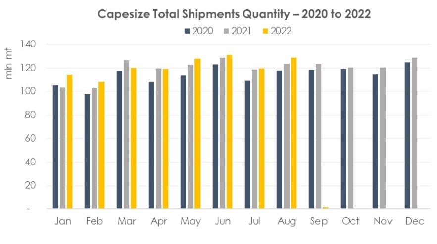
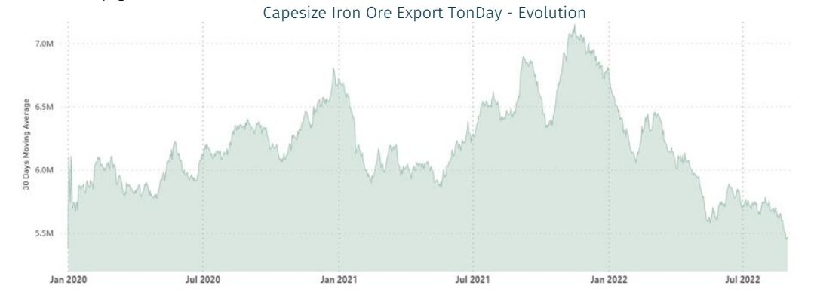
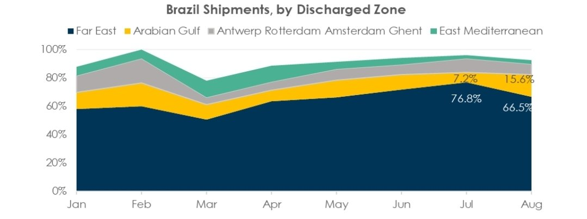
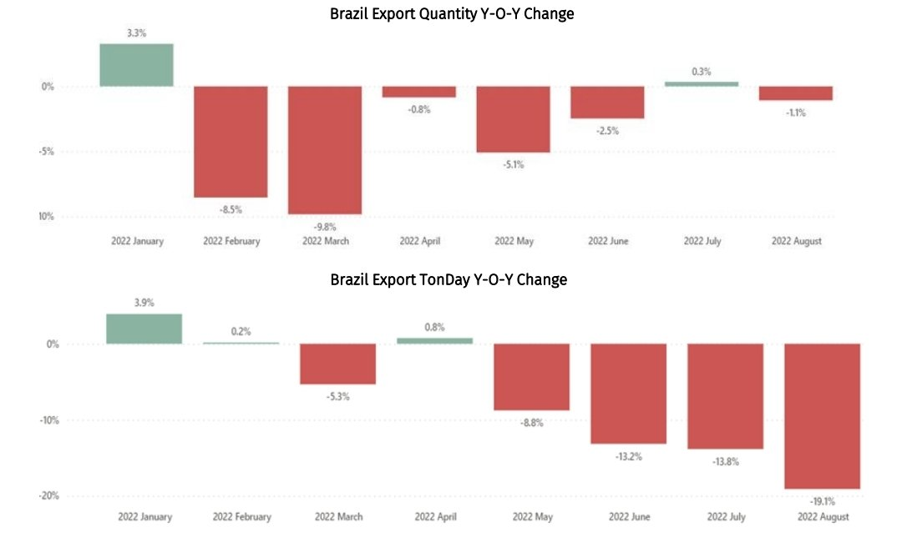
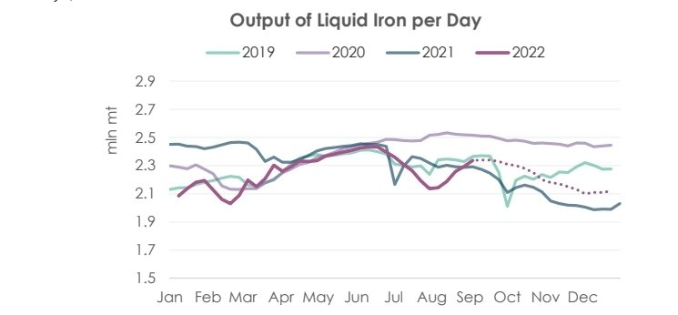
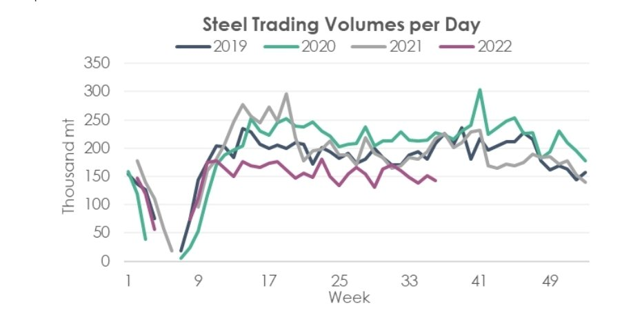

# BRS Dry Bulk Weekly Newsletter

**Date:** September 10, 2022  
**Publisher:** Breakwave Advisors | **Category:** Market Insights  
**Original URL:** [https://www.breakwaveadvisors.com/insights/2022/9/9/brs-dry-bulk-weekly-newsletter](https://www.breakwaveadvisors.com/insights/2022/9/9/brs-dry-bulk-weekly-newsletter)  

---

## Part I – Pointing the Finger

Following 2 months of range-bound market, capsize’ fortunes deteriorated in August-22. The Baltic Exchange C5TC index tumbled 90%, from $24,603/day in mid-July to $2,505/day by the end of August, way below daily operating expenses. This devastating loss was led by the decline of major shipping routes for the transport of iron ore, namely C3 (Tubarao to Qingdao), C5 (West Australia to Qingdao) and C17 (Saldanha Bay to Qingdao). C3 slumped by 45.3% from a month earlier to $17.761/mt, C5 by 29.6% to $7.785/mt and C17 by 42.6% to $13.061/mt. According to AXS data, for the past 5 years, 74%~77% of Capesize (160,000 dwt to 220,000 dwt) volumes were composed of iron ore with the rest mainly consisting of coal and bauxite. In contrast, as of time of writing, iron ore accounted for only 70% of total shipments in 2022 year-to-date. Up to August 31st , capesize iron ore shipments decreased by 2.3% y-o-y (c. 16.2 mln mt), yet coal and bauxite surged by 7.8% (c. 15.4 mln mt) and 40.5% (c. 18.1 mln mt) respectively.

> **Figure 1: Screenshot 20220908 151949 Samsung Notes**  
> [Local Asset](file:///C:/Users/Dell/Github/Shipping/corpus/03-breakwave/insights/2022/assets/2022-09-10_brs-dry-bulk-weekly-newsletter_img_screenshot-20220908-151949-samsungno_9df5dae4def7.jpg)

This meant that, in terms of capesize voyage intakes, we are far from a contraction in actual capsize shipment volumes as some market players claimed. As a matter of fact, it increased by 2.4% in the first eight months of 2022 (see chart above), especially during May to August. It climbed by 2.7% at an annualized rate after falling by 5.3% in March-22. Capesize shipments of iron ore didn’t further decline in August either, it maintained the same level of last year and improved by 4.6% from July onwards. Hence, if iron ore/ total capsize shipment volumes are not the main culprit to be blamed for the nosedive of capesize freight rates, where should the finger be pointed to instead?

As defined by AXS, the TonDay metric is calculated by multiplying the sailed calendar day by the intake quantity for each voyage

> **Figure 2: Screenshot 20220908 152004 Samsung Notes**  
> [Local Asset](file:///C:/Users/Dell/Github/Shipping/corpus/03-breakwave/insights/2022/assets/2022-09-10_brs-dry-bulk-weekly-newsletter_img_screenshot-20220908-152004-samsungno_61425563baac.jpg)

The breakdown of exports by discharged zones deserved further scrutiny. There are some noticeable changes in top exporters’ destinations that could be attribute to the decline in TonDay. Shipments from Australia were nearly unchanged at around 75.8 mln mt over the past two months. However, that’s not the entire story. Due to muted steel demand in China, iron ore exports initially intended for Chinese ports were diverted towards Southeast Asian destinations, leading to a 4.4% m-o-m or a 14.8% y-o-y contraction in TonDay. Thanks to the geographical concentration of Australian iron ore buyers, 99% volumes of which came from Asia, such a shift in discharged countries had a modest negative impact on the aggregate TonDay.

> **Figure 3: Screenshot 20220908 152016 Samsung Notes**  
> [Local Asset](file:///C:/Users/Dell/Github/Shipping/corpus/03-breakwave/insights/2022/assets/2022-09-10_brs-dry-bulk-weekly-newsletter_img_screenshot-20220908-152016-samsungno_371b18474439.jpg)

However, more damaging effects on freight could be created when a similar situation occurred to Brazilian shipments. TonDay of Brazilian iron ore exports experienced a 21.3% y-o-y slip in August, largely caused by reduction in shipments towards Far East including China and Japan. Scorching temperatures and a relentless “Zero-Covid” policy had seriously crippled steel demand in China. After a brief and minuscule recovery in steelmaking margins in early August-22, it quickly reverted to negative territory. This caused steel plants to be more guarded about restocking iron ore. Chinese portside inventories of Brazilian iron ore stayed elevated as appetite for high-grade products shriveled owing to feeble margins.

Consequently, Brazil cut back its shipments to China from 70.7% in July to 60.6% in August and expanded sales to Arabian Gulf countries like Bahrain. This adjustment did not lower the total voyage intakes but significantly curtailed the TonDay.

> **Figure 4: Screenshot 20220909 105309 Samsung Notes**  
> [Local Asset](file:///C:/Users/Dell/Github/Shipping/corpus/03-breakwave/insights/2022/assets/2022-09-10_brs-dry-bulk-weekly-newsletter_img_screenshot-20220909-105309-samsungno_58620cbe36eb.jpg)

## Part Ii – Charting the Short-Term

Outlook Typically speaking, steel output in China tend to pick up as we approached the peak season in construction and property sales, known domestically as “Golden September, Silver October”. However, this time of the year, unless downstream demand displayed a solid turnaround, it is too optimistic to predict a speedy recovery in the steel industry (more to be discussed later on)

> **Figure 5: Screenshot 20220909 105335 Samsung Notes**  
> [Local Asset](file:///C:/Users/Dell/Github/Shipping/corpus/03-breakwave/insights/2022/assets/2022-09-10_brs-dry-bulk-weekly-newsletter_img_screenshot-20220909-105335-samsungno_fa595fd78e41.jpg)

### Capesize Fortunes

Hammered by persistent losses (March through July), steelmakers were forced to shut down electric arc furnaces and curtail utilization rate of blast furnaces to record low levels. Following a nationwide cut in output, Chinese steel prices notched a small gain in first half of August-22. Unfortunately, the gains made in profit margin were not sustainable and it tested negative territory again. Hence, the upturn in liquid iron production is not likely to sustain in near future. Liquid iron output is expected to maintain at an average of 2.34 mln mt per day in September-22

> **Figure 6: Screenshot 20220909 112454 Samsung Notes**  
> [Local Asset](file:///C:/Users/Dell/Github/Shipping/corpus/03-breakwave/insights/2022/assets/2022-09-10_brs-dry-bulk-weekly-newsletter_img_screenshot-20220909-112454-samsungno_36a0c8f97b55.jpg)

Steel transaction volumes among major trading companies in China is at the bottom, indicating a lack confidence in hoarding steel before the aforementioned peak season. The appetite for speculative trading is nearly squeezed out. While steel inventories have been declining for the past two months, steel demand is still tepid at best. Should output ramp up again, inventory levels could easily surge in the absence of downstream demand, pressing down steel prices and impairing margins.

Therefore, steelmakers would be hesitant in restarting blast furnaces after September, a V-shaped reversal pattern of output is improbable to repeat unless fundamentals changed materially.

The 20th National Congress of the Chinese Communist Party meeting is set to be held on Oct. 16th . Perhaps after President Xi Jinping secured a third term in office, economic development would be brought back on the priority list. Under the most optimistic scenario, construction industries in southern China will grasp the last opportunity in 2022 by the coming winter. With the support from special purpose bonds and central government expenditure, they could step up infrastructure projects and boost steel demand.

As for the real estate sector, property developers will find it difficult to accelerate construction as company liquidity showed little improvement due to the house sale slump. Even if they will to speed up home deliveries, steel demand will barely propup because the finished principal part accounts for about 98% of total steel usage in a property project and the remaining construction consumes very small amounts of steel.

In the short term, Chinese steel plants are expected to restock iron ore and coking coal during peak season as raw material inventories in steel mills are at a historical low. Brazilian and Australian miners might shift shipments back to China in September, propping up Capesize freight rates. In the long run, a full recovery in steel demand is not anticipated to start till the spring of next year.

Conservatively speaking, China’s steelmaking industry would stay, at best, lukewarm in the fourth quarter, casting doubts on a radical rebound in seaborne iron ore demand.
