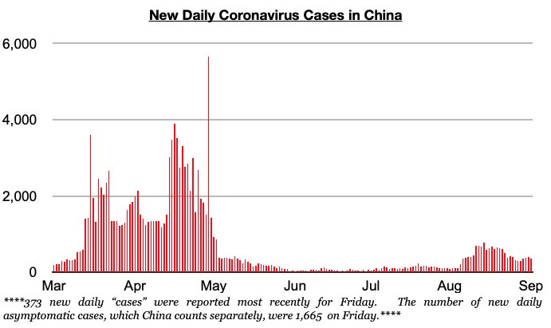

# Improvement in China

**Date:** September 12, 2022  
**Publisher:** Breakwave Advisors | **Category:** Market Insights  
**Original URL:** [https://www.breakwaveadvisors.com/insights/2022/9/12/x70gc29e8v2ckfu9130d2zxpzc4cd3](https://www.breakwaveadvisors.com/insights/2022/9/12/x70gc29e8v2ckfu9130d2zxpzc4cd3)  

---

*By*[*Jeffrey Landsberg*](https://www.linkedin.com/in/jeffrey-landsberg-70ab957/)

While we have remained bearish for much of the global economy and certainly for the steel market outside of China, one positive issue that we have continued to stress in our Weekly Dry Bulk Reports and Weekly China Reports is that there has been a very solid chance that China's steel production bottomed in late July. New this week has been data released showing that China's steel production increased again in late August, just as it increased first back in early August and then again during the middle of the month. Daily crude steel production at large and medium-sized mills in China averaged 2.03 million tons during August 21- 31. This is up by 2% from the middle of August, is up by 7% from the low seen in late July, and is down year-on-year by only 1%.

The ongoing rebound in China's steel production is encouraging especially considering that it has been occurring at the same time that coronavirus cases and restrictions have been intensifying across the nation. Our next Weekly China Report to be sent to our clients will discuss the Chinese steel market and most recent coronavirus outbreak in greater detail. Going forward, we remain most bearish for the world outside of China and continue to believe that China’s economy has the best chance of experiencing the start of a rebound this year. China remains one of only three nations that has cut rates this year, and the government is still very much focused on helping to bring about a rebound.

> **Figure 1: Chart 1 (48)**  
> [Local Asset](file:///C:/Users/Dell/Github/Shipping/corpus/03-breakwave/insights/2022/assets/2022-09-12_x70gc29e8v2ckfu9130d2zxpzc4cd3_img_chart1284829_7b5263591fed.jpg)

Also noteworthy in China is that August has marked another month that has experienced improvement in iron ore and coal imports. China imported 96.2 million tons of iron ore in August. This marks a month-on-month increase of 5 million tons (5%). As we have continued to stress in our work, there has remained a good chance that China's iron ore imports will continue to climb higher during the second half of this year as the nation's iron ore port stockpiles remain well below this year's high, Brazilian and Australian iron ore production remain poised to continue to undergo seasonal strength, and steel production has continued to rise in recent weeks. Coal imports also grew last month, with imports totaling 29.5 million tons. This has marked a month-on-month increase of 6 million tons (26%).
