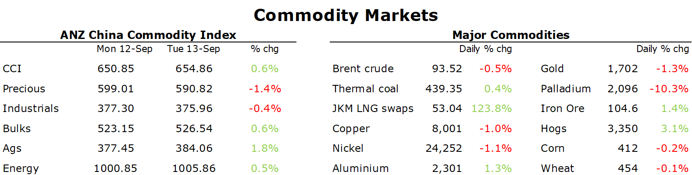

# Higher than expected inflation pushes commodities lower

**Date:** September 14, 2022  
**Publisher:** Breakwave Advisors | **Category:** Market Insights  
**Original URL:** [https://www.breakwaveadvisors.com/insights/2022/9/14/higher-than-expected-inflation-pushes-commodities-lower](https://www.breakwaveadvisors.com/insights/2022/9/14/higher-than-expected-inflation-pushes-commodities-lower)  

---

*By*[*Daniel Hynes*](https://www.linkedin.com/in/dahynes/)

Higher than expected inflation in the US raised fears of further aggressive hikes by the Fed. Risk assets subsequently suffered, with commodities coming under pressure. Supply side issues softened the blow in several markets.

> **Figure 1: 1663106083434**  
> **Interactive Data & Source:** [Publications Anz](https://publications.anz.com/SingletrackCMS__DownloadDocument?docRef=18b3fc84-2224-466e-adab-84d156bf7a2c&uid=bd219b92-f5cc-400e-9646-4178791864b7&jobRef=55aa9789-a68a-4987-8cda-be5abeb7ad29) | [Local Asset](file:///C:/Users/Dell/Github/Shipping/corpus/03-breakwave/insights/2022/assets/2022-09-14_higher-than-expected-inflation-pushes-commodities-lower_img_1663106083434_288d509ef756.png)

**Crude oil**fell along with most risky asset classes after US inflation came in higher than expected. The USD rallied and bonds plunged, which weighed on investor appetite. It also brought back into focus the spectre of weaker economic growth as the Fed struggles to tame high consumer prices. Brent crude was trading as high as USD95/bbl before the CPI data was released. It subsequently dropped nearly USD4/bbl. However, prices rebounded late in the session after the Biden administration said it was considering refilling its strategic oil reserve, which had fallen sharply over the past six months amid efforts to support the market with additional oil. Officials suggested it could undertake this process once prices hit USD80/bbl. This could add to a pickup in demand in China. A spate of Chinese crude purchases via tender have spurred some optimism that weakness in the physical market in that country had reached a bottom. This follows commodity trade data showing August volumes had also improved. Supply also looks constrained. Outside of the expected fall in Russian supply, OPEC has moved to cut production and growth in US shale oil output remains anaemic. The market is also lowering expectations of additional Iran oil. US Secretary of State Antony Blinken said it was unlikely the US and Iran would reach a new nuclear deal anytime soon.

**European natural gas**gained as supply risks came back into focus. The European Commission is expected to unveil its proposals to tackle the energy crisis. However, it appears capping gas prices appears off the table after German Chancellor warned against such a move. A cap on power generation revenues, in combination with a levy on energy company profits, looks the most likely measures to be approved. Dutch front month futures subsequently found some support, rising 4.2% to EUR198.61/MWh.**North Asian LNG**futures stabilised, as recent weakness enticed more buying. India purchased several cargoes on the spot market, which helped offset softer demand in Japan due to cooler weather.

**Gold**slumped as the USD surged and Treasury yields fell. After trading as high as USD1730/oz, it broke back below USD1700/oz as investors braced for a 75bps hike at the next Fed meeting.

It was a mixed session in the base metals market.**Copper**fell more than 1% amid the inflation-induced selloff and a stronger USD. However, supply side issues provided some level of support to other metals.**Aluminium**gained as producers continue to ratchet back supply. Smelters in China’s Yunnan province are being forced to reduce activity due to a drought-induced shortage of hydropower. Authorities have been asking producers to cut operating rates, with most being ordered to lower output by 10%. The province accounts for 13% of China total aluminium capacity. This comes on top of shortages in Europe. Aluminium capacity has halved over the past year due to surging electricity prices[**making most operations uneconomic**](https://publications.anz.com/SingletrackCMS__DownloadDocument?docRef=18b3fc84-2224-466e-adab-84d156bf7a2c&uid=bd219b92-f5cc-400e-9646-4178791864b7&jobRef=55aa9789-a68a-4987-8cda-be5abeb7ad29).

The onset of China’s construction season is also underpinning**iron ore**. Futures rose on the Dalian Exchange after China’s Evergrande Group removed its freeze on construction projects. Of the 768 project currently suspended, 668 will recommence immediately. This comes amid efforts by authorities to shore up sentiment in a sector that has been beleaguered by consumer mortgage boycotts. More support for the construction sector is expected as Beijing looks to boost economic activity.

Data source:[Commodities Wrap](https://www.linkedin.com/newsletters/commodities-wrap-6692196755876012032/?fbclid=IwAR3kiXJqZdxmp9ZcRwBNI7FsBySI-XSC0pfPur1qzjt7OZp7PTE59Tsl1QI)
