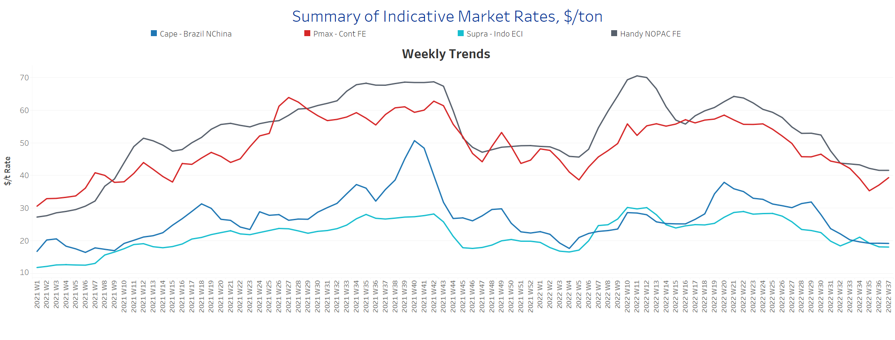
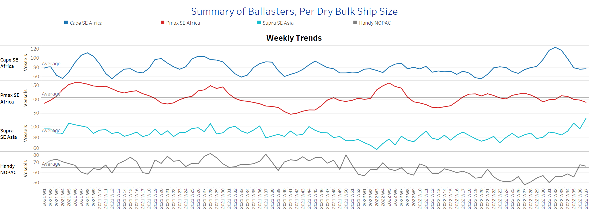

# Signal Dry Bulk Weekly Report

**Date:** September 14, 2022  
**Publisher:** Breakwave Advisors | **Category:** Market Insights  
**Original URL:** [https://www.breakwaveadvisors.com/insights/2022/9/14/signal-dry-bulk-weekly-report](https://www.breakwaveadvisors.com/insights/2022/9/14/signal-dry-bulk-weekly-report)  

---

Prices for iron ore cargoes containing 63.5% iron for delivery to Tianjin rose to around $105, the highest level in nearly three weeks, boosted by the prospect of increased Chinese demand. At the same time, the Chinese city of Zhengzhou has pledged to resume all stalled construction projects by early October, easing worries about the ailing property market and boosting demand for building components.

Firmer sentiment in iron ore prices comes amid confidence among global mining companies that the Chinese stimulus package will boost demand for steel and iron ore. The chief executive of Anglo-Australian BHP said at the release of BHP's annual results in mid-August that he expected China "to be a source of stability for commodity demand in the year ahead, with policy support starting to take hold." However, Chinese iron ore production is expected to decline by 6.9% to 247.6 million tonnes in 2022, as mining companies are expected to curb production due to lower demand from the domestic steel industry. This is partly related to the Chinese government's plan to curb steel production, which is one of the largest carbon-emitting industries, as part of the country's net zero target for 2060. In addition, iron ore production in Russia and Ukraine is expected to decline by 16.3% and 48.6%, respectively, due to the ongoing war between Russia and Ukraine, which began in February 2022.

In the coal segment, futures for Newcastle coal, the benchmark for the region with the highest consumption in Asia, rose to a new record high of around $460 per tonne, reflecting continued robust demand and ongoing supply constraints exacerbated by the war in Eastern Europe. The International Energy Agency projects that coal consumption in Europe will increase by 7% by 2022, following a 14% increase last year, with the continent now turning to coal from South Africa, Indonesia, and even Australia as imports from Russia are halted. Demand for coal in India, the world's second-largest coal importer after China, is expected to rise nearly 10% by 2022 as the country's economy expands and electricity consumption increases.

## Section 1/ Freight -Market Rates ($/T) Weaker

> **Figure 1: Market Chart 1**  
> **Interactive Data & Source:** [Signal Ocean Platform](https://www.thesignalgroup.com/signal-ocean-platform) | [Local Asset](file:///C:/Users/Dell/Github/Shipping/corpus/03-breakwave/insights/2022/assets/2022-09-14_signal-dry-bulk-weekly-report_img_unnamed287129_62749131d545.png)

The second week of September sees weaker sentiment in freight rates across all vessel categories, with an uptick in Panamax vessels.

- **Capesize**freight rates from Brazil to North China fell to $18.7/tonne, down from over $20/tonne in mid-August.
- **Panamax**freight rates fromtheContinent to the Far East rose to $38/tonne, up $3/tonne from week 35.
- **Supramax**freight rates for the Indo-ECI route fell to $18/tonne, down nearly $3/tonne from the week 34 peak.
- **Handysize**vessel freight rates from NOPAC to the Far East fell to $41.6/tonne, nearly $10/tonne below week 30 highs.

## Section 2/ Supply -Ballasters (# Vessels) Increasing

## Supply Trend Lines for Key Load Areas

> **Figure 2: Market Chart 2**  
> **Interactive Data & Source:** [Signal Ocean Platform](https://www.thesignalgroup.com/signal-ocean-platform) | [Local Asset](file:///C:/Users/Dell/Github/Shipping/corpus/03-breakwave/insights/2022/assets/2022-09-14_signal-dry-bulk-weekly-report_img_unnamed287229_8ee6f61632b9.png)

The number of Capesize and Panamax vessels sailing ballast has fallen below the annual average, while the number of Handysize and Supramax vessels has increased significantly compared to previous weekly figures.

- **Capesize**SE Africa: The number of vessels has decreased to 77, a 37% decrease from the peak in week 32.
- **Panamax**SE Africa: The number of vessels is approaching 89, 18 less than the annual average.
- **Supramax**SE Asia: The number of vessels rose to 116, an increase of 35% over the annual average.
- **Handysize**NOPAC: The number of vessels reached 66, 10 more than the low in week 35.

## Section 3/ Demand -TonDays Increasing

> **Figure 3: TonDays Increasing**  
> **Interactive Data & Source:** [Signal Ocean Platform](https://www.thesignalgroup.com/signal-ocean-platform) | [Local Asset](file:///C:/Users/Dell/Github/Shipping/corpus/03-breakwave/insights/2022/assets/2022-09-14_signal-dry-bulk-weekly-report_img_unnamed287129_62749131d545.png)

The number of congested vessels has risen again after two consecutive weeks of decline, with the Supramax and Panamax segments triggering the latest increase.

- **Capesize:**The number of congested ships reached 100, 6 more than the previous week.
- **Panamax:**The number of vessels is back above 200 since the last peak in week 34, which seems to be one of the highest values in September.
- **Supramax:**The number of congested vessels rose to 256, 15 more than the previous week.
- **Handysize**: The number of congested vessels rose to 130, while a similar number was last recorded in week 34.

Data Source:[Signal Ocean Platform](https://www.thesignalgroup.com/signal-ocean-platform)
