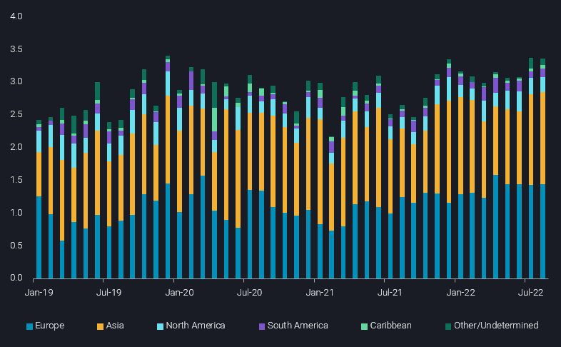
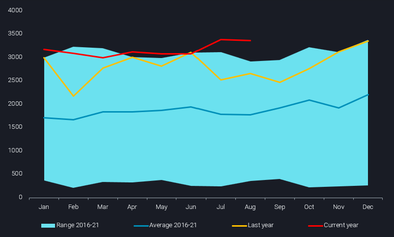
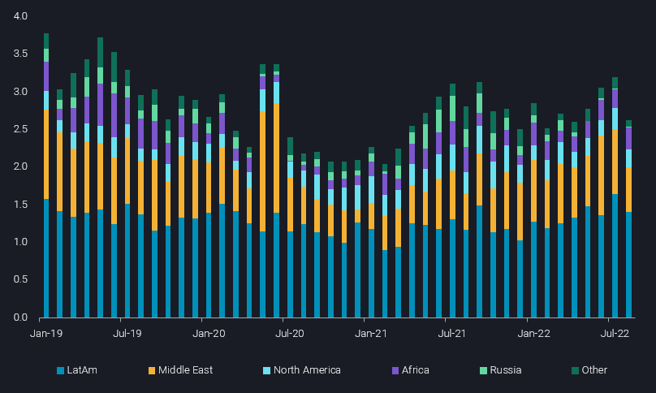

# Slowing fuel demand takes its toll on US crude flows

**Date:** September 15, 2022  
**Publisher:** Breakwave Advisors | **Category:** Market Insights  
**Original URL:** [https://www.breakwaveadvisors.com/insights/2022/9/15/slowing-fuel-demand-takes-its-toll-on-us-crude-flows](https://www.breakwaveadvisors.com/insights/2022/9/15/slowing-fuel-demand-takes-its-toll-on-us-crude-flows)  

---

*By*[*Rohit Rathod*](https://www.linkedin.com/in/rathodrohit/)

As global fuel demand falls amidst a broader economic slowdown that is brewing behind the wings, we see its impact on US crude/condensate flows. Vortexa data shows US seaborne crude/condensate imports in August falling to 4-month lows after the multi-year highs reached in July. Exports on the other hand have managed to remain unchanged in August.

> **Figure 1: Slowing Fuel Demand Img 1**  
> **Interactive Data & Source:** [Analytics Vortexa](https://analytics.vortexa.com/?dateRange=2019-01-01T00%3A00%3A00.000Z__2022-08-31T23%3A59%3A59.999Z&from=%5B%222d92cc08f22524dba59f6a7e340f132a9da0ce9573cca968eb8e3752ef17a963%22%5D&metric=bpd&page=Flows&products=%5B%2254af755a090118dcf9b0724c9a4e9f14745c26165385ffa7f1445bc768f06f11%22%5D&tabId=fed0c5bb-bbe0-4f82-96d5-1e348abc8ef9&timeSeriesProperty=destination_region&timeSeriesSeasonalToggle=0) | [Local Asset](file:///C:/Users/Dell/Github/Shipping/corpus/03-breakwave/insights/2022/assets/2022-09-15_slowing-fuel-demand-takes-its-toll-on-us-crude-flows_img_slowing-fuel-demand-img-1_79b6daa944bb.png)

## Us Crude Exports Hold Steady in August

US crude/condensates exports in July were 3.4mbd – strongest since December 2019 when similar volumes were exported, setting an all time record. August saw these strong exports remain unchanged at 3.4mbd.[Europe](https://analytics.vortexa.com/?dateRange=2019-01-01T00%3A00%3A00.000Z__2022-08-31T23%3A59%3A59.999Z&from=%5B%222d92cc08f22524dba59f6a7e340f132a9da0ce9573cca968eb8e3752ef17a963%22%5D&metric=bpd&page=Flows&products=%5B%2254af755a090118dcf9b0724c9a4e9f14745c26165385ffa7f1445bc768f06f11%22%5D&tabId=fed0c5bb-bbe0-4f82-96d5-1e348abc8ef9&timeSeriesSeasonalToggle=0&to=%5B%22f39d455f5d38907394d6da3a91da4e391f9a34bd6a17e826d6042761067e88f4%22%5D)which has been the top destination for US crudes since the start of the Russian-Ukraine conflict was still the top destination come August, but the strong comeback of[Libyan exports](https://analytics.vortexa.com/?dateRange=2019-01-01T00%3A00%3A00.000Z__2022-08-31T23%3A59%3A59.999Z&from=%5B%2282a6dd5bf8dfb66a8a8a684d60b69474785ed5878f9987ecd5dff6c8b83d3435%22%5D&metric=bpd&page=Flows&products=%5B%2254af755a090118dcf9b0724c9a4e9f14745c26165385ffa7f1445bc768f06f11%22%5D&tabId=fed0c5bb-bbe0-4f82-96d5-1e348abc8ef9&timeSeriesProperty=destination_country&timeSeriesSeasonalToggle=0)– especially useful to Med and NW European buyers – intensified competition faced by US crude exports heading transatlantic. Some recent developments also saw the first time a medium-sour[Mars cargo](https://analytics.vortexa.com/?dateRange=2019-01-01T00%3A00%3A00.000Z__2022-08-31T23%3A59%3A59.999Z&from=%5B%222d92cc08f22524dba59f6a7e340f132a9da0ce9573cca968eb8e3752ef17a963%22%5D&metric=bpd&page=Flows&products=%5B%2254af755a090118dcf9b0724c9a4e9f14745c26165385ffa7f1445bc768f06f11%22%5D&tabId=fed0c5bb-bbe0-4f82-96d5-1e348abc8ef9&timeSeriesSeasonalToggle=0&to=%5B%2255e0cda3e7ce192b56feb1f538377c19ffebe6df5920c24153eeb8cfea7ead86%22%5D)was delivered at Rostock in Germany, which we believe was delivered to an inland German refinery with the refiner testing out the crude as a replacement for Russian Urals that they currently rely on.

> **Figure 2: Slowing Fuel Demand Img 2**  
> **Interactive Data & Source:** [Analytics Vortexa](https://analytics.vortexa.com/?dateRange=2019-01-01T00%3A00%3A00.000Z__2022-08-31T23%3A59%3A59.999Z&from=%5B%222d92cc08f22524dba59f6a7e340f132a9da0ce9573cca968eb8e3752ef17a963%22%5D&metric=bpd&page=Flows&products=%5B%2254af755a090118dcf9b0724c9a4e9f14745c26165385ffa7f1445bc768f06f11%22%5D&tabId=fed0c5bb-bbe0-4f82-96d5-1e348abc8ef9&timeSeriesSeasonalToggle=0) | [Local Asset](file:///C:/Users/Dell/Github/Shipping/corpus/03-breakwave/insights/2022/assets/2022-09-15_slowing-fuel-demand-takes-its-toll-on-us-crude-flows_img_slowing-fuel-demand-img-2_a502eeedf8d3.png)

[US flows to Asia](https://analytics.vortexa.com/?dateRange=2019-01-01T00%3A00%3A00.000Z__2022-08-31T23%3A59%3A59.999Z&from=%5B%222d92cc08f22524dba59f6a7e340f132a9da0ce9573cca968eb8e3752ef17a963%22%5D&metric=bpd&page=Flows&products=%5B%2254af755a090118dcf9b0724c9a4e9f14745c26165385ffa7f1445bc768f06f11%22%5D&tabId=fed0c5bb-bbe0-4f82-96d5-1e348abc8ef9&timeSeriesProperty=destination_country&timeSeriesSeasonalToggle=0&to=%5B%22e6955a2c59dc90833986fe0894cf6718dddaa7816bb51bc955cdd3eb4470e554%22%5D)recovered as refiners in China showed renewed interest in US crude but the recent Covid related lockdowns and expected run cuts from refiners might dampen these flows a bit in the coming months. Elsewhere in Asia, exports to Taiwan and Singapore did increase in August, while Indian refiners continued to shy away from US barrels as cheaper alternatives were available elsewhere.

## Us Crude Imports Drop Significantly in Anticipation of Fall Refinery Turnarounds

> **Figure 3: Slowing Fuel Demand Img 3**  
> **Interactive Data & Source:** [Analytics Vortexa](https://analytics.vortexa.com/?dateRange=2019-01-01T00%3A00%3A00.000Z__2022-08-31T23%3A59%3A59.999Z&filtersEnabled=%5B%22p%22%2C%22o%22%2C%22d%22%2C%22d_r%22%2C%22v%22%2C%22intra%22%2C%22sts_o%22%2C%22c_o%22%2C%22v_f%22%2C%22v_o%22%2C%22c%22%2C%22w%22%5D&metric=bpd&movementEvent=unloading_start&page=Flows&products=%5B%2254af755a090118dcf9b0724c9a4e9f14745c26165385ffa7f1445bc768f06f11%22%5D&tabId=0ab4efbd-2a7a-4213-b1de-bd05279ab7c2&timeSeriesHiddenSeries=%5B%22seasonal_comparison_24%22%2C%22seasonal_comparison_12%22%2C%22b996521be9c996db3560ca234a56286ac38f798d34be229437555fab4f12a6a5%22%2C%22b746356b9c2afdce96197d490c00d864c54c432d61f49dd99f70520ce199f8e8%22%5D&timeSeriesProperty=origin_region&timeSeriesSeasonalToggle=0&to=%5B%222d92cc08f22524dba59f6a7e340f132a9da0ce9573cca968eb8e3752ef17a963%22%5D) | [Local Asset](file:///C:/Users/Dell/Github/Shipping/corpus/03-breakwave/insights/2022/assets/2022-09-15_slowing-fuel-demand-takes-its-toll-on-us-crude-flows_img_slowing-fuel-demand-img-3_84bb11ba091c.png)

US waterborne crude imports dropped sharply m-o-m in August as only 2.6mbd of crude made its way to American shores, compared to 3.2mbd in July. This was mainly due to US refiners gearing up for fall maintenance season as well as a general slowing in US demand for transportation fuels. Imports from the Middle East were a major contributing factor for this decline, as they shipped their barrels to Asia instead, thereby protecting their market share against cheaper Russian barrels. Other factors contributing to this drop were: increased pipeline imports from Canada and additional supply from recent sales of Strategic Petroleum Reserves (SPR) barrels.

## Us Spr Releases Bring Much Needed Supply to a Tight Market

So far, the US has released over 130mb of crude oil from its Strategic Petroleum Reserves (SPR) since the start of the year. SPR sales mostly released sour barrels, but the recent two sales released ~45mb of sweet barrels with deliveries scheduled from 16 August to 21 October. According to Vortexa estimates – based on winning bids from Shell, Unipec, Glencore, Vitol, Equinor, Mercuria, Macquarie and others – around 15-20mb of this light sweet SPR crude was expected to hit the water for exports but we haven’t seen strong export activity for these barrels yet. Which means, most of these barrels stayed within the US acting as a bridge until shale basin production ramps up in 4Q 2022 and providing the additional supply to a tight market.

## Oil Demand Under Pressure As Energy Costs Rise

The recently announced OPEC+ supply cuts underpin the group’s concerns on demand amid global recessionary fears, limited spare capacity led supply risks and most importantly changed price targets. To conclude, we believe that in spite of the strong US crude exports in August, oil demand in a global economy with lower GDP and rising energy costs will remain under pressure. In a weakening crude market, where tight diesel supply seems to be the only saving grace, US crude imports and exports will both remain constrained.

Data Source:[Vortexa](https://www.vortexa.com//oil-gas-data-traders-analysts-data-scientists?gclid=Cj0KCQjw8_qRBhCXARIsAE2AtRZKOvMnbilZ_6_91d7huSFFy71pWLrnPwGwOHVzXsmsG-1a1mZnQw8aAt89EALw_wcB&hsa_acc=1782073842&hsa_ad=548425387665&hsa_cam=14746637662&hsa_grp=125038601902&hsa_kw=&hsa_mt=&hsa_net=adwords&hsa_src=g&hsa_tgt=dsa-1431852288425&hsa_ver=3&utm_campaign=%5BCD%5D%20-%20DSA%20-%20EMEA&utm_medium=cpc&utm_medium=ppc&utm_source=google&utm_source=adwords&utm_term=)
