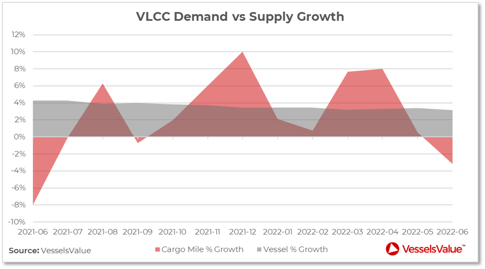
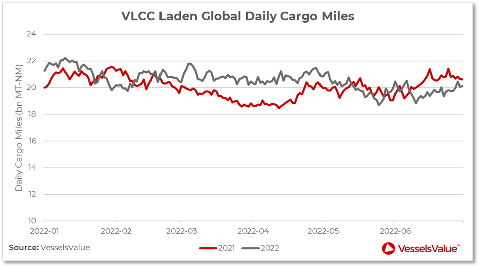
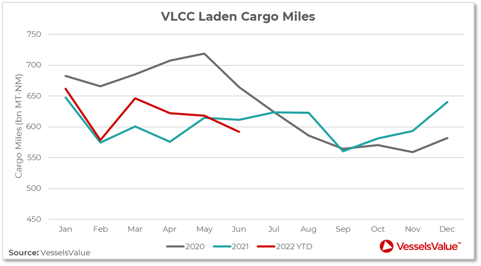
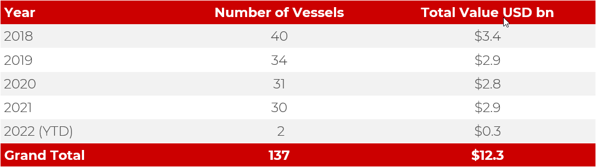
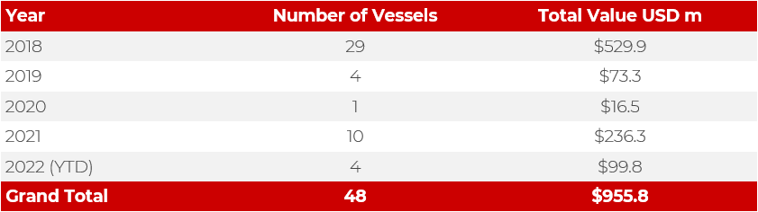

# VesselsValue - VLCC Supply and Demand Analysis

**Date:** September 15, 2022  
**Publisher:** Breakwave Advisors | **Category:** Market Insights  
**Original URL:** [https://www.breakwaveadvisors.com/insights/2022/9/15/vlcc-supply-and-demand-analysis](https://www.breakwaveadvisors.com/insights/2022/9/15/vlcc-supply-and-demand-analysis)  

---

By[*Graham Close*](https://www.linkedin.com/in/graham-close-28138423a/)*and*[*George Delaney*](https://www.linkedin.com/in/george-delaney-5829b7151/)

## Introduction

While the talk of the town has been of the VLCC sector’s spike in rates in recent weeks, this article focuses on some of the key variables that have afflicted these vessels over the past few years and kept market sentiment so low for so long.

The VLCC-TCE is a weighted average of earnings for conventional, non scrubber fitted VLCCs, incorporating two key routes: the TD1-TCE (Middle East Gulf to US Gulf) and the TD3C-TCE (Middle East Gulf to China). This estimate had been valued below zero from the beginning of 2021 until August 2022. At its worst, the daily earnings figure stood at -34,845 USD/Day. This period remains the longest stint of negative earnings on record for these large crude carriers.

The poor earnings seen for VLCCs have linked directly to supply and demand and impacted how market participants responded in newbuilding and demolition activity prior to recent positive developments in the VLCC sector.

## Supply and Demand

Supply growth over the past year had stayed relatively flat at c. 3.0% to 4.5%; the live fleet stood at 861 vessels in July 2022. However, demand had been volatile; down 8% in June 2021 compared to June 2020, yet up 10% year on year in December. June 2022 showed a decrease in demand of -3.2%, year on year. Figure 1 compares month on month supply growth with vessel demand (cargo miles) between 2021 and 2022.

> **Figure 1: VLCC Supply and Demand Growth Since June 2021**  
> *Figure 1: VLCC supply and demand growth since June 2021.*  
> **Interactive Data & Source:** [Blog Vesselsvalue](https://blog.vesselsvalue.com) | [Local Asset](file:///C:/Users/Dell/Github/Shipping/corpus/03-breakwave/insights/2022/assets/2022-09-15_vlcc-supply-and-demand-analysis_img_image_50f7d87a617d.png)

COVID-19 had significant effects on supply and demand with June 2021 and 2022 showing an overall decrease in cargo mile growth. That seen in June 2021 was a result of the movement of 222 million barrels of oil into floating storage by July 9, 2020 (According to EIA figures), driven by a crash in the oil market. June 2020 saw high cargo mile figures, with countries filling storage tanks as a consequence of low prices.

> **Figure 2: VLCC Laden Global Daily Cargo Miles in H1 2021 and 2022**  
> *Figure 2: VLCC laden global daily cargo miles in H1 2021 and 2022.*  
> **Interactive Data & Source:** [Blog Vesselsvalue](https://blog.vesselsvalue.com) | [Local Asset](file:///C:/Users/Dell/Github/Shipping/corpus/03-breakwave/insights/2022/assets/2022-09-15_vlcc-supply-and-demand-analysis_img_image-1_be7a2eafd82c.png)

Figure 2 displays month on month comparison of laden daily cargo miles between 2021 and 2022. Cargo miles in 2021 ranged from 18.5bn MT-NM to 21.6bn MT-NM compared with 2022 where it ranged from 18.7bn MT-NM to 22.2bn MT-NM.

> **Figure 3: VLCC Total Laden Cargo Miles in 2020**  
> *Figure 3: VLCC total laden cargo miles in 2020, 2021 and 2022.*  
> **Interactive Data & Source:** [Blog Vesselsvalue](https://blog.vesselsvalue.com) | [Local Asset](file:///C:/Users/Dell/Github/Shipping/corpus/03-breakwave/insights/2022/assets/2022-09-15_vlcc-supply-and-demand-analysis_img_image-2_9cf05a39ad69.png)

2020 was the most volatile of the periods with a maximum cargo mile value of 719bn MT-NM in May to a low of 559bn MT-NM in November. As in Figure 3, the May 2020 peak in cargo miles resulted from the oil market price crash. In the first half of 2022, the trend of decreasing cargo miles on a daily and monthly scale was reflected in the poor VLCC earnings seen in this period.

## Newbuild and Demolition

Newbuilding orders from 2018 through to 2021 remained relatively stable, peaking at 40 vessels ordered in 2018 and remaining in the mid to low 30s in the 3 subsequent years. In total, 135 vessels have been contracted in these 4 years, worth a combined c. USD 12.0 bn. 2022 was yet to register a single newbuilding order until August 2022, a stark contrast compared to recent years.

> **Figure 4: VLCC Newbuilding Activity Since 2018**  
> *Figure 4: VLCC newbuilding activity since 2018.*  
> **Interactive Data & Source:** [Blog Vesselsvalue](https://blog.vesselsvalue.com) | [Local Asset](file:///C:/Users/Dell/Github/Shipping/corpus/03-breakwave/insights/2022/assets/2022-09-15_vlcc-supply-and-demand-analysis_img_vlcc-table_91d921b235e7.png)

Whilst VLCCs continue to be launched following ordering activity in earlier years, the orderbook has been shrinking, currently standing at 41 vessels. A common theme in the past 18 months had been oversupply; too many vessels were available in key loading regions, particularly the Middle East.

The combination of oversupply and lacklustre oil demand from China had aided the extended periods of negative earnings seen and forced market participants to think twice about contracting VLCCs with builders. Likewise, the skyrocketing price of raw materials for shipbuilding has increased newbuild values significantly; which currently stand c. 16% higher than this time last year at around USD 115.51 mil.

Tightening yard space has catalysed this reversal in VLCC newbuilding orders; as Container and Gas vessels fill up slots, the overall attractiveness in newbuild VLCCs remains low, with little sign of interest at these prices.

> **Figure 5: VLCC Demolition Activity Since 2018**  
> *Figure 5: VLCC demolition activity since 2018.*  
> **Interactive Data & Source:** [Blog Vesselsvalue](https://blog.vesselsvalue.com) | [Local Asset](file:///C:/Users/Dell/Github/Shipping/corpus/03-breakwave/insights/2022/assets/2022-09-15_vlcc-supply-and-demand-analysis_img_vlcc-table2_59b133b44480.png)

With oversupply an issue in this particular vessel segment, you would expect demolition rates to be high, yet this is not the case. As seen in Figure 5, 2018 saw the largest scrapping numbers of the past 5 years with 29 vessels sent for breaking; the combined demolition value of these sales totalled USD 529.9 mil.

Only 19 VLCCs have been sold for scrap since 2019. 2021 having the largest figure since 2019 (10 vessels scrapped) is unsurprising due to the scrap steel prices increasing to over 600 USD/LDT, levels not seen since the financial crisis of 2008, by the end of last year. Yet, to not have these demolition numbers far higher, particularly with an ageing fleet and poor earnings at the time, suggests there are other variables at play.

Where are these vessels that would otherwise be headed for scrapyards? There have been plenty of reports of what tend to be older VLCCs, often with unknown owners, outside of the spot market picking up discounted cargos from sanctioned exporters such as Iran and Venezuela. These vessels are elusive, often operating invisibly; AIS is often disabled or strategically used to hide their illicit activities.

These colloquially named “dark” vessels have been playing a large role in capping the earnings potential of above board VLCCs and helping, in part, to explain the reduced number of VLCCs being scrapped at present. A portion of vessels that require removal from the fleet are commonly engaged in nefarious activity to the benefit of their operators but to the detriment of the VLCC market as a whole.

## Summary

Previous years’ fleet supply had remained relatively stable and, with the orderbook standing at 41, is set to remain steady, particularly with the dearth of newbuilding orders seen in 2022. Demand, similarly, has remained relatively stable over the course of 2021 and 2022. The globe’s largest importer of oil, China, has seen its crude demand oscillate with the severity of their COVID-19 restrictions, particularly through Q2 2022, highlighted by the reduced cargo miles figures seen for VLCCs. With China crucial for VLCC utilisation, this is unsurprising.

Whilst supply and demand figures suggest relative stability, this is not reflected in the newbuilding and demolition statistics seen in recent years. In both markets, VLCC activity has declined rapidly; 2022 has only seen 2 newbuild orders for these large crude carriers, compared to the annual average through 2018 to 2021 of c. 34 vessels contracted per year. Whilst excess supply has been a detriment to market participants, demolition figures have not been up to scrap to aid the lacklustre earnings these vessels experienced until very recently.

Just 4 VLCCs have been sold for demolition in 2022, down from 10 in 2021 and down from 29 in 2018. This despite scrap steel prices remaining at high levels. A combination of caution from owners and illicitly trading vessels can help explain this. Smaller Tanker segments have seen upturns in earnings as a result of the conflict in Ukraine, and many hoped this would translate into an uptick for VLCCs; they were proved right.

Data Source:[VesselsValue](https://blog.vesselsvalue.com)
