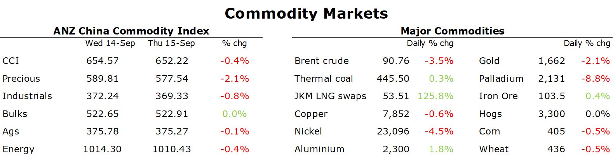

# Gold slumps amid the spectre of more aggressive rate hikes

**Date:** September 16, 2022  
**Publisher:** Breakwave Advisors | **Category:** Market Insights  
**Original URL:** [https://www.breakwaveadvisors.com/insights/2022/9/16/gold-slumps-amid-the-spectre-of-more-aggressive-rate-hikes](https://www.breakwaveadvisors.com/insights/2022/9/16/gold-slumps-amid-the-spectre-of-more-aggressive-rate-hikes)  

---

*By*[*Daniel Hynes*](https://www.linkedin.com/in/dahynes/)

Commodity markets suffered further losses as mixed economic data did nothing to change expectations of further aggressive hikes by the Fed. A stronger USD also weighed on investor appetite.

> **Figure 1: 1663278664913**  
> **Interactive Data & Source:** [Linkedin](https://www.linkedin.com/newsletters/commodities-wrap-6692196755876012032/?fbclid=IwAR3kiXJqZdxmp9ZcRwBNI7FsBySI-XSC0pfPur1qzjt7OZp7PTE59Tsl1QI) | [Local Asset](file:///C:/Users/Dell/Github/Shipping/corpus/03-breakwave/insights/2022/assets/2022-09-16_gold-slumps-amid-the-spectre-of-more-aggressive-rate-hikes_img_1663278664913_6ff515366022.png)

**Gold**slumped amid expectations of more aggressive rate hikes by the Fed. Spot gold fell more than 2% to USD1,660/oz after data showed demand for workers in the US remains strong. Retail sales were also reasonable. This is likely to keep the Fed on the tightening cycle for the foreseeable future. Rising geopolitical and economic risks are doing little to entice safe haven buying, with the USD remaining the asset of choice. Spot silver followed gold lower, while platinum and palladium were also under pressure.

**Crude oil**fell as the market’s focus returned to the worsening economic backdrop. The International Energy Agency said that China faces its biggest annual drop in demand in more than three decades as COVID-19 lockdowns weigh on growth. Oil demand could fall by 420kb/d, or 2.7% this year. This led to the IEA trimming its estimate of global demand. It now sees consumption rising by only 2mb/d. Sentiment wasn’t helped after the US Department of Energy walked back expectations of restocking its strategic reserve. The DoE said its plan to replenish inventories doesn’t include a strike price and isn’t likely to occur until after fiscal 2023. This follows reports that it would start buying once prices hit USD80/bbl. The prospect of disruption to crude oil supply in the US eased after railroads and unions reached a deal to avert strike action.

**European natural gas**gave up earlier gains as traders weigh up efforts to contain the energy crisis. The market breathed a sigh of relief after the European Commission baulked at implementing price caps. The prospect of colder weather in coming days also created uncertainty with the official heating season only weeks away. Gazprom reminded the continent of its worsening energy crisis, with its CEO, Oleg Aksyutin, saying there is no full alternative to Russia’s pipeline gas. He added there won’t be any significant LNG volumes in the global market until at least 2025. However, there is a growing level of optimism that the combination of high storage levels and effective demand reduction measures will avert an acute energy shortage over the coming winter. Dutch front month futures ended the session down 1.2% to EUR214.28/MWh.**North Asian LNG**futures edged higher amid signs of stronger demand in China. LNG terminals in China’s Zhejiang province resumed operations after typhoon Muifa made landfall.

**Copper**fell as investors remained concerned about the economic backdrop amid high inflation. US Steel, Alcoa and Nucro all warned that deliveries are waning across all sectors. However, aluminium gained amid speculation of wide cuts to Chinese output. Some aluminium smelters in Yunnan may cut capacity by 20-30%, according to Shanghai Metals Market. That follows orders from the local electricity authority to cut 10% of production since the weekend. This is added to supply issues in Europe, where soaring energy costs are forcing smelter closures.

**Iron ore**futures were steady as easing curbs in Chengdu aided the demand outlook. The megacity has relaxed restrictions in some areas, spurring optimism that there won’t be a repeat of Shanghai’s two-month lockdown. A report on measures to revive China’s real estate sector also helped sentiment. More than 120 cities have loosened their policies around housing finance this year, the Securities Daily reported.

Data source:[Commodities Wrap](https://www.linkedin.com/newsletters/commodities-wrap-6692196755876012032/?fbclid=IwAR3kiXJqZdxmp9ZcRwBNI7FsBySI-XSC0pfPur1qzjt7OZp7PTE59Tsl1QI)
