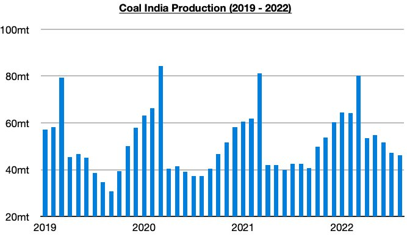
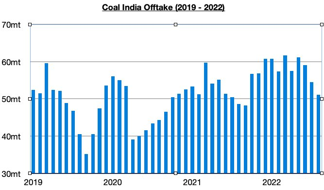
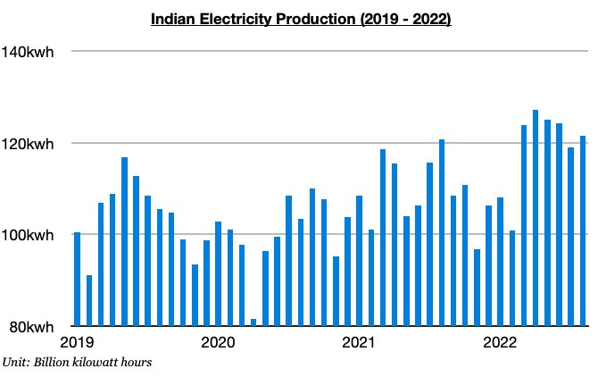

# Strength in India's Coal Production and Electricity Production

**Date:** September 16, 2022  
**Publisher:** Breakwave Advisors | **Category:** Market Insights  
**Original URL:** [https://www.breakwaveadvisors.com/insights/2022/9/16/strength-in-indias-coal-production-and-electricity-production](https://www.breakwaveadvisors.com/insights/2022/9/16/strength-in-indias-coal-production-and-electricity-production)  

---

*By*[*Jeffrey Landsberg*](https://www.linkedin.com/in/jeffrey-landsberg-70ab957/)

Coal India produced approximately 46.2 million tons of coal last month, which marks a month-on-month decline of 1.1 million tons (-2%) but a year-on-year increase of 3.6 million tons (9%). While down again on a month-on-month basis, production has continued to achieve strong year-on-year growth. The first eight months of this year have now seen Coal India’s production grow year-on-year by 49.4 million tons (12%).

> **Figure 1: Chart 1 (49)**  
> [Local Asset](file:///C:/Users/Dell/Github/Shipping/corpus/03-breakwave/insights/2022/assets/2022-09-16_strength-in-indias-coal-production-and-electricity-production_img_chart1284929_b11fb81f2c5a.jpg)

Offtake (amount sent to customers) totaled 51.1 million tons last month, which marks a month-on-month decline of 3.4 million tons (-6%) but a year-on-year increase of 2.5 million tons (5%). Offtake has now increased on a year-on-year basis for eighteen straight months (production has increased on a year-on-year basis for seventeen straight months). The first eight months of this year have now seen offtake increase year-on-year by 39.3 million tons (9%).

> **Figure 2: Chart 2 (42)**  
> [Local Asset](file:///C:/Users/Dell/Github/Shipping/corpus/03-breakwave/insights/2022/assets/2022-09-16_strength-in-indias-coal-production-and-electricity-production_img_chart2284229_47f023f227c7.jpg)

While Coal India's production has remained strong, the nation's overall electricity production has also remained strong. India produced approximately 121.5 billion kilowatt hours of electricity last month, which is up month-on-month by 2.6 billion kilowatt hours (2%) and up year-on- year by 700 million kilowatt hours (1%). Electricity production has now increased on a year-on-year basis during each of the last six months. Prior to this period, it had contracted on a year-on-year basis during January and February. As we also examined in our most recent Weekly Dry Bulk Report, India's hydropower production set an all-time high last month.

> **Figure 3: Chart 3 (33)**  
> [Local Asset](file:///C:/Users/Dell/Github/Shipping/corpus/03-breakwave/insights/2022/assets/2022-09-16_strength-in-indias-coal-production-and-electricity-production_img_chart3283329_8ff107a24b10.jpg)
