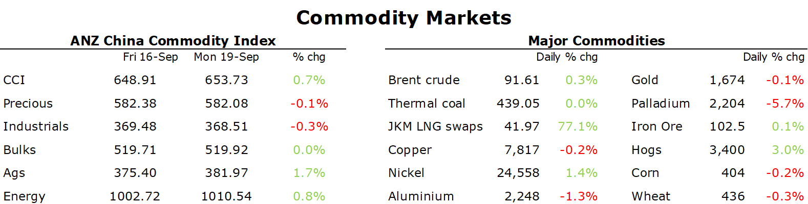

# Commodities edge higher as the market braces for further rate hikes

**Date:** September 20, 2022  
**Publisher:** Breakwave Advisors | **Category:** Market Insights  
**Original URL:** [https://www.breakwaveadvisors.com/insights/2022/9/20/commodities-edge-higher-as-the-market-braces-for-further-rate-hikes](https://www.breakwaveadvisors.com/insights/2022/9/20/commodities-edge-higher-as-the-market-braces-for-further-rate-hikes)  

---

*By*[*Daniel Hynes*](https://www.linkedin.com/in/dahynes/)

Appetite for riskier assets remained weak ahead of the FOMC meeting on Wednesday. Nevertheless, commodities managed to edge higher amid signs of robust physical demand.

> **Figure 1: 1663627362286**  
> **Interactive Data & Source:** [Publications Anz](https://publications.anz.com/SingletrackCMS__DownloadDocument?docRef=233944f4-4042-4a34-90af-b360bd77f2fa&uid=bd219b92-f5cc-400e-9646-4178791864b7&jobRef=e6279406-2302-404a-bff2-2cf5c0976d76) | [Local Asset](file:///C:/Users/Dell/Github/Shipping/corpus/03-breakwave/insights/2022/assets/2022-09-20_commodities-edge-higher-as-the-market-braces-for-further-rate-hikes_img_1663627362286_3a66b34931f6.png)

**Crude oil**eked out a small gain, aided by a weaker USD. It had fallen as much as 3.5% earlier in the session, as the market contemplated several central banks raising rates to tame inflation. This was exacerbated by the potential for increased supply. The US announced that it will offer an additional 10mbbl from its strategic reserve. Only last week it was reported that the Department of Energy was looking at plans to start replenishing the stockpile. UAE also said it was accelerating its plan to produce 5mb/d of crude oil by 2025. However, a weaker USD into the close saw crude oil reverse these earlier losses to end the session higher. This was helped by reports of further easing of restrictions in China. Chengdu and Dalian both lifted citywide lockdowns on Monday.

**European natural gas**extended recent falls as nations intensify their efforts to avert the energy crisis. Germany, the UK and others continue to talk up plans to spend billions of dollars easing their reliance on Russian imports, rescuing local energy companies and capping prices for consumers. Germany announced it may secure an LNG supply contract from UAE in coming days. This comes as it pushed ahead with aggressive plans in expanding its LNG import capacity via new offshore terminals on the north coast. Weaker European markets weighed on**North Asian LNG**futures. However, activity in the spot market remain robust. India’s Gail purchased an LNG cargo at prices above USD40/mmBtu as it looks to replace vital Russian deliveries that were cancelled. This was offset by delays to some LNG shipments to Japan as Typhoon Nanmadol hits the country. Shipments to China are also experiencing delays. Japan-Korea Marker futures for November fell 04% to USD41.97/mmBtu.

**Copper**declined with most other metals as the USD strengthened ahead of central bank meetings. It is seen as a barometer of economic growth. The prospect of aggressive rate hikes has seen it drop more than 20% this year. However, growth in demand appears to be holding up well. The premium for spot cargoes (over futures) in China spiked to CNY825/t last week, its highest level since November 2021. The premium on the London Metal Exchange has also stayed near a multi-month high. Aluminium extended recent falls as the market contemplates strong Chinese production despite disruptions to smelters in Sichuan and Yunnan.

The lifting of restrictions in Chengdu also lifted sentiment in the**iron ore**market. The relatively short lockdown (compared with earlier outbreaks, such as Shanghai) raised hopes that Beijing is getting an upper hand in controlling the virus. The end of restrictions should see more steel-heavy construction work during a peak period for the sector. Blast furnace rates in China’s major steel making hub of Tangshan rose for a second consecutive week. Futures on the Dalian Exchange gained 0.7% while in Singapore they rose a similar level to end the session at USD98.70/t.

**Gold**was under pressure earlier in the session as the spectre of another rate hike pushed the USD higher. The precious metal[**remains vulnerable to further moves lower**](https://publications.anz.com/SingletrackCMS__DownloadDocument?docRef=233944f4-4042-4a34-90af-b360bd77f2fa&uid=bd219b92-f5cc-400e-9646-4178791864b7&jobRef=e6279406-2302-404a-bff2-2cf5c0976d76)amid a challenging macro backdrop. Expectations of another aggressive rate hike are likely to lead to continued strength in the USD. Haven demand remains subdued despite the rising geopolitical risks and worsening economic backdrop. Technically, the bearish trend is likely to continue. The break below USD1,675/oz suggests the price could fall to USD1,600/oz.

Data source:[Commodities Wrap](https://www.linkedin.com/newsletters/commodities-wrap-6692196755876012032/?fbclid=IwAR3kiXJqZdxmp9ZcRwBNI7FsBySI-XSC0pfPur1qzjt7OZp7PTE59Tsl1QI)
