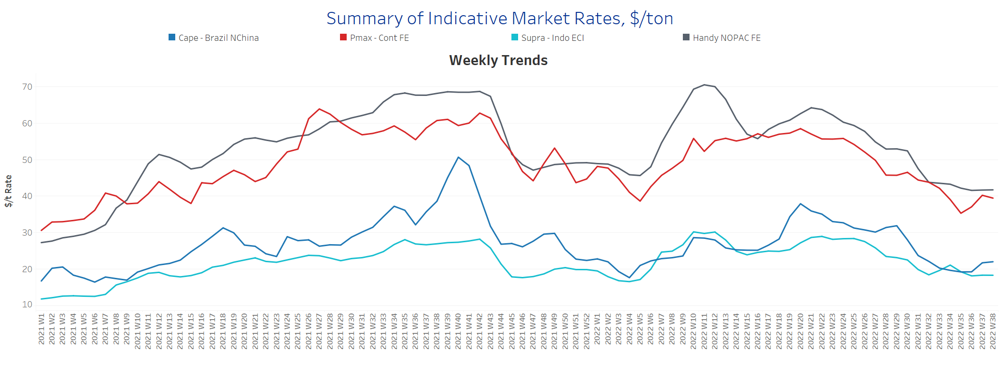
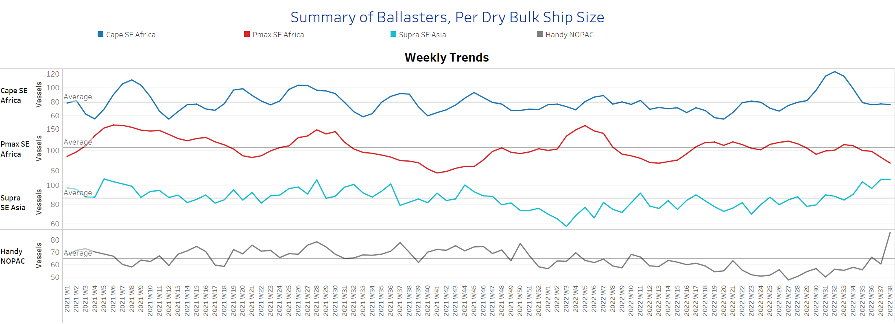
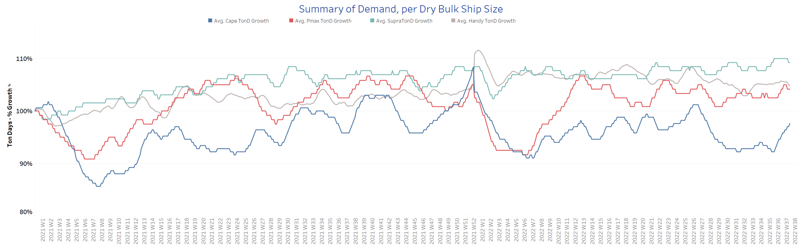
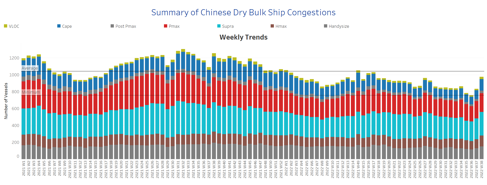

# Signal Dry Bulk Weekly Report

**Date:** September 21, 2022  
**Publisher:** Breakwave Advisors | **Category:** Market Insights  
**Original URL:** [https://www.breakwaveadvisors.com/insights/2022/9/21/signal-dry-bulk-weekly-report](https://www.breakwaveadvisors.com/insights/2022/9/21/signal-dry-bulk-weekly-report)  

---

At the beginning of the third week of September, the picture of freight rates in the Capesize segment has strengthened, while the percentage increase in demand in ton-days is increasing and the number of ships sailing ballast is falling below the annual average trend.

Prices for iron ore cargoes with an iron content of 63.5% for delivery to Tianjin fell to $100 per tonne, well below the peak of $106 reached last week, as ongoing problems in China's real estate sector pressured expectations for steel demand, offsetting better-than-expected industrial production data and new stimulus measures. Real estate investment in the world's second-largest economy fell 13.8% in August, while property prices and sales also continued to fall. In addition, Covid-induced closures continued to weigh on prices and expectations for a recovery in spending.

In the coal segment, futures contracts for Newcastle coal, the benchmark for the major consuming region in Asia, traded around $440 in September, down from a record high of $460 reached earlier in the month, as fears of a U.S. supply freeze eased. Washington reached an agreement with unions that averted a railroad strike that would have halted coal supplies to much of the country's power plants. Still, prices remain near historic highs as energy crises around the world have increased economies' reliance on coal. The IEA projects that coal consumption in Europe will rise by 7% by 2022, following a 14% increase last year. The continent now relies on coal from South Africa, Indonesia, and Australia as imports from Russia cease. EU countries will also increase production to compensate for natural gas shortages, with Germany, Italy, and Austria restarting idled power plants.

## Section 1/ Freight -Market Rates ($/T) Firmer

‘The Big Picture’ - Capesize and Panamax Bulkers and Smaller Ship Sizes

> **Figure 1: Market Chart 1**  
> **Interactive Data & Source:** [Signal Ocean Platform](https://www.thesignalgroup.com/signal-ocean-platform) | [Local Asset](file:///C:/Users/Dell/Github/Shipping/corpus/03-breakwave/insights/2022/assets/2022-09-21_signal-dry-bulk-weekly-report_img_unnamed287429_29636e7da9f9.png)

In the third week of September, freight rate sentiment firmed across all vessel categories, with a downward trend for Panamax vessels.

- **Capesize**freight rates from Brazil to North China rose to $22/tonne, just $2/tonne below the last peak of week 32.
- **Panamax**freight rates fromtheContinent to the Far East recorded a slight decline to less than $40/tonne, while sentiment remains higher than three weeks ago.
- **Supramax**freight rates for the Indo-ECI route held at a high $18/tonne, with an upward trend in the last days of September.
- **Handysize**vessel freight rates from NOPAC to the Far East are still approaching $42/tonne since last week, with no sign of a sharp decline, although well below the week 30 peak.

## Section 2/ Supply -Ballasters (# Vessels) Increasing

> **Figure 2: Supply Trend Lines for Key Load Areas**  
> **Interactive Data & Source:** [Signal Ocean Platform](https://www.thesignalgroup.com/signal-ocean-platform) | [Local Asset](file:///C:/Users/Dell/Github/Shipping/corpus/03-breakwave/insights/2022/assets/2022-09-21_signal-dry-bulk-weekly-report_img_unnamed287529_75bff5ba1172.png)

The number of Capesize and Panamax vessels sailing with ballast remained below the annual average, while the number of Handysize and Supramax vessels followed the previous week's sharp increase.

- **Capesize**SE Africa: The number of vessels remained at 76, a 37% decrease from the peak in week 32.
- **Panamax**SE Africa: The number of vessels has decreased to 71, which is 40 less than the accelerated values of week 34.
- **Supramax**SE Asia: The number of vessels persisted at the high level of the previous week ~106, an increase of 23% over the annual average.
- **Handysize**NOPAC: The number of vessels has risen to 86, 16 more than the previous week and 26 more than the low in week 35.

## Section 3/ Demand -TonDays Increasing

> **Figure 3: TonDays Increasing**  
> **Interactive Data & Source:** [Signal Ocean Platform](https://www.thesignalgroup.com/signal-ocean-platform) | [Local Asset](file:///C:/Users/Dell/Github/Shipping/corpus/03-breakwave/insights/2022/assets/2022-09-21_signal-dry-bulk-weekly-report_img_unnamed287629_5efe49444fd6.png)

The third week of September saw a continuation of the upward trend in Capesize vessels, while some firmness was observed in the Supramax and Panamax segment.

- **Capesize**demand ton-days: The percentage increase remained at the highest level since the last peak in week 27.
- **Panamax**demand ton-days: The upward trend began at the end of last week and continued in the third week of September with a slower pace of growth.
- **Supramax**demand ton-days: After peaking in the first days of September, there seems to have been a steady percentage increase over the last three weeks.
- **Handysize**demand ton-days: There is a downward trend, while it seemed that the previous week was the last firmness after the low of week 32.

## Section 4/ Port Congestion -No of Vesselsincreasing

> **Figure 4: Dry Bulk Ships Congested at Chinese Ports**  
> **Interactive Data & Source:** [Signal Ocean Platform](https://www.thesignalgroup.com/signal-ocean-platform) | [Local Asset](file:///C:/Users/Dell/Github/Shipping/corpus/03-breakwave/insights/2022/assets/2022-09-21_signal-dry-bulk-weekly-report_img_unnamed287729_1e63cb9556bf.png)

The number of congested vessels has accelerated over the past two weeks, with significant increases in all vessel size categories.

- **Capesize:**The number of congested ships reached 137, 33 more than the previous week.
- **Panamax:**The number of vessels increased to 224, 18 more than the previous week and only 6 less than the previous peak week 27.
- **Supramax:**The number of congested vessels increased to 278, 30 more than the previous week.
- **Handysize**: The number of congested vessels increased to 152, 24 more than the previous week.

Data Source:[Signal Ocean Platform](https://www.thesignalgroup.com/signal-ocean-platform)
