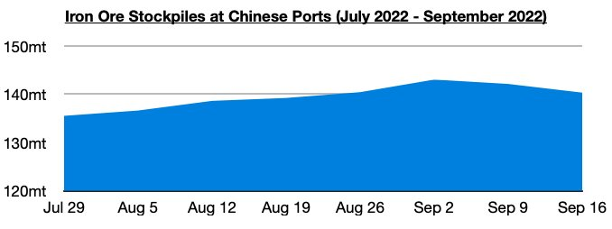
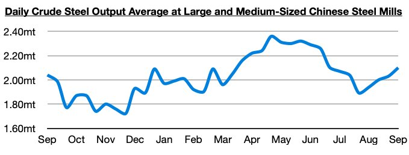

# More Improvement in China

**Date:** September 22, 2022  
**Publisher:** Breakwave Advisors | **Category:** Market Insights  
**Original URL:** [https://www.breakwaveadvisors.com/insights/2022/9/22/more-improvement-in-china](https://www.breakwaveadvisors.com/insights/2022/9/22/more-improvement-in-china)  

---

*By*[*Jeffrey Landsberg*](https://www.linkedin.com/in/jeffrey-landsberg-70ab957/)

In our Weekly Dry Bulk Report published two weeks ago, we highlighted how China’s iron ore port stockpiles finally fell after previously rising for ten straight weeks, and also highlighted how steel production in China continues to rise. New last week is that China’s iron ore port stockpiles fell further, while steel output has also increased even further.

Chinese iron ore port stockpiles ended last week at 140.3 million tons, which is down week-on-week by 1.8 million tons (-1%). Stockpiles have fallen for two straight weeks after previously rising for ten straight weeks. On a year-on-year basis, they are up by 10.2 million tons (8%).

> **Figure 1: Chart 1 (50)**  
> [Local Asset](file:///C:/Users/Dell/Github/Shipping/corpus/03-breakwave/insights/2022/assets/2022-09-22_more-improvement-in-china_img_chart1285029_f839ddc01800.jpg)

Daily crude steel production at large and medium-sized mills in China most recently averaged 2.10 million tons during September 1- 10. This has marked a rise of 3% from late August, is up by 11% from the low seen in late July, and is up year-on-year by 3%. The last time that daily crude steel production at large and medium-sized mills was up on a year-on-year basis was very briefly in late May.

> **Figure 2: Chart 2 (43)**  
> [Local Asset](file:///C:/Users/Dell/Github/Shipping/corpus/03-breakwave/insights/2022/assets/2022-09-22_more-improvement-in-china_img_chart2284329_c124bd47b983.jpg)

Overall, we remain of our view that it is becoming easier to be more bullish for the Chinese steel/iron ore complex and for the Chinese economy in general. China’s steel output has now risen to the highest level since late June and is also now finally experiencing year-on-year growth. Much of the global economy outside of China continues to contend with significant weakness — but several pockets of the Chinese economy are continuing to improve.
