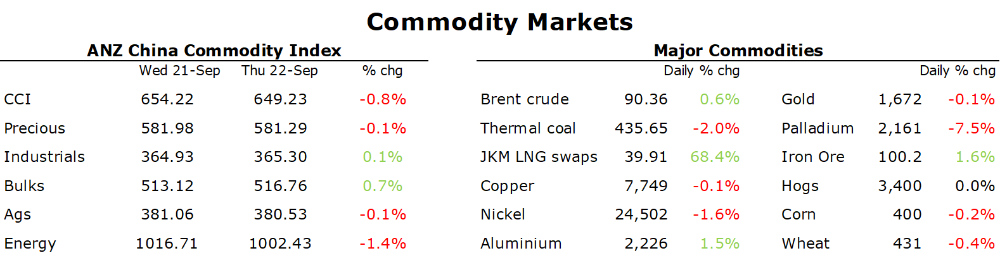

# Metals gain as supply issues offset demand concerns

**Date:** September 23, 2022  
**Publisher:** Breakwave Advisors | **Category:** Market Insights  
**Original URL:** [https://www.breakwaveadvisors.com/insights/2022/9/23/metals-gain-as-supply-issues-offset-demand-concerns](https://www.breakwaveadvisors.com/insights/2022/9/23/metals-gain-as-supply-issues-offset-demand-concerns)  

---

*By*[*Daniel Hynes*](https://www.linkedin.com/in/dahynes/)

Commodity markets shrugged off interest rate hikes by central banks to focus on supply side issues. This saw oil and base metals end a volatile session higher.

> **Figure 1: 1663883759528**  
> **Interactive Data & Source:** [Linkedin](https://www.linkedin.com/newsletters/commodities-wrap-6692196755876012032/?fbclid=IwAR3kiXJqZdxmp9ZcRwBNI7FsBySI-XSC0pfPur1qzjt7OZp7PTE59Tsl1QI) | [Local Asset](file:///C:/Users/Dell/Github/Shipping/corpus/03-breakwave/insights/2022/assets/2022-09-23_metals-gain-as-supply-issues-offset-demand-concerns_img_1663883759528_088d675aa580.png)

**Zinc**led the**base metals**sector higher as the spectre of declining supply outweighed concerns of weaker demand. The slew of central banks tightening monetary policy raises the risk of weaker economic growth. However, the reaction from commodity markets suggests an aggressive rate hike cycle may already be priced in. In the meantime, ongoing supply disruptions continue to push inventories lower.**Zinc**stockpiles in LME warehouses slid to their lowest level since February 2020. Earlier this week, data from China’s statistical bureau showed output of refined zinc fell 5.2% y/y in August. The slowdown in production in China comes as Europe’s energy crisis threatens to curtail more output as costs surge higher. Aluminium also gained amid its own supply issues. Yunnan and Sichuan have ordered smelters to reduce output amid energy shortages.

**Iron ore**gained amid signs of increasing construction activity in China. Real estate developer China Evergrande Group said that of a total of 706 pre-sold and undelivered projects, only 38 haven’t resumed construction. Mysteel also reported that major steel mills are resuming production after months of maintenance. Activity in the physical market is also rising, as the industry prepares for the weeklong National Day holiday at the start of October.

**Gold**fluctuated as central banks hike rates and intervened in currency markets. The move by Japan to defend the JPY saw the USD fall, providing some support for investor demand. Nevertheless, the relentless rise in rates remains a headwind for the precious metal. There was also some safe haven buying as the war in Ukraine escalated.

**Crude oil**edged higher as OPEC warned of additional cuts to output. Nigeria’s oil minister, Timipre Sylva, said that OPEC would consider additional cuts if crude prices fall because current levels are affecting the budget of some member states. Traders also remained mindful of efforts by the European Union to push for the adoption of a price cap on Russian oil before sanctions take place in December. Urgency has risen following Russia’s president, Vladimir Putin’s, announcement of partial mobilisation of troops in an escalation of its war with Ukraine. A price cap could further crimp supply, with Putin warning it will not supply commodities to nations that join any agreement. Nevertheless, the gains in crude oil were limited by concerns that central banks will continue to fight inflation at the expense of economic growth. This comes after IEA data showed that gasoline and diesel demand fell to its lowest seasonal level in more than a decade. Stockpiles of crude oil also rose sharply last week.

**European natural gas**prices remained volatile amid risks of further supply disruptions. Russia’s security service said that it thwarted a planned Ukrainian attack on infrastructure delivering energy to Turkey and Europe. While no details were provided, the gas pipeline TurkStream is the only route that transports Russian gas to both Turkey and Europe. The muted reaction to this news suggests that higher-than-expected storage levels have eased concerns of imminent shortages. The efforts by governments to ease shortages over winter by providing support to consumers and industry is also easing concerns.**North Asian LNG**futures extended recent gains as utilities in the regions bought more LNG ahead of winter. However, high prices could weigh on demand. South Korea is turning to cheaper coal to meet surging electricity demand.

Data source:[Commodities Wrap](https://www.linkedin.com/newsletters/commodities-wrap-6692196755876012032/?fbclid=IwAR3kiXJqZdxmp9ZcRwBNI7FsBySI-XSC0pfPur1qzjt7OZp7PTE59Tsl1QI)
