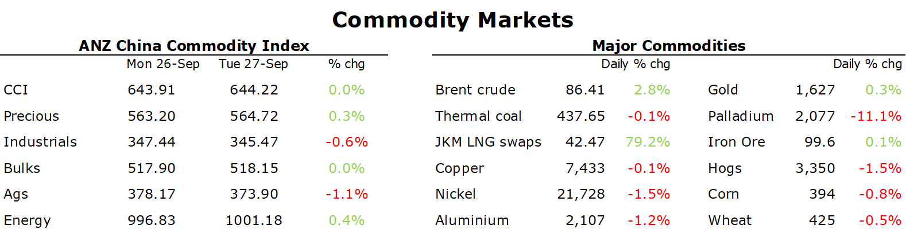

# Energy markets rally as risk of disruptions rise

**Date:** September 28, 2022  
**Publisher:** Breakwave Advisors | **Category:** Market Insights  
**Original URL:** [https://www.breakwaveadvisors.com/insights/2022/9/28/energy-markets-rally-as-risk-of-disruptions-rise](https://www.breakwaveadvisors.com/insights/2022/9/28/energy-markets-rally-as-risk-of-disruptions-rise)  

---

*By*[*Daniel Hynes*](https://www.linkedin.com/in/dahynes/)

An escalation in Europe’s energy crisis saw commodity markets gain as the focus returned to supply side issues. Some relief from selling was also found from a halt to the recent rally in the USD.

> **Figure 1: 1664320754965**  
> **Interactive Data & Source:** [Linkedin](https://www.linkedin.com/newsletters/commodities-wrap-6692196755876012032/?fbclid=IwAR3kiXJqZdxmp9ZcRwBNI7FsBySI-XSC0pfPur1qzjt7OZp7PTE59Tsl1QI) | [Local Asset](file:///C:/Users/Dell/Github/Shipping/corpus/03-breakwave/insights/2022/assets/2022-09-28_energy-markets-rally-as-risk-of-disruptions-rise_img_1664320754965_44007e4624b0.png)

**European natural gas**rallied as risks to further supply disruptions rattled an already fragile market. Dutch front month futures jumped more than 22% after Gazprom warned its Ukrainian counterpart Naftogaz of sanctions over a disagreement on payments. The Ukrainian state-run firm was seeking payments from Gazprom be made in-line with contract terms through a Swiss arbitration. For now, orders for gas flows via Ukraine remain steady. However traders remain on edge, with that route still delivering roughly half of the remaining Russian gas to Europe. This comes after the market was already digesting reports that the Nord Stream pipelines had been damaged. Denmark’s Prime Minister Mette Frederiksen said sabotage could not be ruled out as the cause of leaks. This has raised heightened concerns over the vulnerability of Europe’s energy infrastructure. While gas flows via this pipeline were already effectively stopped by Russia, it raises the spectre of ongoing shortages over coming winters. The spectre of European buyers increasing their reliance on LNG saw**North Asian LNG**futures rally alongside gains in Europe. Japan-Korea Marker November future rose 12.7% to USD42.47/MMBtu, as buyers returned to the market despite unease at the elevated price levels.

**Crude oil**rallied after reports that Russia is pushing for the OPEC+ alliance to cut production. The group of oil producing nations is due to meet early next month to discuss its production plans. They already announced a cut to output for October by 100kb/d and have warned of further reductions amid falling prices. There has been reports that Russia is pushing for a cut to output of at least 1mb/d. This comes ahead of Europe’s deadline for sanctions on Russian oil in early December. The market is also closely watching for disruptions in the Gulf of Mexico. Chevron and BP have both shut platforms southeast of New Orleans as Hurricane Ian bears down on the region.

Selling pressure in the**base metals**sector eased as the rise in USD abated.**Copper**managed to end the session higher after the DXY eased back from its recent record high. Nevertheless, the market remains concerned about the impact of rising interest rates on economic activity and thus demand. Norsk Hydro said it will cut annual aluminium production capacity by as much as 143,300t at two of its plans in Norway in response to reduced demand in Europe. That said, there is some growing optimism that easing restrictions in China could unleash a wave of demand for metals. Beijing is already pushing for increased investment in infrastructure and real estate. The market is ill-prepared to handle any sudden pickup. Inventories for most metals are near record lows, with supply shortages outweighing weaker demand.

That optimism was also present in the**iron ore**market. Futures rose for just the second time in ten sessions amid hopes Chinese stimulus measure will improve demand. The National Development and Reform Commission reiterated that new infrastructure will be the focus of pro-growth measures. Beijing will continue to front-load major projects. In further positive signs for demand, iron ore stockpiles at major Chinese ports fell 3.9% to 131.8.mt in the week through 23 Sep, according to Mysteel data.

**Gold**rebounded from a two year low after the USD slipped from its recent highs. Traders are also digesting signs for easing price pressures, after a fall in US durable goods in August.

Data source:[Commodities Wrap](https://www.linkedin.com/newsletters/commodities-wrap-6692196755876012032/?fbclid=IwAR3kiXJqZdxmp9ZcRwBNI7FsBySI-XSC0pfPur1qzjt7OZp7PTE59Tsl1QI)
