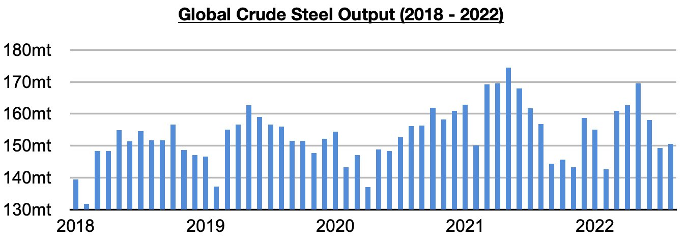
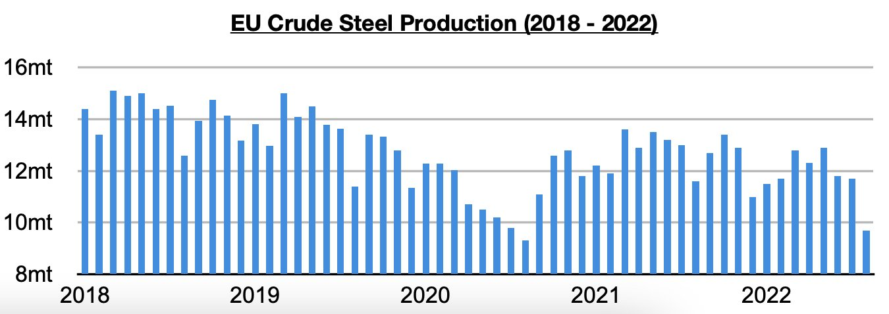

# Global Steel Production Continues to Contract Outside of China

**Date:** September 30, 2022  
**Publisher:** Breakwave Advisors | **Category:** Market Insights  
**Original URL:** [https://www.breakwaveadvisors.com/insights/2022/9/30/global-steel-production-continues-to-contract-outside-of-china](https://www.breakwaveadvisors.com/insights/2022/9/30/global-steel-production-continues-to-contract-outside-of-china)  

---

*By*[*Jeffrey Landsberg*](https://www.linkedin.com/in/jeffrey-landsberg-70ab957/)

Global crude steel production totaled 150.6 million tons last month. This is up month-on-month by 1.3 million tons (1%) but is 6.2 million tons (-4%) less than was reported last year for August 2021's production. Global crude steel production has now contracted on a year-on-year basis for twelve straight months. Last month marked the sixth straight month where production contracted on a year-on-year basis outside of China. In China, though, production finally grew after previously contracting for thirteenth straight months.

> **Figure 1: Chart 1 (52)**  
> [Local Asset](file:///C:/Users/Dell/Github/Shipping/corpus/03-breakwave/insights/2022/assets/2022-09-30_global-steel-production-continues-to-contract-outside-of-china_img_chart1285229_425511303f3f.jpg)

Global crude steel production outside of China totaled 66.7 million tons last month. This is down month-on-month by 1.2 million tons (-2%) and is 6.9 million tons (-9%) less than was reported last year for August 2021’s production. Concerning is that this has marked the sixth straight month with a year-on-year contraction and the largest since 2020. Overall, we remain quite bearish for the world outside of China. Prior to these last six months, crude steel production outside of China had grown on a year-on-year basis for twelve straight months.

> **Figure 2: Chart 3 (35)**  
> [Local Asset](file:///C:/Users/Dell/Github/Shipping/corpus/03-breakwave/insights/2022/assets/2022-09-30_global-steel-production-continues-to-contract-outside-of-china_img_chart3283529_df207d8b17a6.jpg)

As we have continued to highlight in Commodore's Weekly Dry Bulk Reports, we remain particularly concerned for Europe. The European Union produced approximately 9.7 million tons of crude steel last month. This is 2 million tons (-17%) less than was produced in July and is 1.9 million tons (-16%) less than was reported last year for August 2021’s production. EU crude steel production has now contracted on a year-on-year basis for nine consecutive months. Last month’s contraction has marked the largest seen since September 2020. The 9.7 million total also marks the smallest amount produced since August 2020.

> **Figure 3: Chart 3 (35)**  
> [Local Asset](file:///C:/Users/Dell/Github/Shipping/corpus/03-breakwave/insights/2022/assets/2022-09-30_global-steel-production-continues-to-contract-outside-of-china_img_chart3283529_df207d8b17a6.jpg)
