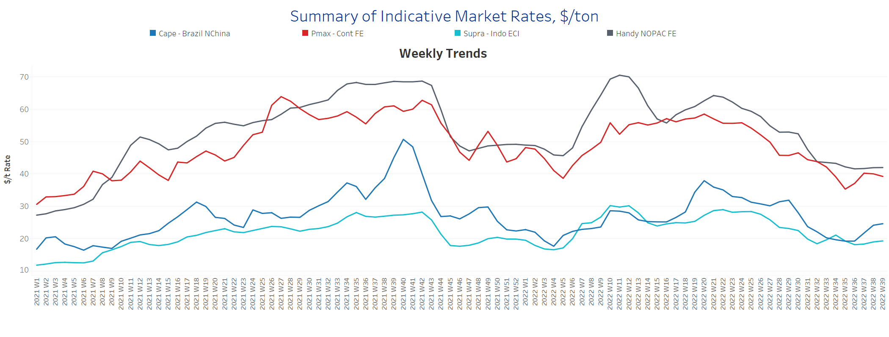
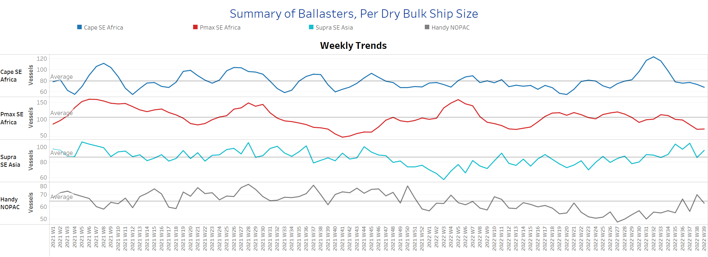
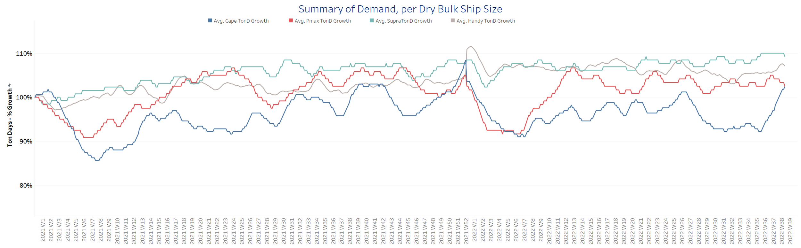
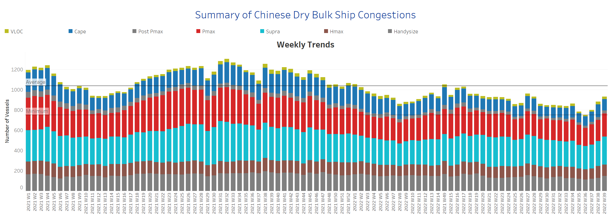

# Signal Dry Bulk Weekly Report

**Date:** September 30, 2022  
**Publisher:** Breakwave Advisors | **Category:** Market Insights  
**Original URL:** [https://www.breakwaveadvisors.com/insights/2022/9/30/signal-dry-bulk-weekly-report](https://www.breakwaveadvisors.com/insights/2022/9/30/signal-dry-bulk-weekly-report)  

---

Iron ore prices are rising toward the end of September, and low steel inventories indicate a possible increase in demand for blast furnaces. Stimulus measures announced by the Chinese government to boost the local economy in the summer following a series of COVID -19 closures appeared to add to the momentum in iron ore prices at the end of the third quarter this year. Iron ore futures rose to surprisingly high levels on Tuesday as strong construction activity fueled the recent price increase. The October benchmark iron ore price on the Singapore Exchange climbed 1.5% to a high of $97.05 per tonne, and market expectations suggest a further rise as giant builder Evergrande resumed 668 construction projects. Meanwhile, the construction industry is well supported by the China Development Bank's increase in the volume of infrastructure loans to local governments.

In the coal segment, Washington agreed with unions, averting a rail strike that would have shut down coal supplies to much of the nation's power plants. Nevertheless, prices remain near historic highs as energy crises around the world have led economies to rely more heavily on coal. In China, demand for coal has also increased significantly in recent days as escalating heat waves have dried up rivers from which hydroelectric power is generated. The upturn in coal demand prompted the IEA to estimate a 7% increase in European coal consumption this year, following a 14% rise last year.

In the grain segment, Chicago wheat futures fell below their three-month high of $9, reached on Sept. 22, on the back of the strong dollar and expectations of rising supply coupled with falling demand. According to Sovecon, the next Russian wheat crop is expected to exceed 100 million tonnes to offset losses due to a smaller crop in North America. Of note, despite the recent decline, prices are still above the 8-month low of $7.5 reached in August, when escalating geopolitical tensions raised fears that Russia could suspend the secure trade corridor from Ukraine's Black Sea ports agreed in a deal brokered by the UN.

## Section 1/ Freight -Market Rates ($/T) Firmer

‘The Big Picture’ - Capesize and Panamax Bulkers and Smaller Ship Sizes

> **Figure 1: Market Chart 1**  
> **Interactive Data & Source:** [Signal Ocean Platform](https://www.thesignalgroup.com/signal-ocean-platform) | [Local Asset](file:///C:/Users/Dell/Github/Shipping/corpus/03-breakwave/insights/2022/assets/2022-09-30_signal-dry-bulk-weekly-report_img_unnamed287929_60e897c7edfc.png)

During the last week of September, freight rate sentiment remained stable across all vessel categories, with a clear upward trend for Capesize vessels.

- **Capesize**freight rates from Brazil to North China rose to $25/tonne, up $5/tonne from the week 35 low.
- **Panamax**freight rates from the Continent to the Far Eastfor the second week in a row, with rates falling below $40/tonne, while sentiment remains better than four weeks ago.
- **Supramax**freight rates for the Indo-ECI route rose to $19/tonne, with an upward trend for late September.
- **Handysize**vessel freight rates from NOPAC to the Far East are still hovering below $42/tonne over the past three weeks, with no signs of a sharp decline yet.

## Section 2/ Supply -Ballasters (# Vessels) Decreasing

> **Figure 2: Supply Trend Lines for Key Load Areas**  
> **Interactive Data & Source:** [Signal Ocean Platform](https://www.thesignalgroup.com/signal-ocean-platform) | [Local Asset](file:///C:/Users/Dell/Github/Shipping/corpus/03-breakwave/insights/2022/assets/2022-09-30_signal-dry-bulk-weekly-report_img_unnamed288029_61f0f232779a.png)

The number of Capesize and Panamax vessels sailing with ballast has gradually declined over the past three weeks, while the number of Supramax and Handysize vessels has slowly declined after peaking last week.

- **Capesize**SE Africa: The number of vessels dropped to 68, a 44% decrease from the peak in week 32.
- **Panamax**SE Africa: The number of vessels continued the downward trend of the previous week and stood at 71, down 36% from week 33.
- **Supramax**SE Asia: The number of vessels increased again, although the trend was down last week. The final vessel count was 96, an increase of 10 vessels from the previous week.
- **Handysize**NOPAC: The number of vessels increased to 63,7 less than the previous week.

## Section 3/ Demand -TonDays Increasing

> **Figure 3: TonDays Increasing**  
> **Interactive Data & Source:** [Signal Ocean Platform](https://www.thesignalgroup.com/signal-ocean-platform) | [Local Asset](file:///C:/Users/Dell/Github/Shipping/corpus/03-breakwave/insights/2022/assets/2022-09-30_signal-dry-bulk-weekly-report_img_unnamed288129_ff6ca4adb8f0.png)

At the end of September, the surprising upward trend in Capesize vessels continued, while some firmness remained in the Supramax segment.

- **Capesize**demand ton-days: The percentage increase recorded its highest level since the beginning of the year.​​​​​​
- **Panamax**demand ton-days: The upward trend observed in the previous two weeks weakened, and weaker growth was recorded in the last week of September.
- **Supramax**demand ton-days: The percentage increase remains stable, with some downward correction observed towards the end of September.
- **Handysize**demand ton-days: Continued firmness is observed at levels above the week 32 low.

## Section 4/ Port Congestion -No of Vesselsincreasing

> **Figure 4: Dry Bulk Ships Congested at Chinese Ports**  
> **Interactive Data & Source:** [Signal Ocean Platform](https://www.thesignalgroup.com/signal-ocean-platform) | [Local Asset](file:///C:/Users/Dell/Github/Shipping/corpus/03-breakwave/insights/2022/assets/2022-09-30_signal-dry-bulk-weekly-report_img_unnamed288229_d6cc2281e625.png)

The number of congested vessels remains accelerated for the end of September, with a significant increase in the Panamax and Supramax segments.

- **Capesize:**The number of congested vessels decreased to 111, down 16 from the previous week.
- **Panamax:**The number of vessels increased to 226, only 4 fewer than the previous peak week 27.
- **Supramax:**The number of congested vessels increased to 276, 30 more than the previous week.
- **Handysize**: The number of congested vessels increased to 149, 20 more than the previous week.

Data Source:[Signal Ocean Platform](https://www.thesignalgroup.com/signal-ocean-platform)
