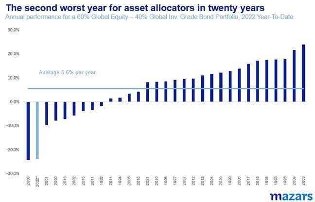
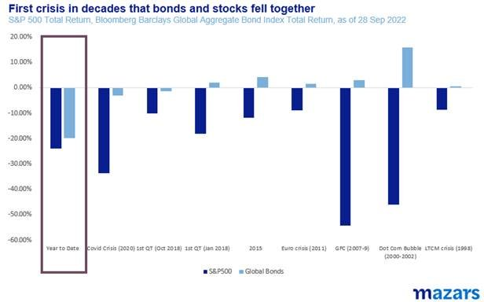
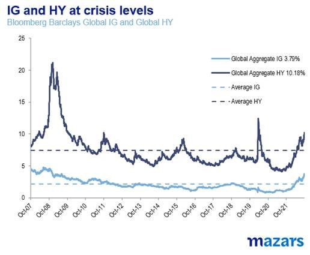
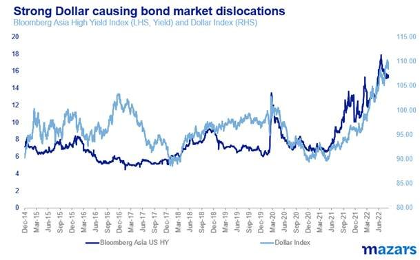
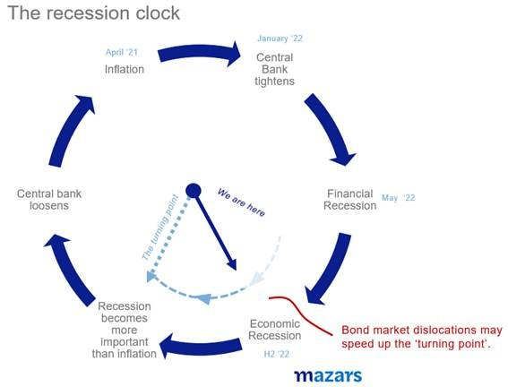
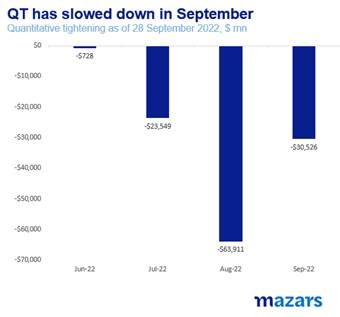
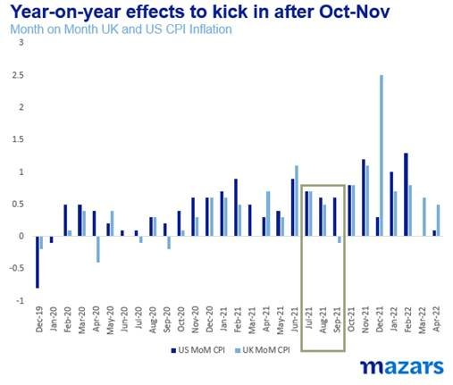

# Mazars Market Comment: ‘Bad news’ is on its way to becoming ‘Good news’ again

**Date:** October 03, 2022  
**Publisher:** Breakwave Advisors | **Category:** Market Insights  
**Original URL:** [https://www.breakwaveadvisors.com/insights/2022/10/3/mazars-comment-bad-news-is-on-its-way-to-becoming-good-news-again](https://www.breakwaveadvisors.com/insights/2022/10/3/mazars-comment-bad-news-is-on-its-way-to-becoming-good-news-again)  

---

*By*[*George Lagarias*](https://www.linkedin.com/in/george-lagarias-mba-3baa769/)

Every time I hear about quantitative easing, the lyrics of the Eagle’s 1976 classic “[Hotel California](https://www.youtube.com/watch?v=jVHhV3A5C5c)” come to mind: ‘You can check out any time you like, but you can never leave’. Quantitative easing is the ultimate tool to pacify markets. Once it was applied with success, it became very difficult for policymakers to consider other options to restore market calm. They can stop QE, and even reverse it for a while, but the moment markets become too wobbly, they will not hesitate to deploy it. The repercussions of not doing so are usually much more severe than an uptick in inflation.

Today’s environment is in some ways worse than in 2008. While during the global financial crisis a 60/40 equity/bond portfolio was slightly below than in 2022, it was mainly equities that suffered, while bondholders of safe bonds were largely spared. In fact that had been the case for every crisis in the past decades.

> **Figure 1: Market Chart 1**  
> **Interactive Data & Source:** [Youtube](https://www.youtube.com/watch?v=8n3ZiFHluMs) | [Local Asset](file:///C:/Users/Dell/Github/Shipping/corpus/03-breakwave/insights/2022/assets/2022-10-03_mazars-comment-bad-news-is-on-its-way-to-becoming-good-news-again_img_unnamed28829_dcb2369c422f.jpg)

This time around, both major asset classes suffer similarly. In other words, there’s[no place to run](https://www.youtube.com/watch?v=8n3ZiFHluMs).

> **Figure 2: Market Chart 2**  
> [Local Asset](file:///C:/Users/Dell/Github/Shipping/corpus/03-breakwave/insights/2022/assets/2022-10-03_mazars-comment-bad-news-is-on-its-way-to-becoming-good-news-again_img_image009_b933889e22b0.jpg)

Making things worse, September and October usually are not good months for investors, a fact not lost on robots deploying trading strategies. And as days pass, more evidence suggests that bond markets are experiencing significant dislocations, spilling over from high yield to investment-grade assets.

High-yield and emerging market bonds are seeing a very persistent rise in yields. Even investment grade markets yields are significantly higher than the average of the past few years.

> **Figure 3: Market Chart 3**  
> [Local Asset](file:///C:/Users/Dell/Github/Shipping/corpus/03-breakwave/insights/2022/assets/2022-10-03_mazars-comment-bad-news-is-on-its-way-to-becoming-good-news-again_img_image010_30e8578c4a0c.jpg)

The dislocations were thought to be contained within the high-yield space. However, the world was perturbed last week when the UK 30-year bond yield rose from 3.5% to 5% in four days, (a 15 standard deviation event), while the Pound plunged more than when George Soros broke the Bank of England in 1992. Yes, the UK budget was a gamble (that clearly did not pan out), but still, the market reaction was extreme. The message to investors globally was clear: Bond markets are getting distressed. Equity markets can afford the volatility. Bond markets, which are run by pension funds and tight risk controls and include the ‘safer assets’ can’t afford anywhere near that stress. The experiences from 2008 are still fresh.

The culprit behind these dislocations is the Fed and the super-strong Dollar.

> **Figure 4: Market Chart 4**  
> [Local Asset](file:///C:/Users/Dell/Github/Shipping/corpus/03-breakwave/insights/2022/assets/2022-10-03_mazars-comment-bad-news-is-on-its-way-to-becoming-good-news-again_img_image01128129_3a5c1694fae7.jpg)

The Fed is forcing other central banks to defend their currencies versus the Dollar, or else face higher input inflation. Many of these countries don’t have enough growth to withstand the higher rates. This game was always difficult. But now, well before it breaks local economies, the strong Dollar and Quantitative Tightening may be breaking things in the bond markets. The calculus becomes simple: If the wrong things break, then we could see contagion in the global financial system. To save a few billion, central banks might be forced to spend trillions in a matter of a few months.

**Yet this may all be good news. We are quickly reaching an inflection point.**The standard liquidity cycle model suggested that central banks would eventually reach a point when they would consider the ills of a recession worse than the ills of inflation. This would happen either if inflation fell a lot, or if growth stalled enough that inflation became a secondary concern. Yet markets once again move faster than the economy.**Before the economy becomes problematic, it may be that bond markets will have forced central banks to pour fresh money into markets, and send risk assets up again.**

> **Figure 5: Market Chart 5**  
> [Local Asset](file:///C:/Users/Dell/Github/Shipping/corpus/03-breakwave/insights/2022/assets/2022-10-03_mazars-comment-bad-news-is-on-its-way-to-becoming-good-news-again_img_image012_d1397b4f06ac.jpg)

Central Bankers are all painfully aware of the impact of belayed reaction to market stresses. That is why the Bank of England was so quick to intervene. Instead of withdrawing £80bn from markets, it may add nearly as much in the next few days. It may claim that its quantitative tightening target stands, but we now know it’s much easier to print trillions than withdraw billions. The ECB has already been buying Italian bonds. The People’s Bank of China is reducing rates, as it faces faltering economic growth. And even the Fed has greatly reduced Quantitative Tightening in September. In the past four months it has reduced its balance sheet by half the amount it said it would.

> **Figure 6: Market Chart 6**  
> [Local Asset](file:///C:/Users/Dell/Github/Shipping/corpus/03-breakwave/insights/2022/assets/2022-10-03_mazars-comment-bad-news-is-on-its-way-to-becoming-good-news-again_img_image013_4865a77e8cf5.jpg)

While residual liquidity is enough, it remains locked by Private Equities and institutional investors. If the Fed isn’t buying, neither do they. The Fed may well have to reverse and return liquidity to the markets in the next few weeks if bond market dislocations persist, to unlock other market forces. Besides, inflation year-on-year numbers could improve markedly after October.

> **Figure 7: Market Chart 7**  
> [Local Asset](file:///C:/Users/Dell/Github/Shipping/corpus/03-breakwave/insights/2022/assets/2022-10-03_mazars-comment-bad-news-is-on-its-way-to-becoming-good-news-again_img_image014_6633b62bd3d1.jpg)

### So These Are the Three Things Investors Need to Know:

1. **We****are near a turning point where more liquidity may be added to markets by the Fed**. Central banks are close to prioritise market stability to tempering inflation. Besides there’s no evidence that quantitative easing, when used to provide emergency liquidity, is inflationary. If the Fed starts printing again, we would not be surprised if risk assets rebound sharply.

**2. The News cycle may remain particularly worrying**. The combination of UK economic and possibly political instability, the ongoing war in Ukraine, rising inflation and pressures on business models may persist well beyond the end of the year. Portfolios, where a lot of bad news is already discounted, could begin to rebound despite a persistently bad newsflow.

**3. Expect less political drama**. The extreme market reaction to Mr Kwarteng’s budget may prove to be a blessing in disguise. Governments, who for years have relied on central banks to keep investors calm even when leaders made extreme pronouncements, now understand the implications of distressed markets and lack of a safety net. Investors all expected the incoming Italian PM, Georgia Meloni to make some sort of extreme statements upon her electoral win. Instead, she has been particularly quiet.

**In short, central bank concerns and reactions suggest that we may be approaching a turning point for markets. This is usually the most tumultuous period, and the one that requires the most patience from investors. It is that tumult exactly that may force central banks to reverse course and help asset prices.**
