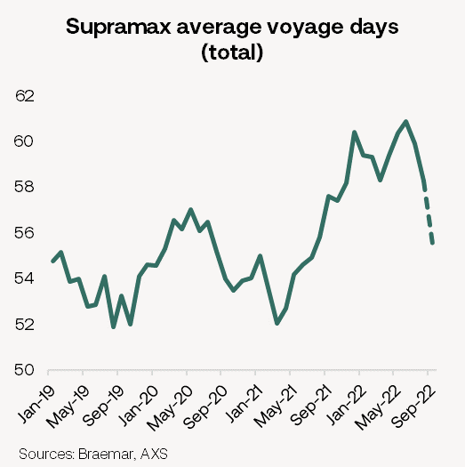
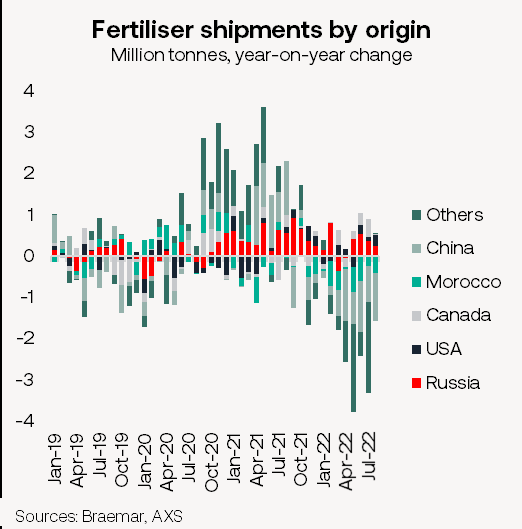
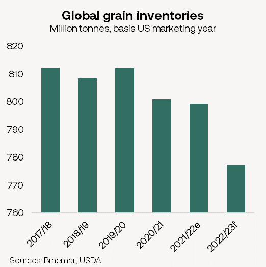

# The Big Picture: Supramax update

**Date:** October 03, 2022  
**Publisher:** Breakwave Advisors | **Category:** Market Insights  
**Original URL:** [https://www.breakwaveadvisors.com/insights/2022/10/3/the-big-picture-supramax-update](https://www.breakwaveadvisors.com/insights/2022/10/3/the-big-picture-supramax-update)  

---

*By*[*Alexandra Alatari*](https://www.linkedin.com/in/alexalatari/)

## Looking Towards Q4 and Beyond

Supramaxes continue to outperform larger bulk carriers. Today we look into how they have fared during the current market downturn and what the main drivers will be in the short and medium term.

## Current State of the Market

The extent of the recent collapse in Capesize earnings was not mirrored in the Supramax segment. However, BSI embarked on a downward trend since May and dropped to a low of $16,199/d on 12 September, a 55% decline. Since then, it has bounced back and steadily improved to $18,500k/d (as of 28 Sep).

While Supramax trade shrank by 5.6% over January—August this year compared to 2021, demand alone cannot justify the slump. Nowadays, the fleet is also running more efficiently. Trade diversions caused by the war have boosted Capesize average voyage distances, but Supramax trades have rapidly become shorter-haul. Meanwhile, congestion remains at seasonal highs allowing the market to form a floor higher than other segments.

> **Figure 1: Market Chart 1**  
> [Local Asset](file:///C:/Users/Dell/Github/Shipping/corpus/03-breakwave/insights/2022/assets/2022-10-03_the-big-picture-supramax-update_img_image028529_e62f69cfc745.png)

## Q4 and 2023

A deteriorating economic outlook is a major headwind for shipping. Lower consumer confidence, higher borrowing costs and soaring energy prices all weigh on industrial demand. Manufacturing activity is very highly correlated with minor bulk trade, which reflects c.60% of Supramax demand. Looking at steel backhaul volumes for instance, which proved particularly tonne-mile intensive for Supras over the past couple of years, they have now come back down to earth. Despite a bleaker macro environment, we do not anticipate a collapse in minor bulk demand as global inventories remain on the low side in the post-pandemic world.

Grain trades are also likely to cause a headache in 2023. While demand is not an issue, future supplies are a major concern. The USDA currently forecasts a 36 million tonne or a 1.3% drop in global grain output in the 2022/23 marketing year (Sep-Aug). On top of further losses from Ukraine, the acute fertiliser shortage could pose a significant threat to crop yields. Meanwhile, production curbs and export restrictions in major producing countries could affect Supramax utilisation. In fact, fertiliser cargoes accounted for over 10% of geared ship demand last year versus less than 7% last month. In the meantime however, a strong US soybean season is upon us to be followed by a record Brazilian harvest, currently pegged at 149mt, up from 126mt in 2022.

> **Figure 2: Market Chart 2**  
> [Local Asset](file:///C:/Users/Dell/Github/Shipping/corpus/03-breakwave/insights/2022/assets/2022-10-03_the-big-picture-supramax-update_img_image128529_74e25d3ae7da.png)

The potential easing of congestion is a major risk to the downside as it would accelerate active fleet growth at a time of softening demand. Although it is impossible to forecast the exact timing, we reckon Supramax congestion will stay above typical historical levels in the coming months.

## 2024 Onwards

As discussed in our Big Picture dated 1 September 2022, China is saturated with traditional infrastructure projects and hesitant to overhaul its ailing housing market. Instead, Beijing is focusing on less steel-intensive projects which are aligned with its long-term aspirations to move away from investment to services and advanced manufacturing. This structural shift will not happen overnight but it will gradually render the country more dependent on ferrous metals, minor ores and minerals. As such, China’s import growth over the next decade will be skewed towards geared ships.

Grains should be another major driver once production bottlenecks ease and inflation subsides. Not only is grain demand set to rise in line with population growth, but restocking demand should also emerge. Global grain inventories came off in 2020 as the pandemic highlighted the importance of food security. A further 4% drawdown is estimated for 2023, which would see stocks retreat to a 6-year low.

> **Figure 3: Market Chart 3**  
> [Local Asset](file:///C:/Users/Dell/Github/Shipping/corpus/03-breakwave/insights/2022/assets/2022-10-03_the-big-picture-supramax-update_img_image228529_44299b1ffe45.png)

Meanwhile the Supramax fleet is entering a period of slower growth. We estimate a 2.4% expansion p.a. on average until 2026 vs 6.5% p.a. over the past decade. Although low by historical standards, it will coincide with a period of flattish seaborne trade growth. That said, with dry bulk demand growth in the following years stemming almost exclusively from grains and minor bulks, the Ultra/ Supramax segment is favoured in the medium-to-long term.

## Summary

Overall, we anticipate a rather stable Q4 with mild fluctuations. Headwinds pile up for 2023 as a global economic deceleration and the war impact bite. However, we do not foresee a return to previous lows in our base case scenario as supply-demand fundamentals appear healthier compared to past downturns. The dry bulk market should gradually rebalance from 2024 onwards and Ultras/Supras are primed to benefit the most.
