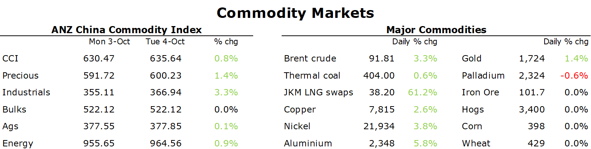

# Commodities gain amid risk-on tone across markets

**Date:** October 05, 2022  
**Publisher:** Breakwave Advisors | **Category:** Market Insights  
**Original URL:** [https://www.breakwaveadvisors.com/insights/2022/10/5/commodities-gain-amid-risk-on-tone-across-markets](https://www.breakwaveadvisors.com/insights/2022/10/5/commodities-gain-amid-risk-on-tone-across-markets)  

---

*By*[*Daniel Hynes*](https://www.linkedin.com/in/dahynes/)

Commodities rallied as concerns over further tightening eased. This was compounded by a rally in energy amid ongoing supply side issues.

> **Figure 1: 1664922775917**  
> **Interactive Data & Source:** [Linkedin](https://www.linkedin.com/newsletters/commodities-wrap-6692196755876012032/?fbclid=IwAR3kiXJqZdxmp9ZcRwBNI7FsBySI-XSC0pfPur1qzjt7OZp7PTE59Tsl1QI) | [Local Asset](file:///C:/Users/Dell/Github/Shipping/corpus/03-breakwave/insights/2022/assets/2022-10-05_commodities-gain-amid-risk-on-tone-across-markets_img_1664922775917_7b382b8127c3.png)

**Crude oil**prices surged higher amid speculation that OPEC is considering an even larger cut to production than first thought. The group is said to be considering a cut of up to 2mb/d, according to media reports. Based on current discussions, the curbs would use existing baselines to measure each country’s contribution. Several members are already pumping below their official quotas, meaning they would automatically be in compliance with the new limit without having to actually change their output. In any case, it would send a strong message that the group is determined to support the market. Saudi Arabia and other members have previously said that current prices don’t reflect the underlying fundamentals. A reduction in output on this scale would significantly tighten the market. Inventories are relatively low and European sanctions are not due to kick in until December. This tightness could be exacerbated by a rebound in Chinese demand if it can contain outbreaks of COVID-19.

**European natural gas**extended recent losses amid mild weather and rising stockpiles. Higher-than-normal temperatures are seen in the UK and continental Europe over the next two weeks. This will keep withdrawals from storage facilities low, despite the heating season officially underway. Reserves have been filling at a steady pace amid an influx of LNG. Pipeline gas from Norway has also recovered from recent disruptions to grow strongly. Nevertheless, the challenges over winter remain. Without Russia supply, Europe will still struggle to build inventories for next year. Commodities trader Gunvor said the market is already anticipating flows via Ukraine will eventually stop. Vitol Group said gas markets remained very stressed while Trafigura remains concerned about the following winter.**North Asian LNG**futures edged lower as mild weather in the region boosted restocking efforts. The respite might not last long, with surging shipping rates showing that buyers are still keen to secure LNG cargoes ahead of winter.

**Copper**led the**base metal**sector higher after US data raised the spectre of less aggressive rate hikes. US job openings plummeted the most since the start of the pandemic. Tighter monetary policy has been a strong headwind for base metals, with concerns demand will falter amid higher borrowing costs. The USD also pushed lower, adding support to commodities that are predominantly consumed by non-USD denominated countries. There is also growing speculation that Beijing may soon start relaxing its zero-COVID strategy. Even a partial relaxation would be welcome news for the sector. Demand has been crippled by the ongoing lockdowns across the country. Even so, we are seeing signs of improvement. The ANZ copper demand indicator has rebounded strongly in recent months. Aluminium and zinc found additional support from fears of further supply disruptions amid high energy prices.

**Iron ore futures**in Singapore also gained. Any easing of virus curbs could give extra impetus to efforts to revive China’s property market. The PBoC announced last week that it will allow some cities to cut mortgage rates.

**Gold**pushed back above USD1700/oz for the first time in nearly four weeks as sentiment continues to turn move bullish. The precious metal has been under pressure as tighter monetary policy and a stronger USD has weighed on investor demand. Further softening of the labour market will be required for this rally to continue. This places much importance on US non-farm payrolls this week for any clues on the future path of central bank monetary policy.

Data source:[Commodities Wrap](https://www.linkedin.com/newsletters/commodities-wrap-6692196755876012032/?fbclid=IwAR3kiXJqZdxmp9ZcRwBNI7FsBySI-XSC0pfPur1qzjt7OZp7PTE59Tsl1QI)
