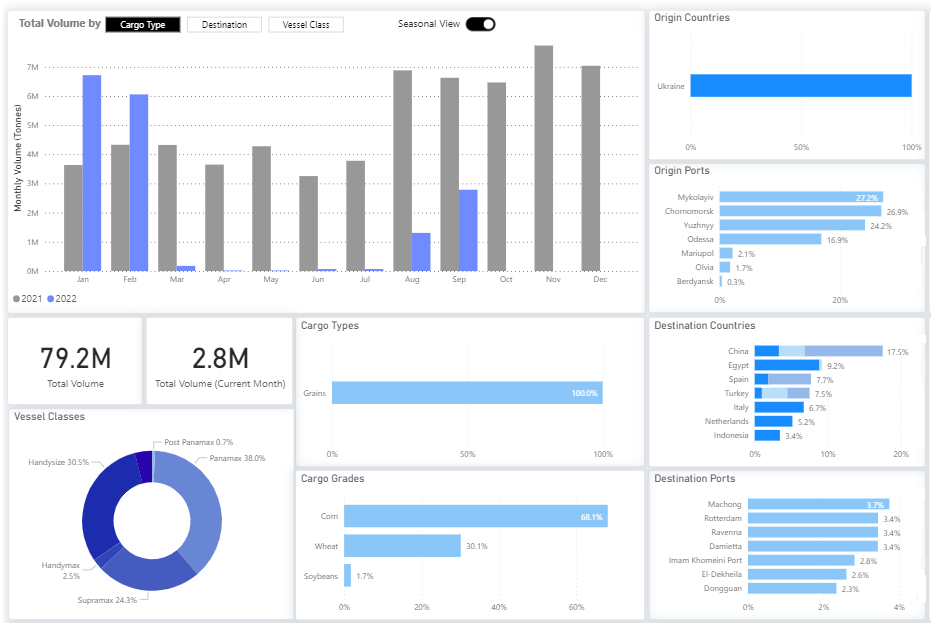
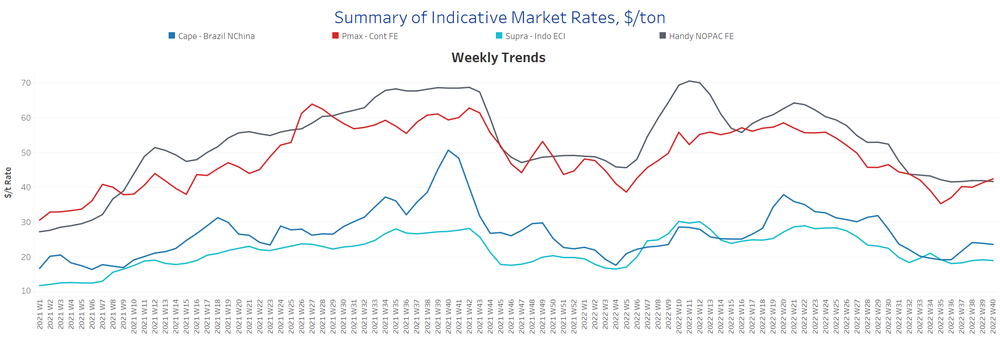
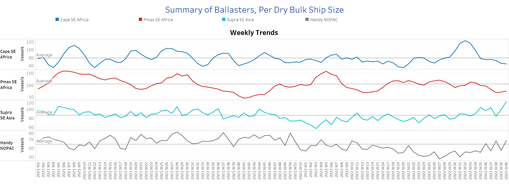
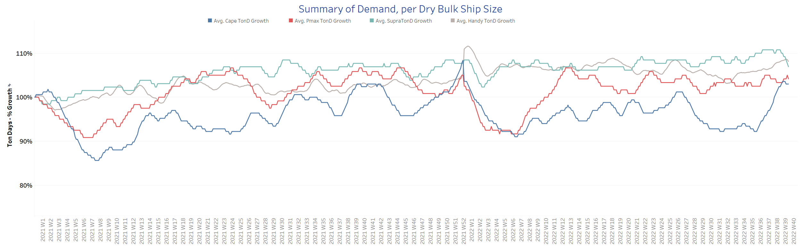
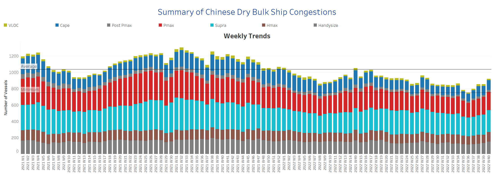

# Signal Dry Bulk Weekly Report

**Date:** October 05, 2022  
**Publisher:** Breakwave Advisors | **Category:** Market Insights  
**Original URL:** [https://www.breakwaveadvisors.com/insights/2022/10/5/signal-dry-bulk-weekly-report](https://www.breakwaveadvisors.com/insights/2022/10/5/signal-dry-bulk-weekly-report)  

---

In the first days of October, freight rates have firmed in the Panamax segment, while Capesize has seen a slight downward trend and Supramax rates have stabilised in the last four weeks. In the Handysize segment, the outlook is still weaker compared to the August highs, as the grain corridor in Ukraine does not seem to have led to an increase in freight rates yet. However, September ended with a rebound in monthly grain flows from Ukraine to all countries, with China accounting for the lion's share of monthly shipments at 18%. (see image below)

In the iron ore market, prices fell to $98per ton as the Golden Week in China dampened sentiment for October prices and raised fears that the announced stimulus program would not be enough to boost construction and economic growth in the world's second-largest economy. The week's interest was in the coal segment, with Rueter's news reporting Chinese coal traders rushing imports from the small town of Ganqimaodu on the Mongolian border as prices for the fuel rose nearly 40% month-on-month amid rising industrial demand.

## Grain Seaborne Flows From Ukraine to All Destinationsa Rebound in Monthly Volumes in August-September, But Still Well Below the January-February Peaks

> **Figure 1: Grain Seaborne Flows From Ukraine to All Destinations**  
> **Interactive Data & Source:** [Signal Ocean Platform](https://go.signalocean.com/e/983831/dry-reports-drybulkflows/2jy1yr/277259569?h=3VJWa0c097j-sOTUebDdAfil9YOhDKtfoEBCcNpIlAw) | [Local Asset](file:///C:/Users/Dell/Github/Shipping/corpus/03-breakwave/insights/2022/assets/2022-10-05_signal-dry-bulk-weekly-report_img_unnamed288329_f028daa34718.png)

Data Source: The Signal Ocean Platform, Dry Bulk Flows, From Ukraine to ALL Countries,

## Section 1/ Freight -Market Rates ($/T) Weaker

‘The Big Picture’ - Capesize and Panamax Bulkers and Smaller Ship Sizes

> **Figure 2: Market Chart 2**  
> **Interactive Data & Source:** [Signal Ocean Platform](https://www.thesignalgroup.com/signal-ocean-platform) | [Local Asset](file:///C:/Users/Dell/Github/Shipping/corpus/03-breakwave/insights/2022/assets/2022-10-05_signal-dry-bulk-weekly-report_img_unnamed288429_908852f47ba0.png)

​​​​​​In the first week of October, sentiment increased for Panamax ship freight rates, while a downward trend was observed for other ship size classes

- **Capesize**freight rates from Brazil to North China fell to less than $24/tonne, and it appears that the downward trend will continue in the coming days.
- **Panamax**freight rates from the Continent to the Far East rose to $42/tonne, up $7/tonne from the week 35 low.​​​​​​
- **Supramax**freight rates for the Indo-ECI route remained at a level of $19/tonne, with no signs of a downward trend yet.
- **Handysize**vessel freight rates from NOPAV to the far East continue to hover below $42/tonne over the past 4 weeks, with a sustained decline emerging in the first days of October.

## Section 2/ Supply -Ballasters (# Vessels) Increasing

> **Figure 3: Supply Trend Lines for Key Load Areas**  
> **Interactive Data & Source:** [Signal Ocean Platform](https://www.thesignalgroup.com/signal-ocean-platform) | [Local Asset](file:///C:/Users/Dell/Github/Shipping/corpus/03-breakwave/insights/2022/assets/2022-10-05_signal-dry-bulk-weekly-report_img_unnamed288529_fec19df91b95.png)

The number of Capesize and Panamax vessels sailing with ballast is still below the annual average for the past four weeks, while the number of Supramax and Handysize vessels jumped, with Supramax vessels reaching their highest level in the past year.

- **Capesize**SE Africa: The number of vessels dropped to 64, a 48% decrease from the peak in week 32.
- **Panamax**SE Africa: The number of vessels was 77, up 7 from two weeks ago, but still well below the yearly average of 105 vessels.
- **Supramax**SE Asia: The number of vessels increased to 117, up 40% from the low in week 38.
- **Handysize**NOPAC: The number of vessels increased to 69, 12 more than the previous week.

## Section 3/ Demand -TonDays Increasing

> **Figure 4: TonDays Increasing**  
> **Interactive Data & Source:** [Signal Ocean Platform](https://www.thesignalgroup.com/signal-ocean-platform) | [Local Asset](file:///C:/Users/Dell/Github/Shipping/corpus/03-breakwave/insights/2022/assets/2022-10-05_signal-dry-bulk-weekly-report_img_unnamed288629_acdade23d398.png)

The surprising upward trend in Capesize vessels recorded a gradual slowdown for the first days of October, while we have seen an upturn in the Handysize segment and a clear downward trend in the Supramax.

- **Capesize**demand ton-days: The percentage increase recorded its highest level this year in the last week of September, with a downward correction in early October.
- **Panamax**demand ton-days: The weaker growth recorded in the last week of September continued, and it remains to be seen whether there will be a recovery in the coming days.
- **Supramax**demand ton-days: The stable outlook of the last few days was undermined by a sudden drop to the lowest level since week 35.
- **Handysize**demand ton-days: The percentage increase in early October appears to be the highest since the beginning of the second quarter of this year.

## Section 4/ Port Congestion -No of Vesselsincreasing

> **Figure 5: Dry Bulk Ships Congested at Chinese Ports**  
> **Interactive Data & Source:** [Signal Ocean Platform](https://www.thesignalgroup.com/signal-ocean-platform) | [Local Asset](file:///C:/Users/Dell/Github/Shipping/corpus/03-breakwave/insights/2022/assets/2022-10-05_signal-dry-bulk-weekly-report_img_unnamed288729_9557f202ad2d.png)

The number of congested vessels remains elevated for the third week in a row, with a significant increase in the Handysize segment and upward movements in other vessel size classes.

- **Capesize:**The number of congested vessels increased to 119, 8 more than the previous week.
- **Panamax:**The number of vessels has increased to 222, which is 5 more than the previous week (216 ships) at the end of September.
- **Supramax:**The number of congested vessels increased to 269, 23 more than the previous week.
- **Handysize**: The number of congested vessels increased to 152, 18 more than the previous week.

Data Source:[Signal Ocean Platform](https://www.thesignalgroup.com/signal-ocean-platform)
