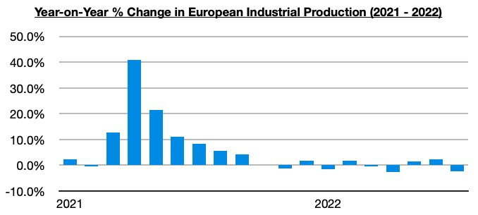

# Decades Where Nothing Happens, And Weeks When Decades Happen

**Date:** October 06, 2022  
**Publisher:** Breakwave Advisors | **Category:** Market Insights  
**Original URL:** [https://www.breakwaveadvisors.com/insights/2022/10/6/decades-where-nothing-happens-and-weeks-when-decades-happen](https://www.breakwaveadvisors.com/insights/2022/10/6/decades-where-nothing-happens-and-weeks-when-decades-happen)  

---

*By*[*Jeffrey Landsberg*](https://www.linkedin.com/in/jeffrey-landsberg-70ab957/)

There are decades where nothing happens, and there are weeks when decades happen. Last week was the latter. Last week began with the pound experiencing a flash crash, and then two days later the Bank of England pivoting away from quantitative tightening. The central bank announced it will begin buying bonds in order to “restore orderly market conditions.” This decision is problematic as UK inflation remains near forty-year highs. For a central bank to need to practice any quantitative easing while citizens are already being bludgeoned by rampant inflation is harmful for any nation and unfortunately has marked a sudden change in policy.

Outside of this change of policy (which unfortunately might also occur in other major economies as the US dollar remains extremely strong), last week was very significant as Nord Stream was reportedly sabotaged by a still yet to be determined nation. The attack occurred just as four regions in Ukraine voted to join Russia (in what many are calling sham elections). Nord Stream is a pair of natural gas pipelines that run under the Baltic Sea from Russia to Germany. The pipelines were not in operation at the time of the attack, but Europe has now lost the option of getting the gas turned back on again. Prior to the attack on Nord Stream, Russia’s unjust war was physically being fought in only one nation. Now, though, the war has physically extended into international waters. In addition, the global energy crisis has also now entered a new phase, as the prospect of Russian gas flowing back to Europe has been eliminated for an indefinite period.

For the dry bulk market, it is concerning that the United Kingdom is practicing quantitative easing again. Our concern is that other nations will follow, that global inflation will not subside, and that industrial demand destruction will continue to intensify. The Nord Stream attack, though, is at least a positive for our market as thermal coal demand is set to continue to grow. Going forward, the dry bulk market needs ongoing improvement in China to continue to offset deterioration in much of the rest of the world. Several major economies continue to experience industrial production contraction, including Europe recently falling back into contraction again. As we discussed for our clients in this week's Weekly Dry Bulk Report, European industrial production most recently contracted on a year-on-year basis by 2.2%. European industrial production has now contracted on a year-on-year basis during three of the last five months.

> **Figure 1: Chart 1 (53)**  
> [Local Asset](file:///C:/Users/Dell/Github/Shipping/corpus/03-breakwave/insights/2022/assets/2022-10-06_decades-where-nothing-happens-and-weeks-when-decades-happen_img_chart1285329_06cfa1d7c317.jpg)
