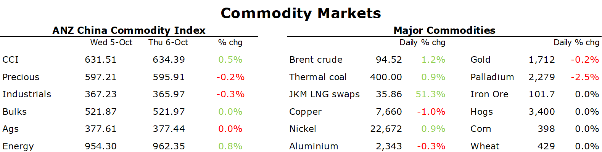

# Metals gain as LME places restrictions on Russian zinc and aluminium

**Date:** October 07, 2022  
**Publisher:** Breakwave Advisors | **Category:** Market Insights  
**Original URL:** [https://www.breakwaveadvisors.com/insights/2022/10/7/metals-gain-as-lme-places-restrictions-on-russian-zinc-and-aluminium](https://www.breakwaveadvisors.com/insights/2022/10/7/metals-gain-as-lme-places-restrictions-on-russian-zinc-and-aluminium)  

---

*By*[*Daniel Hynes*](https://www.linkedin.com/in/dahynes/)

Supply side issues dominated sentiment. The spectre of further disruptions saw metals and energy rise. This offset the headwinds from hawkish central banks that helped push the USD higher.

> **Figure 1: European Natural Gasedged Up**  
> *European natural gasedged up, as a proposal to cap prices hangs over the market. Italy, Greece, Poland and Belgium have proposed creating a corridor or range around the prices cap at the region’s biggest trading hubs, according to a Bloomberg report. This comes as European Union leaders meet in Prague to discuss ways to contain the energy crisis. While details are yet to be ironed out, the industry is concerned that such a move would hinder supplies as Europe seeks alternatives to dwindling Russian deliveries. TotalEnergies’ CEO, Patrick Pouyanne, urged governments to rely on companies and let the market do its work. He added that attracting more LNG to Europe will mean paying a more than Asian buyers.North Asian LNGfutures gained on the prospect of increased competition from European buyers, exacerbated by supply disruptions. Malaysia’s Petroliam Nasional Bhd declaredforce majeureafter a pipeline leak at its export terminal. It will subsequently curb shipments to Japan this winter.*  
> **Interactive Data & Source:** [Linkedin](https://www.linkedin.com/newsletters/commodities-wrap-6692196755876012032/?fbclid=IwAR3kiXJqZdxmp9ZcRwBNI7FsBySI-XSC0pfPur1qzjt7OZp7PTE59Tsl1QI) | [Local Asset](file:///C:/Users/Dell/Github/Shipping/corpus/03-breakwave/insights/2022/assets/2022-10-07_metals-gain-as-lme-places-restrictions-on-russian-zinc-and-aluminium_img_unnamed288929_8d1362b87e28.png)

**Crude oil**extended gains as the fallout from OPEC’s aggressive output cut continued. At a hastily arrange in-person meeting in Vienna, the**OPEC+**alliance agreed to cut current production quotas by 2mb/d. Due to some members still below current quotas, the effective cut is close to half that level. The decision drew a swift rebuke from the US. However, top energy advisor, Amos Hochstein, said the cuts have had a smaller effect on prices than the White House expected. President Biden said the administration is now weighing up its response. Options include a further release of oil from the strategic reserve. Despite the bullish tone the move created, Saudi Arabia defied expectations on pricing for its own crude. It left the premium on its Arab light grade unchanged at USD5.85/bbl. All grades for Northwest Europe and the Mediterranean were cut. The production cut leaves the market vulnerable to further volatility and will come just as European sanctions on Russian oil kick in. The agreement is also extended to the end of 2023, which could mean supply is constrained just as Chinese demand recovers from a lockdown-induced slowdown.

**Zinc and aluminium**climbed after the London Metal Exchange said it will restrict deliveries of some Russian metal. Starting immediately, metal from UMMC or its Chelyabinsk Zinc unit can only be delivered to LME warehouses if the owner can prove it won’t constitute a breach of recent sanctions on the firm’s co-founder, Iskandar Makhmudov. This gave support to the base metals complex, which has been under pressure amid weak demand in China and a slowing global economy. Last week it emerged that the LME was considering a wider ban on all Russian-sourced metal. United Co Rusal International warned banning its aluminium would damage the standing of the LME. Zinc jumped as much as 4.9% following the announcement. However, metals gave up some of the gains as a rally in the USD weighed on investor appetite.

**Gold**also slipped as fresh data painted a mixed picture on the US economy. There is also a view that OPEC’s production cut might keep the Fed on an aggressive rate hike cycle longer as it battles to contain inflation.

**Iron ore**futures were steady in Singapore following gains earlier this week amid increased support for the China’s property sector. Trading in China has been closed this week due to Golden Week holidays.

Data source:[Commodities Wrap](https://www.linkedin.com/newsletters/commodities-wrap-6692196755876012032/?fbclid=IwAR3kiXJqZdxmp9ZcRwBNI7FsBySI-XSC0pfPur1qzjt7OZp7PTE59Tsl1QI)
