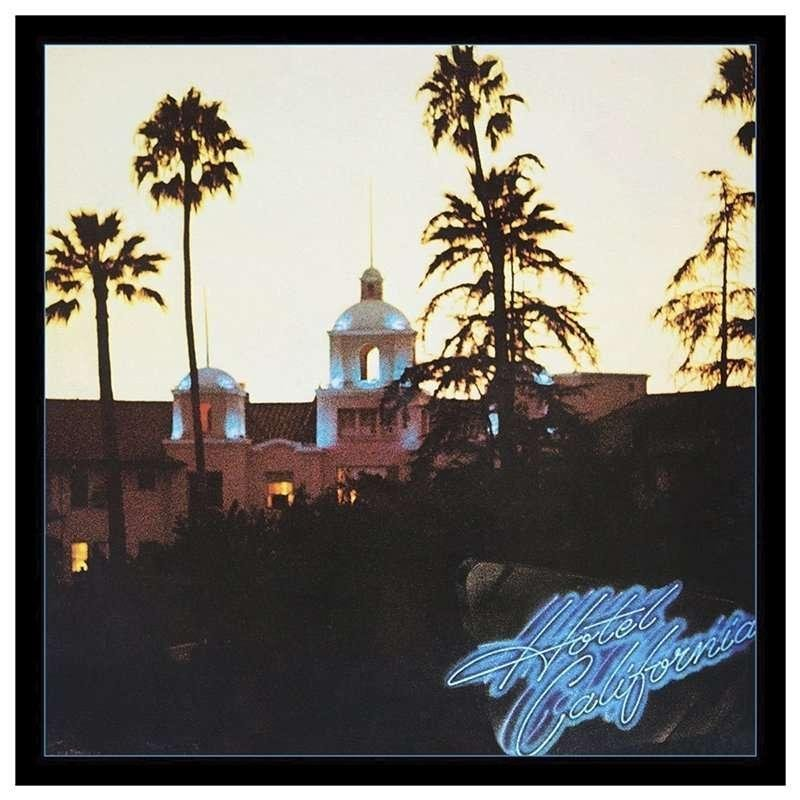

# Weekly Insights Review

**Date:** October 09, 2022  
**Publisher:** Breakwave Advisors | **Category:** Market Insights  
**Original URL:** [https://www.breakwaveadvisors.com/insights/2022/10/9/weekly-insights-review](https://www.breakwaveadvisors.com/insights/2022/10/9/weekly-insights-review)  

---

## Welcome to Our Weekly Insights Review

## Read Here Everything You Need to Know

> **Figure 1: A80e6deb 343e 40ce A7c6 6a049e8ee734 Hotel California (1)**  
> **Interactive Data & Source:** [Breakwave Advisors Market Insights](https://www.breakwaveadvisors.com/insights/2022/10/3/the-big-picture-supramax-update) | [Local Asset](file:///C:/Users/Dell/Github/Shipping/corpus/03-breakwave/insights/2022/assets/2022-10-09_weekly-insights-review_img_a80e6deb-343e-40ce-a7c6-6a049e8ee734_6c837a1e10b5.jpg)

## Mazars Market Comment: ‘Bad News’ Is on Its Way to Becoming ‘Good News’ Again

## Things Investors Need to Know

Every time I hear about quantitative easing, the lyrics of the Eagle’s 1976 classic “[Hotel California](https://www.youtube.com/watch?v=jVHhV3A5C5c)” come to mind: ‘You can check out any time you like, but you can never leave’. Quantitative easing is the ultimate tool to pacify markets.
[Read More](https://www.breakwaveadvisors.com/insights/2022/10/3/mazars-comment-bad-news-is-on-its-way-to-becoming-good-news-again)

## The Big Picture: Supramax Update

## Supramaxes Continue to Outperform Larger Bulk Carriers

Today we look into how they have fared during the current market downturn and what the main drivers will be in the short and medium term.

> **Figure 2: Unsplash Image Xrkej3byu6a**  
> **Interactive Data & Source:** [Breakwave Advisors Market Insights](https://www.breakwaveadvisors.com/insights/2022/10/5/signal-dry-bulk-weekly-report) | [Local Asset](file:///C:/Users/Dell/Github/Shipping/corpus/03-breakwave/insights/2022/assets/2022-10-09_weekly-insights-review_img_unsplash-image-xrkej3byu6a_f5a737976c99.jpg)

## Signal Dry Bulk Weekly Report

## Snapshot of Spot Freight Rates, Supply-Demand Trends, Port Congestions

In the first days of October, freight rates have firmed in the Panamax segment, while Capesize has seen a slight downward trend and Supramax rates have stabilised in the last four weeks.
[Read More](https://www.breakwaveadvisors.com/insights/2022/10/5/signal-dry-bulk-weekly-report)

> **Figure 3: Unsplash Image Gpdc Lgjjpa**  
> **Interactive Data & Source:** [Breakwave Advisors Market Insights](https://www.breakwaveadvisors.com/insights/2022/10/4/gibsons-tanker-market-report) | [Local Asset](file:///C:/Users/Dell/Github/Shipping/corpus/03-breakwave/insights/2022/assets/2022-10-09_weekly-insights-review_img_unsplash-image-gpdc-lgjjpa_7fe55d306305.jpg)

> **Figure 4: Unsplash Image Lshmx8gyfi4**  
> **Interactive Data & Source:** [Breakwave Advisors Market Insights](https://www.breakwaveadvisors.com/insights/2022/10/4/gibsons-tanker-market-report) | [Local Asset](file:///C:/Users/Dell/Github/Shipping/corpus/03-breakwave/insights/2022/assets/2022-10-09_weekly-insights-review_img_unsplash-image-lshmx8gyfi4_f503a058a40b.jpg)

## Gibson's Tanker Market Report

## The Bulls and the Bears

With the global economic picture continuing to be dominated by bearish sentiment, and oil prices falling to lows not seen since the start of the year, the picture couldn’t be more different in the tanker market.
[Read More](https://www.breakwaveadvisors.com/insights/2022/10/4/gibsons-tanker-market-report)

> **Figure 5: Unsplash Image V5dpn Vmf58**  
> **Interactive Data & Source:** [Breakwave Advisors Market Insights](https://www.breakwaveadvisors.com/insights/2022/10/5/commodities-gain-amid-risk-on-tone-across-markets) | [Local Asset](file:///C:/Users/Dell/Github/Shipping/corpus/03-breakwave/insights/2022/assets/2022-10-09_weekly-insights-review_img_unsplash-image-v5dpn-vmf58_9a2865a9cba8.jpg)

## Commodities Gain Amid Risk-On Tone Across Markets

## Commodities Rallied As Concerns Over Further Tightening Eased

This was compounded by a rally in energy amid ongoing supply side issues.
[Read More](https://www.breakwaveadvisors.com/insights/2022/10/5/commodities-gain-amid-risk-on-tone-across-markets)

## Shipfix-Global Market Update

## Global Vessel Supply in the Segment Remained at Recent Low Levels

The US economy has seen a few weaker-than-expected economic data releases so far this week.
[Read More](https://www.breakwaveadvisors.com/insights/2022/10/4/shipfix-global-market-update)

> **Figure 6: Unsplash Image Lfuqrw8eaha%2b%25281%2529**  
> **Interactive Data & Source:** [Breakwave Advisors Market Insights](https://www.breakwaveadvisors.com/insights/2022/10/6/decades-where-nothing-happens-and-weeks-when-decades-happen) | [Local Asset](file:///C:/Users/Dell/Github/Shipping/corpus/03-breakwave/insights/2022/assets/2022-10-09_weekly-insights-review_img_unsplash-image-lfuqrw8eaha252b252528_3156ea92eeb6.jpg)

> **Figure 7: Unsplash Image Rbpofvqrozy**  
> **Interactive Data & Source:** [Breakwave Advisors Market Insights](https://www.breakwaveadvisors.com/insights/2022/10/6/decades-where-nothing-happens-and-weeks-when-decades-happen) | [Local Asset](file:///C:/Users/Dell/Github/Shipping/corpus/03-breakwave/insights/2022/assets/2022-10-09_weekly-insights-review_img_unsplash-image-rbpofvqrozy_c61fb6ad33bd.jpg)

## Decades Where Nothing Happens, and Weeks When Decades Happen

## Τhermal Coal Demand Is Set to Continue to Grow

Last week was the latter. Last week began with the pound experiencing a flash crash, and then two days later the Bank of England pivoting away from quantitative tightening.
[Read More](https://www.breakwaveadvisors.com/insights/2022/10/6/decades-where-nothing-happens-and-weeks-when-decades-happen)

> **Figure 8: Unsplash Image Hf1wk T4lxo (2)**  
> **Interactive Data & Source:** [Breakwave Advisors Market Insights](https://www.breakwaveadvisors.com/insights/2022/10/6/shipfix-global-market-update) | [Local Asset](file:///C:/Users/Dell/Github/Shipping/corpus/03-breakwave/insights/2022/assets/2022-10-09_weekly-insights-review_img_unsplash-image-hf1wk-t4lxo28229_377bf14466fa.jpg)

## Shipfix-Global Market Update

## Dry Bulk Freight Rates Only Registered Minor Changes

The US economy has seen a few weaker-than-expected economic data releases so far this week.
[Read More](https://www.breakwaveadvisors.com/insights/2022/10/6/shipfix-global-market-update)

> **Figure 9: Unsplash Image Zparcxkfqty**  
> **Interactive Data & Source:** [Breakwave Advisors Market Insights](https://www.breakwaveadvisors.com/insights/2022/10/7/metals-gain-as-lme-places-restrictions-on-russian-zinc-and-aluminium) | [Local Asset](file:///C:/Users/Dell/Github/Shipping/corpus/03-breakwave/insights/2022/assets/2022-10-09_weekly-insights-review_img_unsplash-image-zparcxkfqty_bd83af63a797.jpg)

## Metals Gain As Lme Places Restrictions on Russian Zinc and Aluminium

## Supply Side Issues Dominated Sentiment

The spectre of further disruptions saw metals and energy rise. This offset the headwinds from hawkish central banks that helped push the USD higher.
[Read More](https://www.breakwaveadvisors.com/insights/2022/10/7/metals-gain-as-lme-places-restrictions-on-russian-zinc-and-aluminium)
