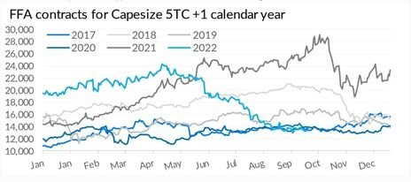

# ALLIED - Weekly Market Report

**Date:** October 11, 2022  
**Publisher:** Breakwave Advisors | **Category:** Market Insights  
**Original URL:** [https://www.breakwaveadvisors.com/insights/2022/10/11/allied-weekly-market-report](https://www.breakwaveadvisors.com/insights/2022/10/11/allied-weekly-market-report)  

---

*By Thomas Chasapis*

Market sentiment is a finicky thing to accurately capture and quantify, yet it plays a strong role in directing the market and gives a basis for any and all excess noted in terms of market noise.

The basic idea behind the below graph is to show the development, during the course of a year, of daily mid-closing levels of FFA contracts with swap period the next calendar year. In this particular case, we have taken FFA contracts with an underlying benchmark the Capesize 5TC figure. We have also extended this analysis to compare how equivalent contracts performed over the past 5 years (i.e., since 2017), with the sole purpose to see how returns varied over a 12-month period against different market regimes, asymmetries and trends that were present at each respective time frame.

In other words, this is a quantitative approach to capture sentiment (as presented exclusively through the paper market), while stepping, at the same time, beyond the typical cliché (and sometimes vague) use of this term.

> **Figure 1: 311338878 623434322605327 1255593271956338010 N**  
> [Local Asset](file:///C:/Users/Dell/Github/Shipping/corpus/03-breakwave/insights/2022/assets/2022-10-11_allied-weekly-market-report_img_311338878-623434322605327-1255593271_f43861006ebf.jpg)

It is evident that the current forward view for the upcoming year has completely collapsed during the latter half of the 3rd quarter, escaping at the same time, the typical seasonality patterns noted over the past 4 years or so. Strategies based on seasonality and historical trends are “well-intended”, but oftentimes insufficient to either diversify or hedge risks that apply within different market regimes.

In relative terms, in fact, we are almost on par with the market in 2020, a time period of confusing market conditions and high uncertainty following the first big wave of the pandemic. The market, at the time, failed to even consider or capture any bull run that would (in retrospect) emerge over the course of the next year and a half (the actual average of the BCI 5TC for 2021 was roughly US$ 33,300/day).

Moreover, to this, we are just slightly higher than the market in 2017, a year following the market’s absolute bottoming out due to tonnage oversupply. 2017 was also the year in which we can place the onset of the market’s incremental rebalancing, followed by record scrapping and a considerable drop in orderbook figures. So, the question here is, are we at such a low point in terms of momentum and sentiment in the market?

We are of course in a state of fragile fundamentals and clouded global macro trends, which obviously play a key role in these exaggerations noted in the market. It is also worth pointing out how quickly the market adapts in order to correct periodical bubbles and excessive rallies. However, the current noise in the market (sometimes very well hidden and mispriced), is in itself a major source of systemic risk.
