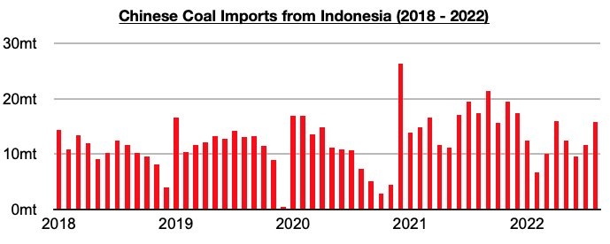
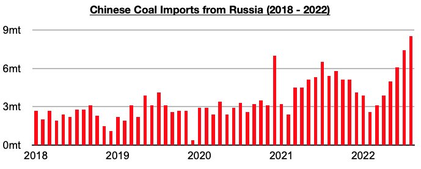
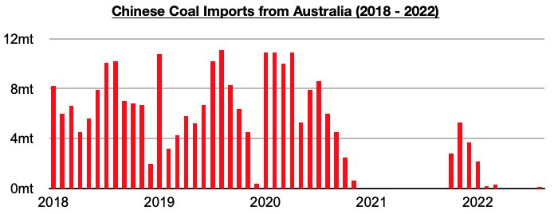

# Indonesia and Russia Continue to Contribute to Majority of China's Coal Imports

**Date:** October 11, 2022  
**Publisher:** Breakwave Advisors | **Category:** Market Insights  
**Original URL:** [https://www.breakwaveadvisors.com/insights/2022/10/11/indonesia-and-russia-continue-to-contribute-to-majority-of-chinas-coal-imports](https://www.breakwaveadvisors.com/insights/2022/10/11/indonesia-and-russia-continue-to-contribute-to-majority-of-chinas-coal-imports)  

---

*By*[*Jeffrey Landsberg*](https://www.linkedin.com/in/jeffrey-landsberg-70ab957/)

China's coal import data for August by origin was recently released and showed that imports from Indonesia have remained China’s primary source and Russia the second largest source. Imports from Indonesia totaled 15.8 million tons, which is up from July by 4.1 million tons (35%) but down year-on-year by 1.6 million tons (-9%).

> **Figure 1: Chart 1 (54)**  
> [Local Asset](file:///C:/Users/Dell/Github/Shipping/corpus/03-breakwave/insights/2022/assets/2022-10-11_indonesia-and-russia-continue-to-contribute-to-majority-of-chinas-coal-imports_img_chart1285429_0fd4978de7ec.jpg)

Imports from Russia totaled 8.5 million tons, which is up from July by 1.1 million tons (15%) and up year-on-year by 3.1 million tons (57%). Imports from Russia have continued to find significant strength, as we have anticipated, in the months since April’s tariff cut (thermal coal imports from Russia previously had a 6% tariff, while imports from Indonesia already had a tariff rate of zero). The last four months have seen imports from Russia average 6.8 million tons, which is double the 3.4 million ton monthly average that was seen this year before the tariff cut.

> **Figure 2: Chart 2 (46)**  
> [Local Asset](file:///C:/Users/Dell/Github/Shipping/corpus/03-breakwave/insights/2022/assets/2022-10-11_indonesia-and-russia-continue-to-contribute-to-majority-of-chinas-coal-imports_img_chart2284629_64c574e8ca52.jpg)

Also of note is that China finally imported coal from Australia again, albeit only a very small amount. Imports from Australia totaled 100,000 tons. This has marked the first time that Australian coal has been imported since March.

> **Figure 3: Chart 3 (36)**  
> [Local Asset](file:///C:/Users/Dell/Github/Shipping/corpus/03-breakwave/insights/2022/assets/2022-10-11_indonesia-and-russia-continue-to-contribute-to-majority-of-chinas-coal-imports_img_chart3283629_313b3ce3613c.jpg)

Also of note is that August again did not see any coal imported from South Africa or Colombia. August has marked the seventh straight month where no coal was imported from South Africa and the six straight month where no coal was imported from Colombia.
