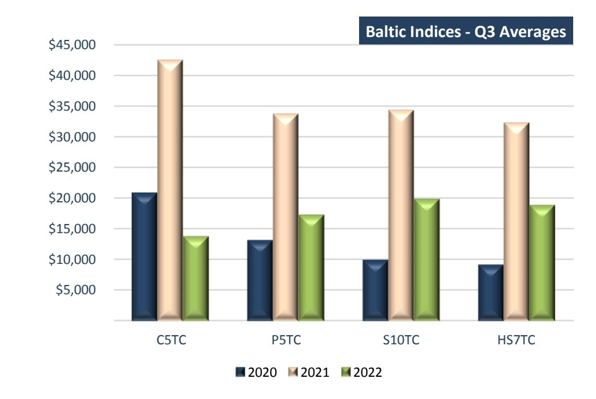
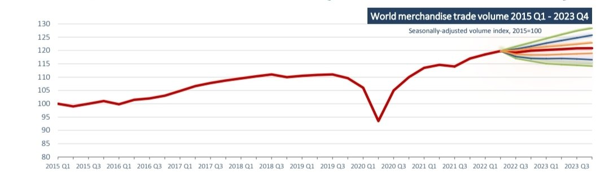

# Doric Market Weekly Report

**Date:** October 12, 2022  
**Publisher:** Breakwave Advisors | **Category:** Market Insights  
**Original URL:** [https://www.breakwaveadvisors.com/insights/2022/10/12/doric-market-weekly-report](https://www.breakwaveadvisors.com/insights/2022/10/12/doric-market-weekly-report)  

---

*By*[*Michalis Voutsinas*](https://www.linkedin.com/in/michalis-voutsinas-587544163/)

For the first half of 2022, dry bulk market was echoing the fertile 2021 trading environment. However, it was around the end of May, when numerous bearish factors began kicking in, blurring the picture. Among them, a feeling of a softening world trade activity started building momentum. Aside from the bullish among us stargazing super-cycles and markets through the roof for the third quarter, consensus was focusing on the major shifts in monetary policies across the globe along with a recession aroma, probably having a negative bearing on the short-term prospects of the sector. In fact, the macroeconomic burden was hard on dry bulk’s knees during the third quarter, pushing Baltic indices materially lower.

In particular, the leading BCI TCA had a Q3 average of $13,695 daily, or down by 67.7 percent year-on-year. In tandem, BPI TCA, BSI TCA and BHSI TCA reported quarterly averages of $17,172, $19,728 and $18,709 per day respectively, more than forty percent below the respective averages a year ago in all segments.

> **Figure 1: Screenshot 20221012 143913 Samsung Notes (1)**  
> [Local Asset](file:///C:/Users/Dell/Github/Shipping/corpus/03-breakwave/insights/2022/assets/2022-10-12_doric-market-weekly-report_img_screenshot-20221012-143913-samsungno_c372e2d14ada.jpg)

The last quarter of this volatile trading year started this week with Baltic indices hovering at two-month highs. In spite of this positivity of late in the spot market, international organizations and central banks kept revisiting downwards their GDP growth and world trade volume projections. In particular, on Wednesday, World Trade Organization stressed that world trade is expected to lose momentum in the second half of 2022 and remain subdued in 2023 as multiple shocks weigh on the global economy.

WTO economists now predict global merchandise trade volumes will grow by 3.5 percent in 2022 – slightly better than the 3.0 percent forecast in April. For 2023, however, they foresee a marginal 1.0 percent increase – down sharply from the previous estimate of 3.4 percent. Furthermore, the new World Trade Organization forecast estimates world GDP at market exchange rates will grow by 2.8 percent in 2022 and 2.3 percent in 2023, with the latter being a whole percentage point lower than what was previously projected.

The aforementioned sluggish tone became apparent not only in the spot market of the dry bulk sector during the last three months but also in one of the container sector. In fact, the RWI/ISL container throughput index – tracking global goods trade quite closely – has been mostly flat since October 2020. Throughput of Chinese ports dipped during spring due to pandemic-related lockdowns, but traffic rebounded again after these measures were relaxed. The decline in China was partly compensated by increased container handling at US ports, which had previously experienced severe congestion. Overall, the index suggests continued stagnation in merchandise trade.

Whilst concerns for the course of global economy keep rising, OPEC plus, with a bold move, agreed its deepest cuts to production in more than two years at a meeting in Vienna on Wednesday. The cut of two million barrels a day represents about 2 percent of global oil production. The move threatens further inflationary pressures in a world economy already burdened by an energy crisis, drawing a sharp response from president Biden. The US President called on his administration and Congress to explore ways to boost US energy production and reduce OPEC's control over energy prices after the cartel's "shortsighted" production cut, the White House said on Wednesday. Following these developments, oil prices rose on Thursday and on Friday, heading for a second consecutive weekly gain.

Within this framework, Baltic indices keep navigating in choppy waters. Being on an upward trajectory for four consecutive weeks, albeit timid, Baltic indices have shown their navigation skills lately, covering the lost ground of August and September.

## Being on an Upward Trajectory for Four Consecutive Weeks, Albeit Timid, Baltic Indices Have Shown Their Navigation Skills Lately, Covering the Lost Ground of August and September.

> **Figure 2: Screenshot 20221012 143956 Samsung Notes (1)**  
> [Local Asset](file:///C:/Users/Dell/Github/Shipping/corpus/03-breakwave/insights/2022/assets/2022-10-12_doric-market-weekly-report_img_screenshot-20221012-143956-samsungno_737dbca6f869.jpg)
