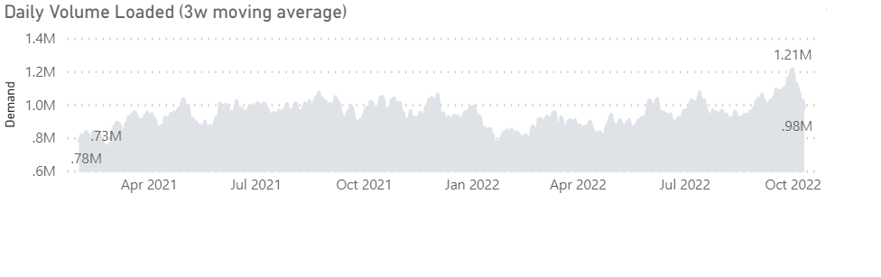
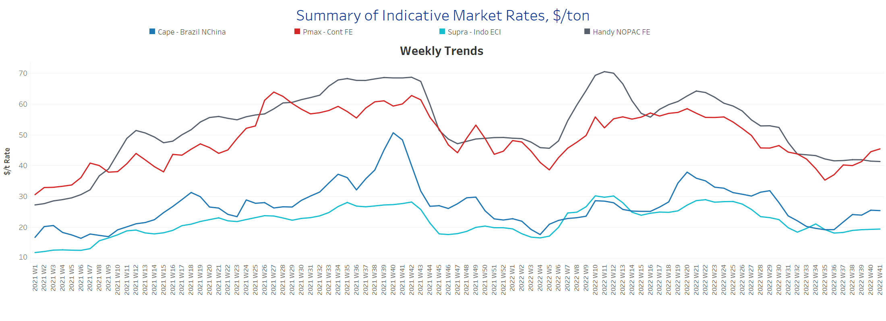
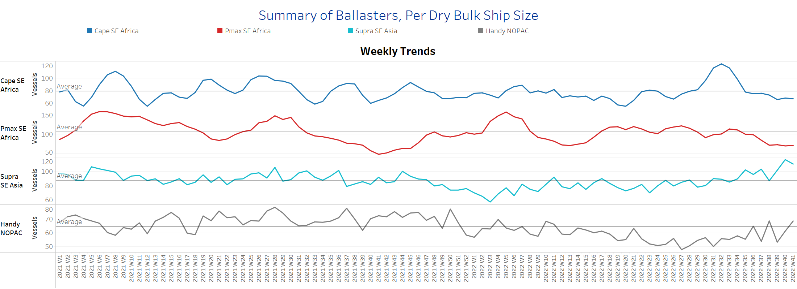
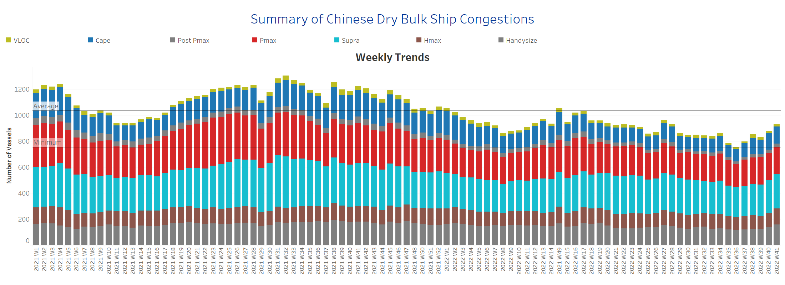

# Signal Dry Bulk Weekly Report

**Date:** October 13, 2022  
**Publisher:** Breakwave Advisors | **Category:** Market Insights  
**Original URL:** [https://www.breakwaveadvisors.com/insights/2022/10/13/signal-dry-bulk-weekly-report](https://www.breakwaveadvisors.com/insights/2022/10/13/signal-dry-bulk-weekly-report)  

---

The second week saw a continued upswing in Panamax freight rates, with signs of strength in the Capesize class, while the ballast vessel count is still below the annual average, leading to an optimistic outlook for fourth quarter freight rates. The positive element that feeds the existing optimism is demand, where we can see (image below) that the daily volume loaded (3w moving average) for Capesize vessels is now at the highest level recorded in October in more than a year.

### Chart of the Week: Capesize Demand - Daily Volume Loaded

> **Figure 1: Highest Volume Recorded in October for More Than a Year**  
> **Interactive Data & Source:** [Signal Ocean Platform](https://go.signalocean.com/e/983831/dry-reports-c3/2k55p8/278585659?h=ybNRDUe8Nxf_zQZCLT8QrqtW2x13A7qbMkwusTK9FpA) | [Local Asset](file:///C:/Users/Dell/Github/Shipping/corpus/03-breakwave/insights/2022/assets/2022-10-13_signal-dry-bulk-weekly-report_img_unnamed289029_fbe696fd36b0.png)

Data Source: The Signal Ocean Platform, C3 Dashboard, Demand
[Signal Ocean Platform](https://go.signalocean.com/e/983831/dry-reports-c3/2k55p8/278585659?h=ybNRDUe8Nxf_zQZCLT8QrqtW2x13A7qbMkwusTK9FpA)

Meanwhile, iron ore prices recorded a rise on Monday as stocks at Chinese ports fell to the lowest level after the Golden Week holidays. Mining.com news reported earlier this week that the mostactively traded January iron ore contract on the Dalian Commodity Exchange ended the trading day up 2.2% at 739.50 yuan ($103.93) per tonne, having previously been at 744.50 yuan, the highest level since August 9. In addition, there are supply concerns stemming from intense floodings in Australia that will potentially influence the pricing levels over the next few days.

## Section 1/ Freight -Market Rates ($/T) Firmer

‘The Big Picture’ - Capesize and Panamax Bulkers and Smaller Ship Sizes

> **Figure 2: Market Chart 2**  
> **Interactive Data & Source:** [Signal Ocean Platform](https://www.thesignalgroup.com/signal-ocean-platform) | [Local Asset](file:///C:/Users/Dell/Github/Shipping/corpus/03-breakwave/insights/2022/assets/2022-10-13_signal-dry-bulk-weekly-report_img_unnamed289129_7f01af936a35.png)

The second week of October saw a continuation of the upward trend in freight rates for Panamax vessels, with firmer signs for Capesize vessels, while a downward trend was observed for smaller vessel size classes.

- **Capesize**freight rates from Brazil to North China rose $25/tonne, up $1.5/tonne from week 39 and nearly $5.5/tonne from the week 35 low.
- **Panamax**freight rates from the continent to the Far East rose to $45.5/tonne, up $10.5/tonne from the week 35 low.
- **Supramax**freight rates for the Indo-ECI route remained at $19/tonne for the last three consecutive weeks, with no sign of a downward trend so far.
- **Handysize**vessel freight rates from NOPAC to the Far East have remained below $42/tonne for more than a month, with signs of a continued decline in the coming days.

## Section 2/ Supply -Ballasters (# Vessels) Increasing

> **Figure 3: Supply Trend Lines for Key Load Areas**  
> **Interactive Data & Source:** [Signal Ocean Platform](https://www.thesignalgroup.com/signal-ocean-platform) | [Local Asset](file:///C:/Users/Dell/Github/Shipping/corpus/03-breakwave/insights/2022/assets/2022-10-13_signal-dry-bulk-weekly-report_img_unnamed289229_1e924994c69f.png)

The number of Capesize and Panamax vessels sailing with ballast remains below the annual average for the past five weeks, while the number of Supramax vessels appears to be down slightly from the previous week's annual high.

- **Capesize**SE Africa: The number of vessels is now at 67, down 45% from the high in week 32.
- **Panamax**SE Africa: The number of vessels is at 77, up 6 from three weeks ago, but still well below the yearly average of 105.
- **Supramax**SE Asia: The number of vessels decreased to 110, 6 fewer than the previous week.
- **Handysize**NOPAC: Vessel count remained at an accelerated level of 69, 16 more than week 39.

## Section 3/ Demand -TonDays Decreasing

> **Figure 4: TonDays Decreasing**  
> **Interactive Data & Source:** [Signal Ocean Platform](https://www.thesignalgroup.com/signal-ocean-platform) | [Local Asset](file:///C:/Users/Dell/Github/Shipping/corpus/03-breakwave/insights/2022/assets/2022-10-13_signal-dry-bulk-weekly-report_img_unnamed289029_fbe696fd36b0.png)

The trend for Capesize vessels has slowed in the first two weeks of October, and there has also been a significant decline for Panamax vessels.

- **Capesize**demand ton-days: The percentage increase has slowed in October, but is still well above the low in week 35.
- **Panamax**demand ton-days: The volatility of recorded growth has not yet shown a significant upward or downward trend in the first half of October.
- **Supramax**demand ton-days: The sudden decline recorded last week has intensified and dropped to the lowest level of the year.
- **Handysize**demand ton-days: The percentage increase recorded at the beginning of October does not seem to continue, as the values show a downward correction in the first half of the month.

## Section 4/ Port Congestion -No of Vesselsincreasing

> **Figure 5: Dry Bulk Ships Congested at Chinese Ports**  
> **Interactive Data & Source:** [Signal Ocean Platform](https://www.thesignalgroup.com/signal-ocean-platform) | [Local Asset](file:///C:/Users/Dell/Github/Shipping/corpus/03-breakwave/insights/2022/assets/2022-10-13_signal-dry-bulk-weekly-report_img_unnamed289429_bc3084529859.png)

The number of congested vessels rose to the highest level since week 35, with a significant increase in the Handysize segment in the last two weeks.

- **Capesize:**The number of congested vessels increased to 132, 8 more than the previous week.
- **Panamax:**The number of vessels remained at the same level as the previous week (207), 29 more than in week 36..
- **Supramax:**The number of congested vessels increased to 265, 11 more than the previous week.
- **Handysize**: The number of congested vessels increased to 160, 20 more than the previous week.

Data Source:[Signal Ocean Platform](https://www.thesignalgroup.com/signal-ocean-platform)
