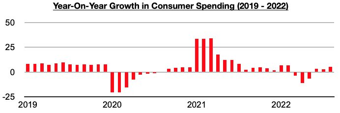
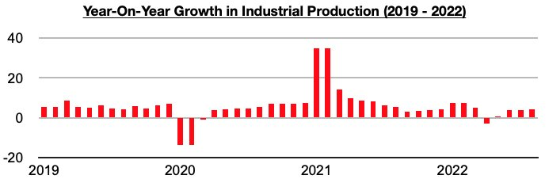
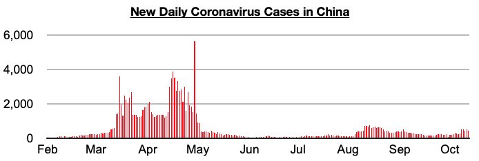

# June's Significant Shift in China Remains in Place

**Date:** October 14, 2022  
**Publisher:** Breakwave Advisors | **Category:** Market Insights  
**Original URL:** [https://www.breakwaveadvisors.com/insights/2022/10/14/junes-significant-shift-in-china-remains-in-place](https://www.breakwaveadvisors.com/insights/2022/10/14/junes-significant-shift-in-china-remains-in-place)  

---

*By*[*Jeffrey Landsberg*](https://www.linkedin.com/in/jeffrey-landsberg-70ab957/)

As we have continued to stress in Commodore's Weekly China Reports, coronavirus cases and restrictions eased significantly in June and this helped allow both consumer spending and industrial production to enjoy sustained year-on-year growth. China’s consumer spending experienced year-on-year growth during June, July, and August (at the time of writing, data is still pending for September).

> **Figure 1: Chart 1 (55)**  
> [Local Asset](file:///C:/Users/Dell/Github/Shipping/corpus/03-breakwave/insights/2022/assets/2022-10-14_junes-significant-shift-in-china-remains-in-place_img_chart1285529_e3fae20d43b0.jpg)

Industrial production during each of these months also impressively grew year-on-year by at least 3%.

> **Figure 2: Chart 2 (47)**  
> [Local Asset](file:///C:/Users/Dell/Github/Shipping/corpus/03-breakwave/insights/2022/assets/2022-10-14_junes-significant-shift-in-china-remains-in-place_img_chart2284729_22d578482e73.jpg)

Prior to June, consumer spending had contracted on a year-on-year basis during May, April, and March, and industrial production had increased year-on-year by only 0.7% in May and contracted year-on-year by 2.9% in April. For this month, new daily coronavirus cases have so far remained well below May’s peak. For now, the June shift remains firmly in place.

> **Figure 3: Chart 3 (37)**  
> [Local Asset](file:///C:/Users/Dell/Github/Shipping/corpus/03-breakwave/insights/2022/assets/2022-10-14_junes-significant-shift-in-china-remains-in-place_img_chart3283729_c7c0beba32c7.jpg)
