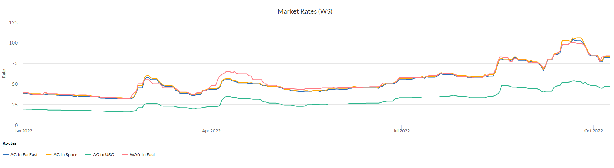
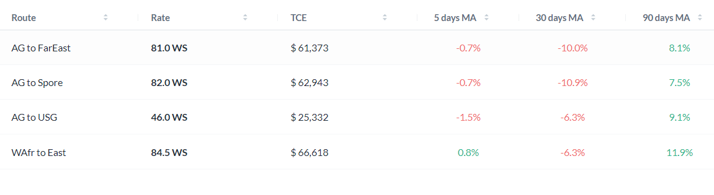
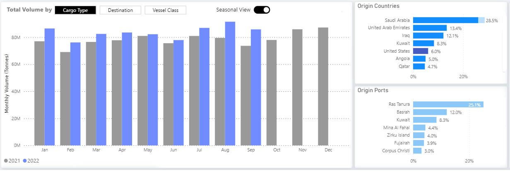
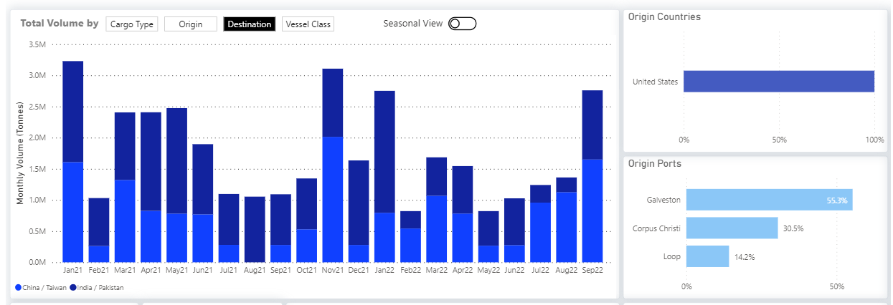
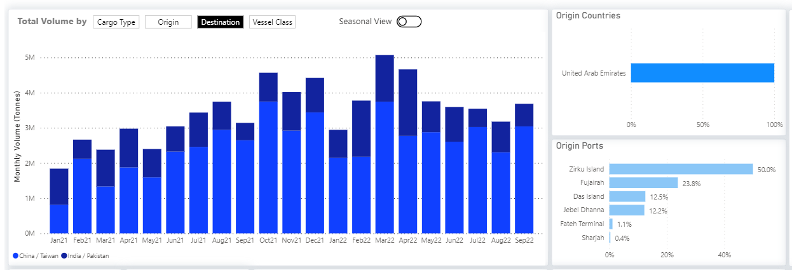
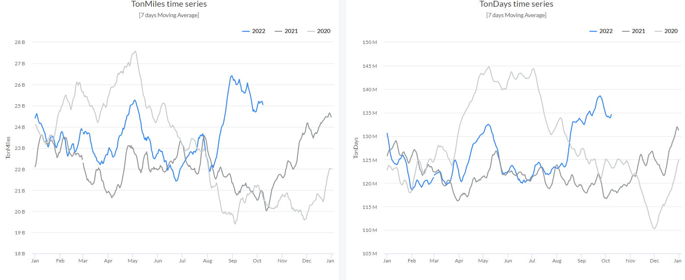
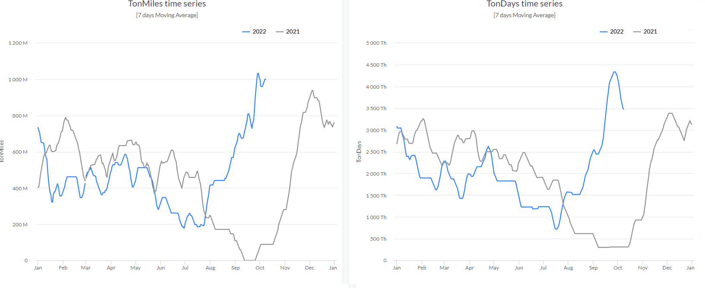
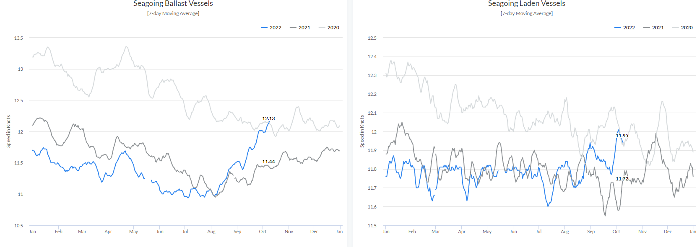
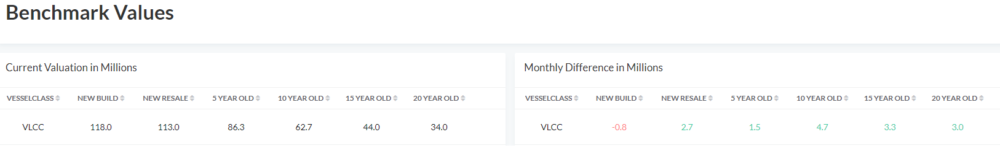

# VLCC rates in Q3 2022: An upswing with uncertainties

**Date:** October 15, 2022  
**Publisher:** Breakwave Advisors | **Category:** Market Insights  
**Original URL:** [https://www.breakwaveadvisors.com/insights/2022/10/14/vlcc-rates-in-q3-2022-an-upswing-with-uncertainties](https://www.breakwaveadvisors.com/insights/2022/10/14/vlcc-rates-in-q3-2022-an-upswing-with-uncertainties)  

---

The VLCC freight market saw a surprise rate increase in September, accompanied by an increase in demand (in terms of ton-days and miles), leading to a further improvement in sentiment by the end of the third quarter. This analysis includes critical variables such as oil flows, demand trends, and vessel speeds that underscore the current picture with expectations for the final quarter of the year.

‍

For the scope of this review, we have used the[***Signal Ocean Platform Reports***](https://app.signalocean.com/tanker/reports?utm_source=newsroom&utm_medium=organic&utm_campaign=vlcc&utm_content=w41_2022&fbclid=IwAR1haIQH8vKhcjvU35Gi-Yv6LTSly__oZn5CRJ83Sf_bQ2_dmrPoBjMb30U)for the i.) Freight market, ii.) Crude oil seaborne flows, iii.) Demand-ton charts, iv.) Vessel speed (ballast-laden) v.) Benchmark values.

‍

In the[**December Annual Shipping Review**](https://www.thesignalgroup.com/newsroom/a-tale-of-two-cities-2021-dry-and-tanker-market-analysis), we analyzed the tanker environment for all tanker sizes as demand for VLCCs rebounded significantly in the last quarter of last year compared to the decline in other crude tanker categories.

‍

Before moving on to the section of our fundamental analysis, we point out recent macroeconomic developments we have noted that will shape future oil price and demand trends that could reshape the outlook for the VLCC tanker market.

‍

## A Macroeconomic Perspective of the Oil Market

‍

There are estimates that[**oil prices will reach a new high**](assets/2022-10-15_vlcc-rates-in-q3-2022-an-upswing-with-uncertainties_oil-prices-rally-into-october-as-ope_b82e171ff8cc.html)in October as OPEC will make a production cut of 1 million barrels per day. Meanwhile, it appears that the decision OPEC+ will not lead to a sudden increase in oil prices, as there are concerns about falling Chinese demand. The world's second-largest economy is trying to adjust to stronger growth after a series of lockdowns and fears a new round of COVID cases. Beijing's target of a 5.5% annual growth rate now appears out of reach, as the latest official data showed a decline in Chinese services activity in September for the first time in four months.

‍

It is almost undeniable that the decision of OPEC+ to cut oil production adds to uncertainty about the potential impact of the European Union's upcoming embargo on Russian oil on global supplies. The planned EU measures against Russian crude oil and oil products are scheduled for December and February, respectively, while the outlook for oil demand is dimming due to the deteriorating macroeconomic environment.

‍

In the first half of this year,[**Brent crude hit $125 a barrel**](https://capital.com/oil-price-forecast)on June 14 for the first time since March 9, as tight supplies fueled concerns about sluggish global economic growth. At the end of the third quarter of this year, we saw a downward trend in prices even though the market was expecting higher crude oil prices. The[**IEA Oil Market Report**](https://www.iea.org/reports/oil-market-report-september-2022)highlighted that brent crude oil futures slipped below $90/barrel in early September, their lowest level since January, and more than $34/barrel below their June peak. On October 6, 2022, Brent crude oil was trading at $92.66/barrel, down 14% from its mid-June peak.

‍

Compared to the highs of last June, there has been a downward trend in oil price forecasts. In early September, the[**U.S. Energy Information Administration**](https://www.eia.gov/outlooks/steo/report/prices.php)predicted that the spot price of Brent crude oil will average $98 per barrel in the fourth quarter of 2022 and $97 per barrel in 2023. The report added that there is concern that slower-than-expected crude oil production growth continues to hold the potential for higher oil prices, while the possibility of slower-than-expected economic growth holds the potential for lower prices.

‍

Fears about tight supplies also stem from[**Russia's warning**](https://tradingeconomics.com/commodity/crude-oil)not to sell oil to countries that support the U.S.-led plan to impose a price cap on Russian oil. In late September,[**the European Commission**](https://www.politico.eu/article/eu-proposes-new-sanctions-package-including-oil-price-cap/)proposed a price cap on Russian oil as part of its latest package of sanctions against Moscow over its war with Ukraine.

‍

Finally,[**Russia**](assets/2022-10-15_vlcc-rates-in-q3-2022-an-upswing-with-uncertainties_russia-could-be-the-biggest-benefici_2a5ef9d7e9a4.html)could be the biggest beneficiary of an OPEC + oil production cut, as it is estimated to be 1 million barrels per day below its September quota of 11 million barrels per day, so it will not need to cut production and will only benefit from higher oil prices.

‍

## I. Freight Market

‍

We can observe the sudden upturn in freight rates (image 1) after the third week of September, when VLCC crude rates from AG to the Far East - Spore and Wafr to East recorded the highest level this year, while there seems to be a downward correction at the beginning of the fourth quarter. It is interesting to note, however, that the decline in the last few days has not yet led to a similar collapse in prices as in the first quarter, as the growth rates of demand in August and September were higher than in the previous months of the first half of the year.

‍

Current rates remain at much firmer levels than the rest of the year, and the 90-day moving average (image 2) for the second week of October ended in the green for all trading routes, with the AG-USG and Wafr-East trading routes posting the highest increases.

‍

Routes:**AG**to the Far East - Spore - USG |**WAfr**to East

> **Figure 1: 63468ea4ab7fc228948304eb Image 1 VLCC Market Rates**  
> **Interactive Data & Source:** [Signal Ocean Platform](https://www.thesignalgroup.com/signal-ocean-platform) | [Local Asset](file:///C:/Users/Dell/Github/Shipping/corpus/03-breakwave/insights/2022/assets/2022-10-15_vlcc-rates-in-q3-2022-an-upswing-with-uncertainties_img_63468ea4ab7fc228948304eb-image1vlccm_094568ad9b56.png)

> **Figure 2: Image 2 Data Source: The Signal Ocean Platform**  
> *Image 2 Data Source: The Signal Ocean Platform, Market Rates, as of October 11, 2022Market rates displayed are based on Signal Ocean's own assessments using licensed and market data for all the main routes. Moving Averages (MA) columns express the percentage of the difference between the market rate from today and the corresponding days ago. For example, column '5 days MA' indicates the percentage of change between the market rate from five days ago versus today's market rate. TCE values refer to a Round Voyage (RV) of a non-scrubber-fitted vessel using the latest relevant market rate (today).‍*  
> **Interactive Data & Source:** [Signal Ocean Platform](https://www.thesignalgroup.com/signal-ocean-platform) | [Local Asset](file:///C:/Users/Dell/Github/Shipping/corpus/03-breakwave/insights/2022/assets/2022-10-15_vlcc-rates-in-q3-2022-an-upswing-with-uncertainties_img_63468ec129da932836967213-image2ratei_98c743ce1770.png)

## Ii.crude Oil Seaborne Flows

‍

*1.****VLCC****- Monthly Volume of Shipments from All Origin Countries to All Destinations*

‍

It should be noted that despite fears of supply shortages, monthly crude oil shipments from all source countries to all destinations have still not declined significantly (image 3), with Saudi Arabia accounting for the largest share of shipments at 38.5% and the UAE following in second place at 13.4%. July and August were the months with the highest figures this year and last, when monthly volumes exceeded 80 million tonnes, while September ended with a downward trend but still exceeded 80 million tonnes. There is a high potential for a level below 80 million tonnes, followed by the announcement of OPEC+ for oil production cuts, with target countries looking for oil substitutes in the face of EU sanctions on Russian oil imports.

> **Figure 3: Image 3 Data Source: The Signal Ocean Platform**  
> *Image 3 Data Source: The Signal Ocean Platform, Crude Seaborne Oil Flows, VLCC, 2021-2022, as of the end of September 2022*  
> **Interactive Data & Source:** [Signal Ocean Platform](https://www.thesignalgroup.com/signal-ocean-platform) | [Local Asset](file:///C:/Users/Dell/Github/Shipping/corpus/03-breakwave/insights/2022/assets/2022-10-15_vlcc-rates-in-q3-2022-an-upswing-with-uncertainties_img_63468f0d7b634d85b1c374ef-image3vlccf_bc66eae3d552.png)

‍

‍*2. Focus on****China****&****India****:*

*‍*‍

It is interesting to note the increase in the monthly volume of shipments from the U.S. to China and India, and even to India, as September ended with one of the highest levels since the beginning of the year. In September, monthly U.S. shipments to China and India totaled more than 2.5 million tons, up from a low of fewer than 1 million tons in May (image 4). A contrasting picture emerges for monthly VLCC shipments from the United Arab Emirates, which saw a significant decline in September (less than 4 million tons), compared to a high of 5 million tons in March 2022 (image 5). The current trend provokes a transition to a higher volume of shipments from the U.S. to emerging markets than shipments from OPEC+ countries. This transition increases the potential for more substantial growth in demand in ton-miles and -days and firmer freight rates from the U.S. to Far East countries.

‍

*a.****VLCC****Monthly volume of shipments from the U.S*

> **Figure 4: Image 4 Data Source: The Signal Ocean Platform**  
> *Image 4 Data Source: The Signal Ocean Platform, Crude Seaborne Oil Flows, VLCC, the U.S. to China & India 2021-2022, as of the end of September 2022*  
> **Interactive Data & Source:** [Signal Ocean Platform](https://www.thesignalgroup.com/signal-ocean-platform) | [Local Asset](file:///C:/Users/Dell/Github/Shipping/corpus/03-breakwave/insights/2022/assets/2022-10-15_vlcc-rates-in-q3-2022-an-upswing-with-uncertainties_img_63468f407b634d4860c3a9ce-image4vlccf_ed071525a20f.png)

> **Figure 5: ‍Image 5 Data Source: The Signal Ocean Platform**  
> *‍Image 5 Data Source: The Signal Ocean Platform, Crude Seaborne Oil Flows, VLCC, U.A.E. to China & India 2021-2022, as of the end of September 2022*  
> **Interactive Data & Source:** [Signal Ocean Platform](https://www.thesignalgroup.com/signal-ocean-platform) | [Local Asset](file:///C:/Users/Dell/Github/Shipping/corpus/03-breakwave/insights/2022/assets/2022-10-15_vlcc-rates-in-q3-2022-an-upswing-with-uncertainties_img_63468f62e736fd7e7b0358cc-image5vlccf_a7c68ca6d4be.png)

‍

## Iii. Demand - Ton Charts

‍

*1.****VLCC****- Ton Miles / Ton Days from All Origin Countries to All Destinations*

‍

Demand showed spectacular growth in both ton-miles and days through the end of the third quarter of this year (image 6), but growth gradually slowed as less crude was shipped to all destinations, affecting overall demand. In the first two weeks of October, we can see that demand growth is gradually decreasing from the peak of late September, but is still significantly higher than the trend in the previous two years in a similar period, but there is a potential for further growth as demand has not yet reached the highest levels of late May 2020.

> **Figure 6: Image 6 Data Source: The Signal Ocean Platform**  
> *Image 6 Data Source: The Signal Ocean Platform, Ton Charts, 2020 - 2022*  
> **Interactive Data & Source:** [Signal Ocean Platform](https://www.thesignalgroup.com/signal-ocean-platform) | [Local Asset](file:///C:/Users/Dell/Github/Shipping/corpus/03-breakwave/insights/2022/assets/2022-10-15_vlcc-rates-in-q3-2022-an-upswing-with-uncertainties_img_63468fcb180498a930ccef68-image6vlccd_9b0ff24e9e86.png)

‍

*2.****VLCC****- Ton Miles / Ton Days Focus on****China****from USG*

‍

Looking specifically at Chinese demand growth in tonne-miles and -days, we find that the third quarter was an exceptional year, as growth in U.S. goods shipments to China reached a significant peak, the highest this year and the previous. This increase was due to the monthly increase in shipments from the U.S. to China in September. However, fears of further economic recession in China and lower oil demand led to a gradual slowdown in demand, which put downward pressure on spot prices starting in early October.

> **Figure 7: Mage 7 Data Source: The Signal Ocean Platform**  
> *mage 7 Data Source: The Signal Ocean Platform, Ton Charts, from USG to China, 2021 - 2022Methodology: TheTonMilestime-series graph presents the laden miles of the seagoing vessels for the user-selected vessel class range that have loaded (Area From) and discharged (Area To) the selected areas. This graph shows the 7 days moving average (MA) of the time series. TheTonDaystime-series graph presents the laden days of the seagoing and stopped vessels for the user-selected vessel class range that have loaded (Area From) and discharged (Area To) the selected areas. This graph shows the 7 days moving average (MA) of the time series. Differences in the trend between the TonMiles and TonDays time series indicate an increase/decrease in the voyage days of laden vessels. For example, port congestion will contribute to the overall increase of the TonDays in contrast to the TonMiles.*  
> **Interactive Data & Source:** [Signal Ocean Platform](https://www.thesignalgroup.com/signal-ocean-platform) | [Local Asset](file:///C:/Users/Dell/Github/Shipping/corpus/03-breakwave/insights/2022/assets/2022-10-15_vlcc-rates-in-q3-2022-an-upswing-with-uncertainties_img_63468f9cba64406eb1df97dc-image7usgch_9103be903a40.png)

‍

## Iv.vessel Speed (ballast-Laden)

‍

The recovery in freight rates and the increase in oil demand led to an increase in the number of loaded and ballasted ocean-going vessels, with the speed of ocean-going vessels reaching their highest level since early 2021 (Figure 8). For ballasted vessels, the speed (7-day moving average) exceeded 12 knots in early October, and for loaded vessels, the speed was nearly 12 knots. It appears that the lows recorded in the second and third quarters of this year will not be matched in the final quarter, as crude oil freight rates may increase despite signs of lower oil demand. There is still a shortage of oil supply that will weigh on the global economy during the winter months when developed and developing countries will look to sources of supply from the United States and OPEC+ countries to meet their energy needs.

> **Figure 8: Image 8 Data Source: The Signal Ocean Platform**  
> *Image 8 Data Source: The Signal Ocean Platform, Vessel Speed, 2020 - 2022Methodology: The two provided charts capture the historical average speed of all the vessels that adhere to the user-selected filter values. Each point in time represents the average speed of all vessels that belong to the selected vessel class range, have traveled over the selected areas, belong to the selected commercial operators, and their age is between the selected year range. The speeds are based on the vessel’s AIS information.*  
> **Interactive Data & Source:** [Signal Ocean Platform](https://www.thesignalgroup.com/signal-ocean-platform) | [Local Asset](file:///C:/Users/Dell/Github/Shipping/corpus/03-breakwave/insights/2022/assets/2022-10-15_vlcc-rates-in-q3-2022-an-upswing-with-uncertainties_img_6346905c3e71cbdf44f386b5-image8vlccs_61cd65987616.png)

‍

## V. VLCC Benchmark Values

‍

The current month saw an increase in asset values for VLCC tankers of all ages (Figure 9), as the increase influenced the buying and selling of secondhand vessels in freight rates recorded in September. The secondhand value of VLCC tankers is increasing month over month. The latest benchmark values from October showed that the value of a 10-year-old VLCC tanker compared to the value of a 5-year-old tanker and resale appeared to make the highest monthly difference in millions.

‍

Given the recovery of the spot freight market, investors are tending to get involved in the secondhand tanker market against the newbuilding industry, with a stronger interest in immediate delivery of the vessels to absorb the recent freight gains and the increase in value on the sell side.

> **Figure 9: Image 9 Data Source: The Signal Ocean Platform**  
> *Image 9 Data Source: The Signal Ocean Platform, Benchmark Values, 2022Methodology: Values and trends are estimated by aggregating a list of widely distributed Sales & Purchases transactions. Valuations are based on a benchmark vessel per vessel class withDeadweight: Tanker VLCC - 300.000 Tonnes*  
> **Interactive Data & Source:** [Signal Ocean Platform](https://www.thesignalgroup.com/signal-ocean-platform) | [Local Asset](file:///C:/Users/Dell/Github/Shipping/corpus/03-breakwave/insights/2022/assets/2022-10-15_vlcc-rates-in-q3-2022-an-upswing-with-uncertainties_img_6346908eb8ef936ee7aed2c8-image9bench_7882509255f6.png)

‍

## ‍Looking Ahead‍

There are still macroeconomic challenges related to the oil supply-demand balance that will affect the recovery observed toward the end of the third quarter of this year. There is a high potential for continued higher demand growth in tonne-miles and days, which will put upward pressure on freight rates and used vessel values in the final quarter of this year. Oil production cuts already announced by OPEC have not slowed the downward trend in Brent crude prices, while China and India are still buying more oil than in recent months for fear of tight oil supplies. It remains to be seen how the oil supply will develop in the remaining months against the backdrop of current oil demand growth and the reaction of European economies to the impact of Russian oil sanctions from December.

‍

Data Source:[Signal Ocean Platform](https://www.thesignalgroup.com/signal-ocean-platform)
