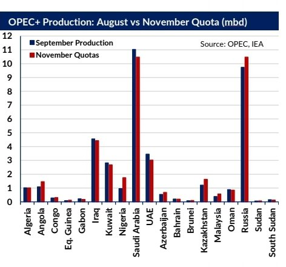

# Gibson's Weekly Tanker Market Report

**Date:** October 19, 2022  
**Publisher:** Breakwave Advisors | **Category:** Market Insights  
**Original URL:** [https://www.breakwaveadvisors.com/insights/2022/10/19/q6jhcrrya5i2uw3r7upb6hb7lsaopy](https://www.breakwaveadvisors.com/insights/2022/10/19/q6jhcrrya5i2uw3r7upb6hb7lsaopy)  

---

Last week, OPEC+ agreed to make production cuts of 2 mbd for the next 14 months from November 2022 to December 2023, representing a 2% reduction in global oil supply. This stemmed from a concern that the oil market is now out of balance which has put downward pressure on oil prices. Meanwhile a stronger dollar and a deteriorating economic outlook are impacting the demand outlook and thus reinforcing the pressure on oil prices. Crude prices rose on the news of OPEC’s decision but have yet to breach the $100/bbl mark due to the broader demand concerns outweighing the reduction in supply. The question now arises as to how effective these cuts will be in supporting oil prices and what impact this could have on the tanker market. In addition, it also raises further questions about the future of OPEC relations with leading oil consumers such as the US, following President Biden’s criticism of the plan and how this could accelerate the energy transition.

> **Figure 1: Screenshot 20221019 134223 Samsung Notes**  
> [Local Asset](file:///C:/Users/Dell/Github/Shipping/corpus/03-breakwave/insights/2022/assets/2022-10-19_q6jhcrrya5i2uw3r7upb6hb7lsaopy_img_screenshot-20221019-134223-samsungno_920cfc0b590d.jpg)

Under the new quotas, the OPEC 10 will be required to make a combined cut of 1.273 mbd, whilst associate members will cut up to 727 kbd. The largest of these cuts will come from Saudi Arabia and Russia who will both be required to reduce production by 526 kbd respectivly; as well as Iraq by 220 kbd and the UAE by 160 kbd. Other members will make varying levels of much smaller cuts meaning the bulk of these cuts will come from the Middle East (55%) and Russia (26%). These producers have adequate capacity to make such production cuts given their steady increases in production in line with previous OPEC+ policy since April 2021. In contrast, Russia is a special case, where output has been falling since April 2022 and is currently producing below its output quota.

Countries such as Nigeria and Angola have also been consistently underproducting due to lack of investment and production difficulties which will make the cuts lower in real terms. As of September, OPEC+ has been collectivly underproducing their combined quota by 3.3 mbd, with overall production of those participating in cuts at 38.76 mbd. For the tanker market, the annoucned cut is a concern, especially given that the vast bulk of reductions are due to be made in the Middle East and this will inherently impact VLCC and Suezmax flows. Trade data seems to indicate OPEC+ seaborne crude exports peaked in August at 28.86 mbd and are now likely to ease off, although reduced direct burn demand could limit some of the decline. Reduced OPEC+ production will likely support the market for Russian crude to make up any shortfall in exports from the Middle East to Asia for those willing to trade outside the G7 price cap.

In making these cuts, OPEC+ has received criticism from President Biden for reducing output when inflationary pressures are taking their toll on the global economy and the G7 price cap on Russian oil is gathering momentum prior to its future implementation. This is likely to further increase tension between OPEC+ and consumers such as the US and in the longer term, encourage production increases in Non-OPEC+ producers such as the US, Canada, Brazil and the North Sea. It is also likely to increase the political support for energy security in the US and Europe through renewables. Whilst these lower volumes are a cause for concern, especially if deeper cuts are made, the main source of downside risk in the tanker market will likely be macroeconomic in nature relating to oil demand rather than supply, given the expected increased tonne mile effect from sanctions.
