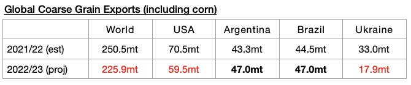
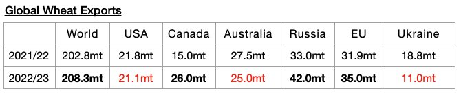
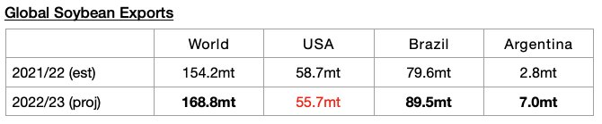
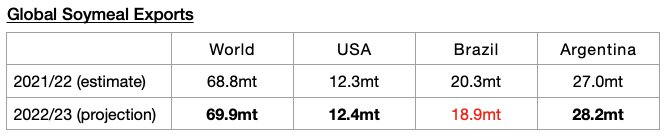

# Global Grain Trade Forecast Lowered Again

**Date:** October 20, 2022  
**Publisher:** Breakwave Advisors | **Category:** Market Insights  
**Original URL:** [https://www.breakwaveadvisors.com/insights/2022/10/20/global-grain-trade-forecast-lowered-again](https://www.breakwaveadvisors.com/insights/2022/10/20/global-grain-trade-forecast-lowered-again)  

---

*By*[*Jeffrey Landsberg*](https://www.linkedin.com/in/jeffrey-landsberg-70ab957/)

The United States Department of Agriculture (USDA) has released their latest global grain export forecast for the 2022/23 season and has again reduced its expectations. The trade forecast is still very preliminary, but of note is that 487.4 million tons of exports are now expected. This is 1.5 million tons less than was forecast a month ago and would mark a year-on-year decline of 21.3 million tons (-4%). Global soybean exports (soybeans are not technically classified as a grain) are now expected to rise year-on-year by 14.6 million tons (*discussed in more detail below*).

The USDA is now forecasting that global coarse grain exports in 2022/23 will total 225.9 million tons, which is 500,000 tons less than was forecast a month ago and would mark a year-on-year decline of 24.6 million tons (-10%).

> **Figure 1: Chart 1 (56)**  
> [Local Asset](file:///C:/Users/Dell/Github/Shipping/corpus/03-breakwave/insights/2022/assets/2022-10-20_global-grain-trade-forecast-lowered-again_img_chart1285629_b26ca32d7035.jpg)

Global wheat exports are expected to total 208.3 million tons. This is 600,000 tons less than was forecast a month ago but would mark a year-on-year increase of 5.5 million tons (3%).

> **Figure 2: Chart 2 (48)**  
> [Local Asset](file:///C:/Users/Dell/Github/Shipping/corpus/03-breakwave/insights/2022/assets/2022-10-20_global-grain-trade-forecast-lowered-again_img_chart2284829_515cee1c2ade.jpg)

Global soybean exports are expected to total 168.8 million tons. This is 900,000 tons (1%) more than was forecast a month ago and would mark a year-on-year increase of 14.6 million tons (9%).

> **Figure 3: Chart 3 (38)**  
> [Local Asset](file:///C:/Users/Dell/Github/Shipping/corpus/03-breakwave/insights/2022/assets/2022-10-20_global-grain-trade-forecast-lowered-again_img_chart3283829_f9641ace7ad5.jpg)

Global soymeal exports are expected to total 69.9 million tons. This is 100,000 tons less than was forecast a month ago but would mark a year-on-year increase of 1.1 million tons (2%).

> **Figure 4: Chart 4 (18)**  
> [Local Asset](file:///C:/Users/Dell/Github/Shipping/corpus/03-breakwave/insights/2022/assets/2022-10-20_global-grain-trade-forecast-lowered-again_img_chart4281829_e778d1e3eb9a.jpg)
