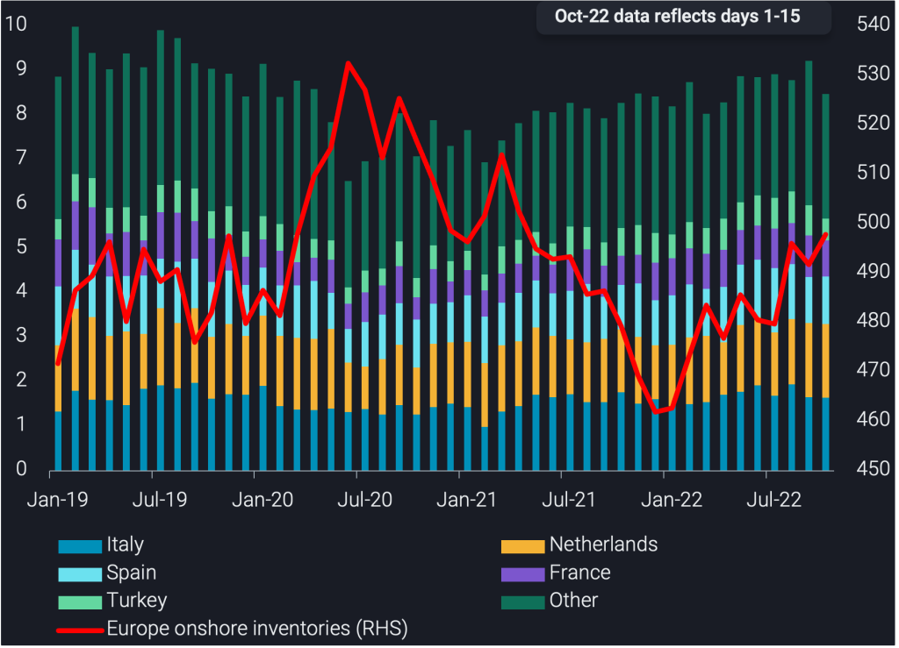
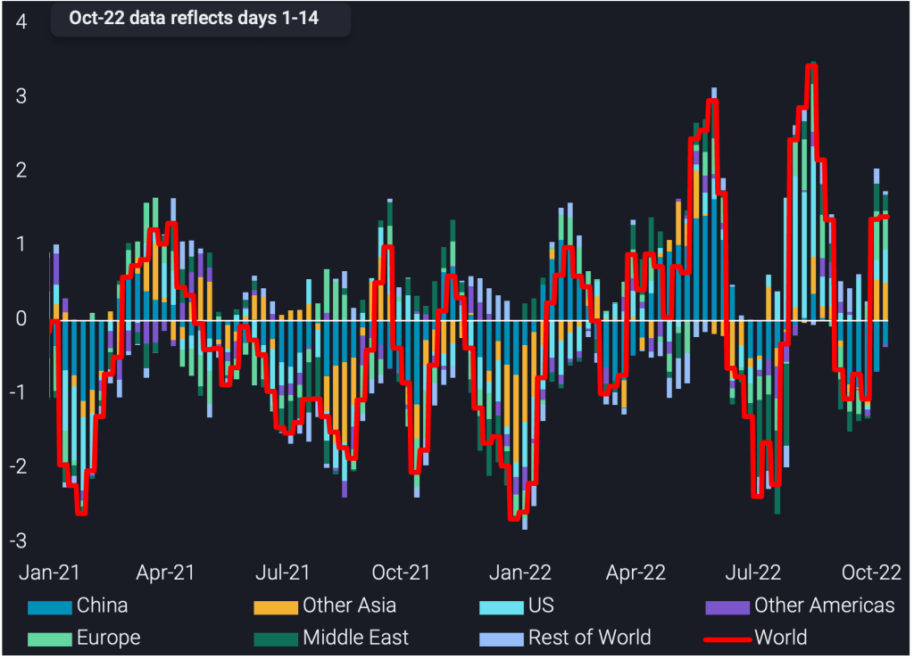

# Global onshore crude inventories continue to build

**Date:** October 20, 2022  
**Publisher:** Breakwave Advisors | **Category:** Market Insights  
**Original URL:** [https://www.breakwaveadvisors.com/insights/2022/10/20/global-onshore-crude-inventories-continue-to-build](https://www.breakwaveadvisors.com/insights/2022/10/20/global-onshore-crude-inventories-continue-to-build)  

---

*By*[*Armen Azizian*](https://www.linkedin.com/in/armenazizian/)

Global crude inventories have been volatile in 2022, with recent stock builds stocks in floating-roof tanks indicating another build phase as we approach Q4. This insight will highlight recent developments and illustrate what these builds mean for the global crude oil market.

Observed global onshore crude inventories (largely in floating-roof tanks) grew at an accelerated rate of 1.4mbd over the last 4 weeks ending 14 October, reaching 3.17bb.

This recent build in inventories is much faster than the average 610kbd rate across the six months to 14 October 2022. During the same period last year, stocks drew by 860kbd, implying that the global crude balance lengthened by 1.5mbd y-o-y over that period. However, when accounting for stock changes in the US SPR, the stockbuild over the last six months is essentially canceled out, while the y-o-y widening of the crude balance is cut into half.

For the week ending 14 October, global crude stocks are entering the third building period of 2022, reflected by two consecutive weeks of 10mb stock builds on a 4-week average basis. The previous two building periods of 2022 ended 2 June and 18 August, where stock build highs were 20mb and 24mb (4-week average), respectively. Global floating roof tank utilisation is indicative of this, rising above 56% as of 14 October 2022, the third time this level has been reached in 2022.

The key drivers behind the most recent stock builds are the following:

1) Supply risk ahead of EU sanctions on Russian oil

As the northern hemisphere’s winter fast approaches, global crude stockpiling is underway to ensure supply security. Onshore crude storage is climbing, as the risks of product shortages in Europe through the winter (reasons of which are listed below) will incentivise refiners to draw stocks and increase runs where possible to supply Europe. Europe’s imports of diesel from India in October (days 1-15) sit at 330kbd, a 180kbd increase m-o-m and a multi-year high.

Another element of supply risk is also evident in the extraordinary levels for European diesel cracks which peaked above $70/bl in October, underlying the need for Europe to have sufficient crude supplies available to continue producing the road fuel, irrespective of Russia-related supply/logistical constraints.

2) European refinery maintenance (planned and unplanned)

Strikes across France have unexpectedly taken 740kbd of refining capacity offline, the country is a huge importer of diesel and since the strikes crude flows into France have declined. On top of this, planned maintenance this month at sites including Eni’s Sannazzaro refinery and Repsol’s Tarragona refinery (Reuters) is also hampering European run rates.

## European Crude/condensate Floating Roof Inventories Rising

European onshore crude inventories were at 497mb as of 14 October, a 6mb stock build m-o-m and 18 month highs. Europe’s tank utilisation, at 58.9%, is the highest in 12 months. This coincides with European seaborne crude/condensate imports sitting at 8.5mb as of 15 October, 500kbd above the 2021 average but a decline from the[2 year highs of September](https://www.vortexa.com/insights/crude/european-crude-condensate-imports-reach-2-year-high-in-september/).

The countries that have been driving the build are France, Italy and Netherlands, with 2.7mb, 5.9mb and 1.7mb builds m-o-m, respectively. The former can be attributed to strike action (mentioned above).

On a weekly basis (latest data as of 14 October),[European](https://analytics.vortexa.com/?dateRange=2020-01-30T00%3A00%3A00.000Z__2022-10-14T23%3A59%3A59.999Z&hiddenSeries=%5B%222cfd6f285665585c60351b6d59508896a8d5672da60eba9c8e3191591c5ec400%22%2C%22dd80e5e493cdd218a037721239189244c84d318d3df877544e9cc717efd89b21%22%2C%22b36c45f9370868b3030ac6567a4e344d69932d843b2125a41901a295e48a2d32%22%2C%22d1357097959bb46ccb3d9adc96640cb8d86782639e7f5b13e745db9fc08ed475%22%2C%2239f1baa602b24621eaa84786e298661bdf966e04ab05646cd1942d798712cedf%22%2C%22other%22%5D&multiSelect=1&onshoreInventoriesLocations=%5B%22f39d455f5d38907394d6da3a91da4e391f9a34bd6a17e826d6042761067e88f4%22%5D&page=OnShoreCrudeInventories&selectedRegion=%5B%22f39d455f5d38907394d6da3a91da4e391f9a34bd6a17e826d6042761067e88f4%22%5D&splitSelected=location_country&tabId=5bba9d4b-b30a-4ff3-89ba-f13d871acba1&tankCrude=%5B%22confirmed%22%2C%22probable%22%5D)stocks rose 4.2mb. This build was also driven by the same countries with the large m-o-m increases – France, Italy and Netherlands posted 3.1mb, 2.5mb and 1.5mb builds w-o-w, respectively.

> **Figure 1: European Crude/condensate Imports Split by Destination Country**  
> *European crude/condensate imports split by destination country (mbd, LHS)vsEurope onshore crude inventories (mb, RHS)*  
> **Interactive Data & Source:** [Analytics Vortexa](https://analytics.vortexa.com/?dateRange=2019-01-01T00%3A00%3A00.000Z__2022-10-15T23%3A59%3A59.999Z&filtersEnabled=%5B%22p%22%2C%22o%22%2C%22d%22%2C%22d_r%22%2C%22v%22%2C%22intra%22%2C%22sts_o%22%2C%22c_o%22%2C%22sts%22%2C%22c%22%5D&geoBreakdownDestinationGlobal=region&gradeAnalysisClassification=api&metric=bpd&movementEvent=unloading_start&page=Flows&products=%5B%2254af755a090118dcf9b0724c9a4e9f14745c26165385ffa7f1445bc768f06f11%22%5D&tabId=dc0ced44-d3ea-4ca6-ab9e-822672330557&timeSeriesProperty=destination_country&to=%5B%22f39d455f5d38907394d6da3a91da4e391f9a34bd6a17e826d6042761067e88f4%22%5D) | [Local Asset](file:///C:/Users/Dell/Github/Shipping/corpus/03-breakwave/insights/2022/assets/2022-10-20_global-onshore-crude-inventories-continue-to-build_img_onshore-europe-1-1024x739_9843b06abff7.png)

## Other Consumer Regions Also Build Stocks, Producer Nations Show Drawdown

Outside of Europe, stock builds in floating roof tanks have also been taking place in North America and Asia, albeit at reduced rates. The former region’s builds are largely accounted for by the transfer of volumes from the US SPR into commercial storage while Asia builds are the result of diverging patterns for key players in the region.

[North America](https://analytics.vortexa.com/?dateRange=2020-01-30T00%3A00%3A00.000Z__2022-10-14T23%3A59%3A59.999Z&hiddenSeries=%5B%222cfd6f285665585c60351b6d59508896a8d5672da60eba9c8e3191591c5ec400%22%2C%22dd80e5e493cdd218a037721239189244c84d318d3df877544e9cc717efd89b21%22%2C%22b36c45f9370868b3030ac6567a4e344d69932d843b2125a41901a295e48a2d32%22%2C%22d1357097959bb46ccb3d9adc96640cb8d86782639e7f5b13e745db9fc08ed475%22%2C%2239f1baa602b24621eaa84786e298661bdf966e04ab05646cd1942d798712cedf%22%2C%22other%22%5D&multiSelect=1&onshoreInventoriesLocations=%5B%22ae06d7e47d6ca2a5bcd7625b8ad402d39e5e92fcc740157dc3301a6d2a6bb207%22%5D&page=OnShoreCrudeInventories&selectedRegion=%5B%22ae06d7e47d6ca2a5bcd7625b8ad402d39e5e92fcc740157dc3301a6d2a6bb207%22%5D&splitSelected=location_country&tabId=5bba9d4b-b30a-4ff3-89ba-f13d871acba1&tankCrude=%5B%22confirmed%22%2C%22probable%22%5D)saw a 3mb stock build w-o-w, placing it’s total stocks (North America floating roof plus all tank types in Cushing) at the highest level since January 2021. This build is driven by the United States, which built 3.2mb whilst Canada saw a slight draw of 220kb. The United States has built 66mb crude stocks since July 2022, driven by SPR releases which have partly gone into commercial storage.

[Asia](https://analytics.vortexa.com/?dateRange=2020-01-30T00%3A00%3A00.000Z__2022-10-14T23%3A59%3A59.999Z&hiddenSeries=%5B%222cfd6f285665585c60351b6d59508896a8d5672da60eba9c8e3191591c5ec400%22%2C%22dd80e5e493cdd218a037721239189244c84d318d3df877544e9cc717efd89b21%22%2C%22b36c45f9370868b3030ac6567a4e344d69932d843b2125a41901a295e48a2d32%22%2C%22d1357097959bb46ccb3d9adc96640cb8d86782639e7f5b13e745db9fc08ed475%22%2C%2239f1baa602b24621eaa84786e298661bdf966e04ab05646cd1942d798712cedf%22%2C%22other%22%5D&multiSelect=1&onshoreInventoriesLocations=%5B%22e6955a2c59dc90833986fe0894cf6718dddaa7816bb51bc955cdd3eb4470e554%22%5D&page=OnShoreCrudeInventories&selectedRegion=%5B%22e6955a2c59dc90833986fe0894cf6718dddaa7816bb51bc955cdd3eb4470e554%22%5D&tabId=5bba9d4b-b30a-4ff3-89ba-f13d871acba1&tankCrude=%5B%22confirmed%22%2C%22probable%22%5D)saw a 800kb stock build w-o-w, the second consecutive weekly build following the 16mb stock build seen the previous week.
The build is driven largely by India (+2mb w-o-w) and reflective of India’s high crude imports so far in October (days 1-15), sitting at 4.3mbd. The country has been a key importer of discounted Russian Urals, which accounts for nearly 20% of its October crude imports, having been a negligible feedstock for the country before the Russia-Ukraine war. Taiwan and Singapore, Taiwan and Thailand saw a collective stock build of 2mb w-o-w. On the other hand, whilst China is largely unchanged w-o-w, Japan and South Korea saw stock draws of 1.57mb each w-o-w.

[OPEC](https://analytics.vortexa.com/?dateRange=2020-01-30T00%3A00%3A00.000Z__2022-10-14T23%3A59%3A59.999Z&hiddenSeries=%5B%222cfd6f285665585c60351b6d59508896a8d5672da60eba9c8e3191591c5ec400%22%2C%22dd80e5e493cdd218a037721239189244c84d318d3df877544e9cc717efd89b21%22%2C%22b36c45f9370868b3030ac6567a4e344d69932d843b2125a41901a295e48a2d32%22%2C%22d1357097959bb46ccb3d9adc96640cb8d86782639e7f5b13e745db9fc08ed475%22%2C%2239f1baa602b24621eaa84786e298661bdf966e04ab05646cd1942d798712cedf%22%2C%22other%22%5D&multiSelect=1&onshoreInventoriesLocations=%5B%225057dafe08229da478858da705209d61d88db8dcaadf8376c266eeabdbe1f0ee%22%5D&page=OnShoreCrudeInventories&selectedRegion=%5B%225057dafe08229da478858da705209d61d88db8dcaadf8376c266eeabdbe1f0ee%22%5D&splitSelected=location_country&tabId=5bba9d4b-b30a-4ff3-89ba-f13d871acba1&tankCrude=%5B%22confirmed%22%2C%22probable%22%5D)nations saw a 8.3mb stock draw w-o-w, placing its total stocks near the year-low of 2022. Amidst the announced 2mbd production cut target, and the group failing to increase their production significantly in September, the collective group has been drawing stocks to supply the global market and/or feed its own refineries. OPEC exported 1.4mbd of diesel in October (1-15), a multi-year high.

[West Africa](https://analytics.vortexa.com/?dateRange=2020-01-30T00%3A00%3A00.000Z__2022-10-14T23%3A59%3A59.999Z&hiddenSeries=%5B%222cfd6f285665585c60351b6d59508896a8d5672da60eba9c8e3191591c5ec400%22%2C%22dd80e5e493cdd218a037721239189244c84d318d3df877544e9cc717efd89b21%22%2C%22b36c45f9370868b3030ac6567a4e344d69932d843b2125a41901a295e48a2d32%22%2C%22d1357097959bb46ccb3d9adc96640cb8d86782639e7f5b13e745db9fc08ed475%22%2C%2239f1baa602b24621eaa84786e298661bdf966e04ab05646cd1942d798712cedf%22%2C%22other%22%5D&multiSelect=1&onshoreInventoriesLocations=%5B%229f9774f40a5a36f75ae844510feaf1c01c262cf84ba1f229ff6a93fb8e0171e2%22%5D&page=OnShoreCrudeInventories&selectedRegion=%5B%229f9774f40a5a36f75ae844510feaf1c01c262cf84ba1f229ff6a93fb8e0171e2%22%5D&splitSelected=location_country&tabId=5bba9d4b-b30a-4ff3-89ba-f13d871acba1&tankCrude=%5B%22confirmed%22%2C%22probable%22%5D)saw a 850kb stock draw w-o-w, with Nigeria accounting for the largest w-o-w draw of 850kb. This is indicative of its attempts to raise exports which have been depressed in recent months due to port and pipeline closures coupled with declining production. Angolan crude stocks are assessed at 4.8mb, largely unchanged w-o-w. Angolan stocks have been drawing since August, with total stocks hitting lows not seen since June 2022. This is reflective of its attempt to sustain elevated crude exports.

> **Figure 2: Global Inventories 2 1024x739**  
> **Interactive Data & Source:** [Vortexa](https://www.vortexa.com//oil-gas-data-traders-analysts-data-scientists?gclid=Cj0KCQjw8_qRBhCXARIsAE2AtRZKOvMnbilZ_6_91d7huSFFy71pWLrnPwGwOHVzXsmsG-1a1mZnQw8aAt89EALw_wcB&hsa_acc=1782073842&hsa_ad=548425387665&hsa_cam=14746637662&hsa_grp=125038601902&hsa_kw=&hsa_mt=&hsa_net=adwords&hsa_src=g&hsa_tgt=dsa-1431852288425&hsa_ver=3&utm_campaign=%5BCD%5D%20-%20DSA%20-%20EMEA&utm_medium=cpc&utm_medium=ppc&utm_source=google&utm_source=adwords&utm_term=) | [Local Asset](file:///C:/Users/Dell/Github/Shipping/corpus/03-breakwave/insights/2022/assets/2022-10-20_global-onshore-crude-inventories-continue-to-build_img_global-inventories-2-1024x739_f4fb87046265.png)

### World Onshore Crude Inventory Change by Region (4-Week Average, Mbd)

Data Source:[Vortexa](https://www.vortexa.com//oil-gas-data-traders-analysts-data-scientists?gclid=Cj0KCQjw8_qRBhCXARIsAE2AtRZKOvMnbilZ_6_91d7huSFFy71pWLrnPwGwOHVzXsmsG-1a1mZnQw8aAt89EALw_wcB&hsa_acc=1782073842&hsa_ad=548425387665&hsa_cam=14746637662&hsa_grp=125038601902&hsa_kw=&hsa_mt=&hsa_net=adwords&hsa_src=g&hsa_tgt=dsa-1431852288425&hsa_ver=3&utm_campaign=%5BCD%5D%20-%20DSA%20-%20EMEA&utm_medium=cpc&utm_medium=ppc&utm_source=google&utm_source=adwords&utm_term=)
