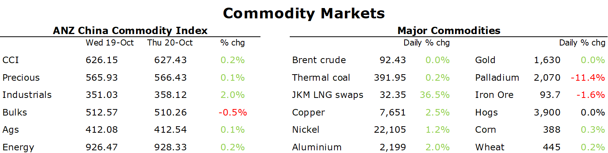

# Metals gain amid signs of tight supplies

**Date:** October 21, 2022  
**Publisher:** Breakwave Advisors | **Category:** Market Insights  
**Original URL:** [https://www.breakwaveadvisors.com/insights/2022/10/21/metals-gain-amid-signs-of-tight-supplies](https://www.breakwaveadvisors.com/insights/2022/10/21/metals-gain-amid-signs-of-tight-supplies)  

---

*By*[*Daniel Hynes*](https://www.linkedin.com/in/dahynes/)

Commodities edged higher as tight supplies and signs of robust demand boosted sentiment. Bulk commodities remained under pressure amid ongoing weakness in China’s real estate market.

> **Figure 1: European Natural Gassurged More Than 13% As the Likelihood of A**  
> *European natural gassurged more than 13% as the likelihood of a price cap eased. France, Italy and Poland want to limit prices, but Germany opposes the idea. It argues it would endanger supply at a time when the region needs all the flows it can get. The leaders have gathered in Brussels for a two-day summit to discuss the energy crisis. This comes amid high inventories and forecasts for warmer weather that has suppressed demand. However, this could quickly turn with a cold snap. Signs of lower wind generated power output across Europe added to the bullish sentiment. Dutch front month futures ended the session at EUR127.15/MWh. North Asia LNG futures extended gains amid ongoing supply risks. Severe flooding has seen Nigeria LNG Ltd announceforce majeureon exports, putting at risk more than 15% of LNG supply to the region. This has sparked further buying by Asian consumers worried about tightness ahead of winter. Woodside’s CEO, Meg O’Neill, warned that customers are looking for more cargo to cover the season.*  
> **Interactive Data & Source:** [Linkedin](https://www.linkedin.com/newsletters/commodities-wrap-6692196755876012032/?fbclid=IwAR3kiXJqZdxmp9ZcRwBNI7FsBySI-XSC0pfPur1qzjt7OZp7PTE59Tsl1QI) | [Local Asset](file:///C:/Users/Dell/Github/Shipping/corpus/03-breakwave/insights/2022/assets/2022-10-21_metals-gain-amid-signs-of-tight-supplies_img_1666299616766_11d38ef81a88.png)

**Crude oil**gained sharply in early trade amid optimism China may ease quarantine restrictions. Demand for crude oil has been muted in recent months as Beijing continues its zero-COVID strategy. According to a report by Bloomberg, officials have been recently debating whether to ease restrictions for visitors to the country. While such a move would have limited impact on oil consumption, it signals a possible change in strategy that could ultimately lead to a revival in economic activity. Efforts by the US to lower oil prices also failed. President Biden announced the drawdown of an additional 15mbbl of oil from the US strategic reserve. Traders shrugged off the news, with the release seen as part of its original 180mbbl release that commenced earlier this year. Instead, the market was more interested in the guidelines for refilling the reserve. Biden’s comments that the US will only buy crude once prices hit USD70/bbl provides a strong support level for the market.

Base metals gained amid signs of strong demand.**Copper**gained after Freeport’s CEO, Richard Adkersen, called the physical market strikingly tight, and customers are not reducing orders. Global trading house Trafigura said the green energy transition and tight supply with drive a rally in copper. Stockpiles remain low at 4.7 days of consumption.**Aluminium**rose after a surprise spike in orders to withdraw metal from LME warehouses. Recent inflows have raised concerns that Russian companies were dumping metal ahead of a prospective ban. However, the latest data suggests demand remains high. This comes as the Biden administration is considering options including sanctions on Russia’s top aluminium producer.

**Gold**rose strongly early in the session as a weaker USD boosted investor appetite. This wasn’t enough to placate the broader investment community, with outflows from gold-backed exchange traded funds accelerating. Holdings fell by 12.5t on Wednesday, according to Bloomberg data.

**Iron ore**futures in Singapore fell below USD90/t amid concerns that China’s real estate crisis looks poised to extend well into 2023. Hopes that China’s National Peoples’ Congress would bring some easing of its policy have faded quickly.

Data source:[Commodities Wrap](https://www.linkedin.com/newsletters/commodities-wrap-6692196755876012032/?fbclid=IwAR3kiXJqZdxmp9ZcRwBNI7FsBySI-XSC0pfPur1qzjt7OZp7PTE59Tsl1QI)
