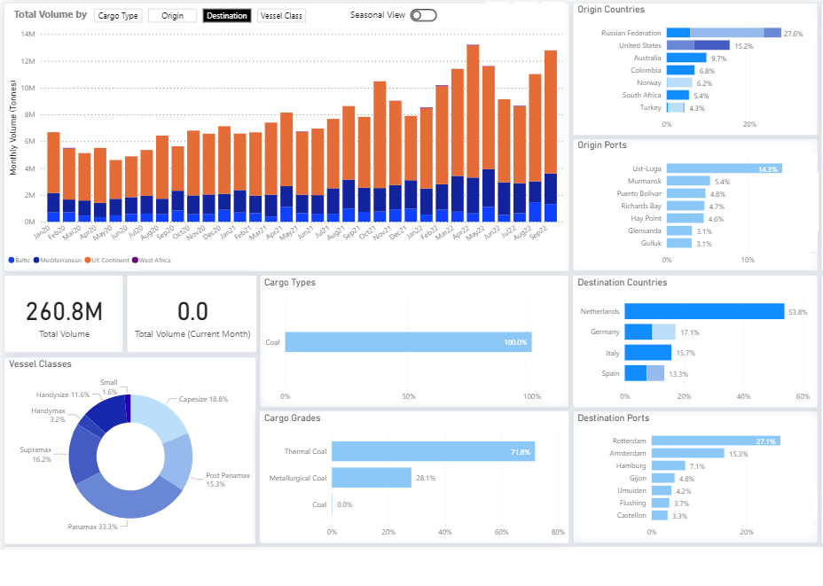
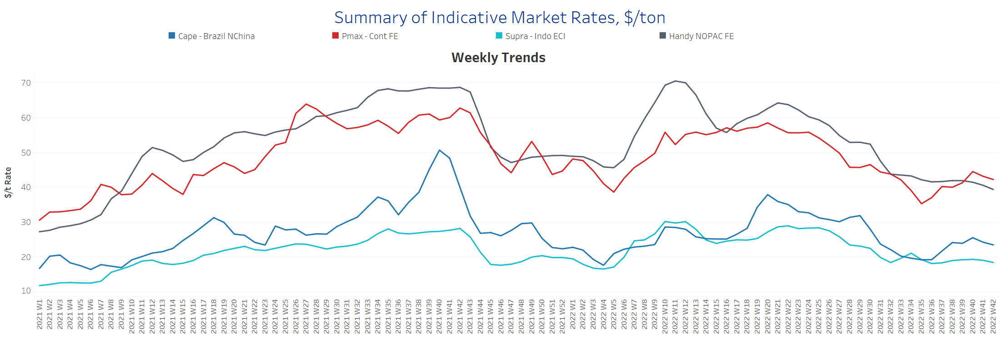
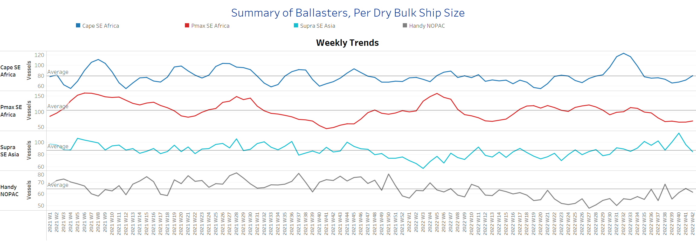
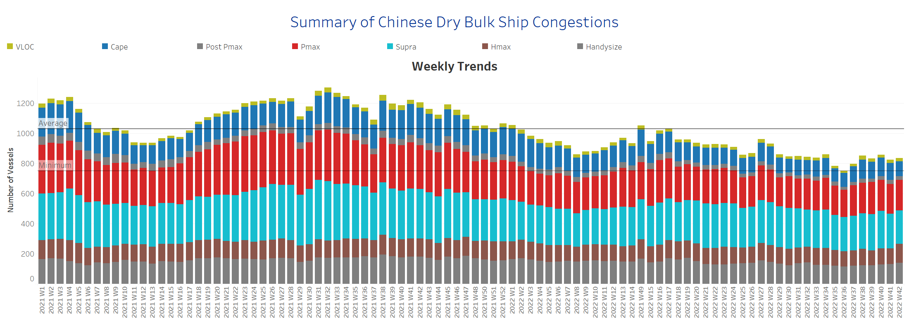

# Signal Dry Bulk Weekly Report

**Date:** October 21, 2022  
**Publisher:** Breakwave Advisors | **Category:** Market Insights  
**Original URL:** [https://www.breakwaveadvisors.com/insights/2022/10/21/signal-dry-bulk-weekly-report](https://www.breakwaveadvisors.com/insights/2022/10/21/signal-dry-bulk-weekly-report)  

---

Freight rates in the Capesize and Panamax segments, as well as in the smaller vessel categories, weakened in the third week of October, indicating slower percentage demand growth. However, dry bulk coal flows continue to see an increase in shipments to Europe, with the Netherlands, Germany, Italy, and Spain as the main destinations, and Russia still considered the main country of origin.

**Chart of the Week Dry Bulk Flows: Europe continues to import coal**
*The Netherlands at the top*

> **Figure 1: Data Source: The Signal Ocean Platform**  
> *Data Source: The Signal Ocean Platform, Dry Bulk Flowshttps://go.signalocean.com/e/983831/dry-reports-drybulkflows/2kk94v/280281820?h=kO7eAqUxpoIeVOcP1sJzboQA187-UsG8IoyZKvbCA0o*  
> **Interactive Data & Source:** [Signal Ocean Platform](https://go.signalocean.com/e/983831/dry-reports-drybulkflows/2kk94v/280281820?h=kO7eAqUxpoIeVOcP1sJzboQA187-UsG8IoyZKvbCA0o) | [Local Asset](file:///C:/Users/Dell/Github/Shipping/corpus/03-breakwave/insights/2022/assets/2022-10-21_signal-dry-bulk-weekly-report_img_unnamed289829_dcccc4aa9408.png)

In the iron ore market, Mining.com news reported a drop in prices as China's zero-tolerance approach to Covid-19 has caused supply chain disruptions, dampened demand and dramatically slowed China's economy. According to Fastmarkets MB, 62% fine ore imported in northern China traded for $93.68 per tonne on Thursday morning, down 1.94%. In addition, Rio Tinto predicted slower growth in Chinese demand in its quarterly report, with iron ore prices tending to reach the lowest levels in 2022.

## Section 1/ Freight -Market Rates ($/T) Weaker

‘The Big Picture’ - Capesize and Panamax Bulkers and Smaller Ship Sizes

> **Figure 2: Market Chart 2**  
> **Interactive Data & Source:** [Signal Ocean Platform](https://www.thesignalgroup.com/signal-ocean-platform) | [Local Asset](file:///C:/Users/Dell/Github/Shipping/corpus/03-breakwave/insights/2022/assets/2022-10-21_signal-dry-bulk-weekly-report_img_unnamed289929_8f86b7f7c0b1.png)

The third week of October began with a downward trend in all size categories, with Panamax and Capesize rates still firmer than in September despite the recent slump.

- **Capesize**freight rates from Brazil to North China fell to $23.5/tonne, down nearly $2/tonne from week 40.
- **Panamax**freight rates from the Continent to the Far East fell below $43/tonne, but are still $8/tonne above the week 35 low.
- **Supramax**freight rates for the Indo-ECI route were below $19/tonne for the first time since the end of week 37, continuing a trend of falling rates.
- **Handysize**vessel freight rates from NOPAC to the Far East fell to $49/tonne,which appears to be the lowest since January last year.

## Section 2/ Supply -Ballasters (# Vessels) Increasing

> **Figure 3: Supply Trend Lines for Key Load Areas**  
> **Interactive Data & Source:** [Signal Ocean Platform](https://www.thesignalgroup.com/signal-ocean-platform) | [Local Asset](file:///C:/Users/Dell/Github/Shipping/corpus/03-breakwave/insights/2022/assets/2022-10-21_signal-dry-bulk-weekly-report_img_unnamed2810029_e781e432ab06.png)

The trend has decreased significantly in the Capesize segment, while a strong downward correction is observed in the Supramax segment.

- **Capesize**demand ton-days: The percentage increase is now at its lowest level in a month, while freight rates showed a weaker picture in the October days.
- **Panamax**demand ton-days: The volatility of the recorded growth remains with an insignificant upward or downward trend, but with a gradually slower rate of increase.
- **Supramax**demand ton-days: The slower growth rate followed the last peak of week 38 while maintaining the weaker outlook of the previous days.
- **Handysize**demand ton-days: The sudden decline seen since week 40 continued in the following days and is now even lower, with no signs of recovery.

## Section 4/ Port Congestion -No of Vesselsdecreasing

> **Figure 4: Dry Bulk Ships Congested at Chinese Ports**  
> **Interactive Data & Source:** [Signal Ocean Platform](https://www.thesignalgroup.com/signal-ocean-platform) | [Local Asset](file:///C:/Users/Dell/Github/Shipping/corpus/03-breakwave/insights/2022/assets/2022-10-21_signal-dry-bulk-weekly-report_img_unnamed-2022-10-21t124130908_ce2ebf557a82.png)

The number of congested vessels showed a downward trend after an accelerated increase in the previous weeks, while in the smaller vessel categories the numbers seemed to remain at a high level.

- **Capesize:**The number of vessels dropped to less than 100 for the first time since week 36.
- **Panamax:**The number of vessels is still too high at 200, compared to the low of 178 vessels in week 36.
- **Supramax:**The number of congested vessels decreased to 220, down 10 from the previous week.
- **Handysize**: The number of congested vessels was 139, 7 more than the previous week.

Data Source:[Signal Ocean Platform](https://www.thesignalgroup.com/signal-ocean-platform)
