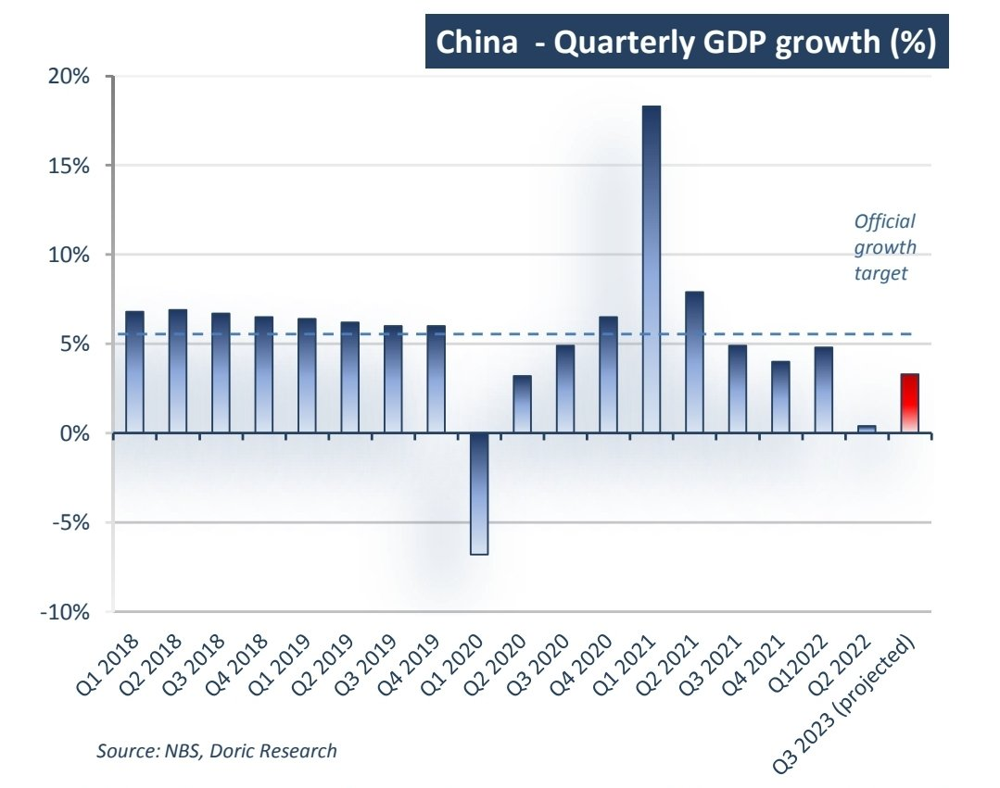
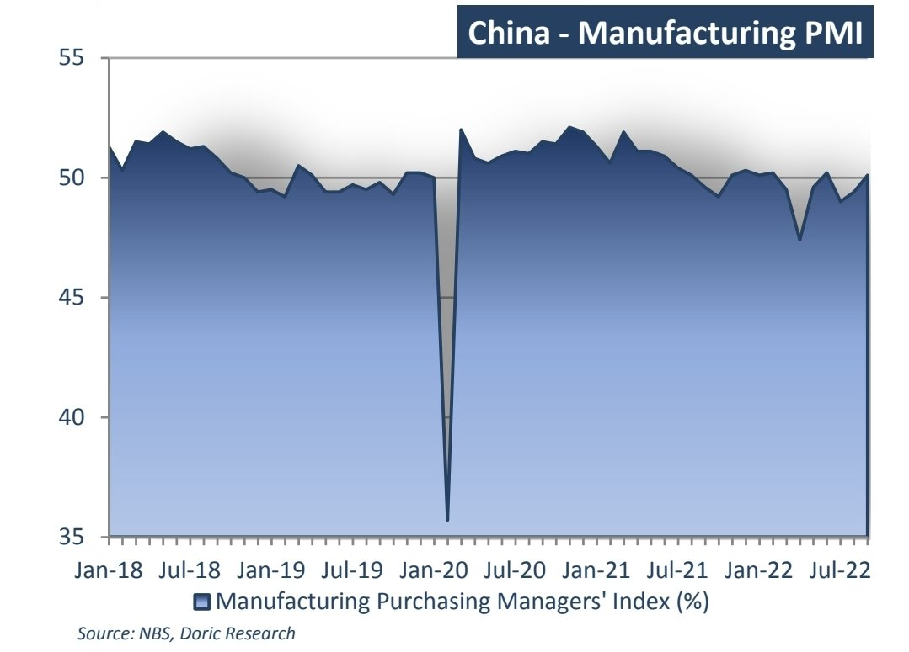

# Doric Market Weekly Report

**Date:** October 24, 2022  
**Publisher:** Breakwave Advisors | **Category:** Market Insights  
**Original URL:** [https://www.breakwaveadvisors.com/insights/2022/10/24/fxvpz1w52pbditqxbwe3e6jee01sji](https://www.breakwaveadvisors.com/insights/2022/10/24/fxvpz1w52pbditqxbwe3e6jee01sji)  

---

*By*[*Michalis Voutsinas*](https://www.linkedin.com/in/michalis-voutsinas-587544163/)

The forty-second trading week of last year was anything but dull. “Following the previous week’s harsh Capesize correction, the third Monday of October saw a plethora of macro data been published. In particular, missing market expectations of 5 percent growth and being well below the 7.9 percent gain of the second quarter, China’s economy grew by 4.9 percent in the third quarter of 2021 compared with a year earlier, according to the National Bureau of Statistics.

Following a period of turmoil, the world’s second largest economy rebounded from the pandemic but the recovery was losing steam. Faltering factory activity, electricity shortages, persistently soft consumption and a slowing property sector had altogether a clear bearing on the softer growth of the last few quarters”. Last year’s Doric Weekly Insight started with these lines.

Twelve months later, the spot market was trading within a very narrow range for yet another week whilst China's third quarter GDP data were not available on the official website. In fact, the only update from the government’s statistics department came to clarify that the renewed data would be delayed, without providing further explanation or comment.

Away from the centre stage of the 20th National Congress of the Communist Party of China, a press conference on Monday addressed the delicate question of economic growth. “The economy rebounded significantly in the third quarter,” said Zhao Chenxin, a senior official at the National Development and Reform Commission. On the other hand, economists had forecast growth of just 3.3 percent – far below its 5.5 percent target for the year.

> **Figure 1: Screenshot 20221024 144511 Samsung Notes (1)**  
> [Local Asset](file:///C:/Users/Dell/Github/Shipping/corpus/03-breakwave/insights/2022/assets/2022-10-24_fxvpz1w52pbditqxbwe3e6jee01sji_img_screenshot-20221024-144511-samsungno_8a68660f566b.jpg)

Whilst a divergence of views between most of the economists and Zhao Chenxin became apparent, the latest official data published earlier this month indicated an economy trending sideways. In September, the Purchasing Manager Index (PMI) of China's manufacturing industry was 50.1 percent – up by 0.7 percentage points from the previous month – entering marginally into the expansion range. Among the five sub-indices that constitute the manufacturing PMI, the production index was the only one lingering higher than the threshold.

The new order index, the raw material inventory index, the employee index and the supplier delivery time index were all balancing below the threshold. In particular, the production index was 51.5 percent, reporting an increase of 1.7 percentage points month-on-month. Being increased by 0.6 percent from the previous month, the new order index lay at 49.8 percent, yet still remaining below the threshold. Being decreased by 0.4 percentage point from the previous month, the raw materialinventory index balanced at 47.6 percent, indicating that the inventory of major raw materials in the manufacturing industry was less than that of the previous month.

The employment index was 49.0 percent, trending sideways during the last month. The supplier delivery time index was 48.7 percent, indicating that the delivery time of raw material suppliers in the manufacturing industry was longer than that of the previous month.

> **Figure 2: Screenshot 20221024 144526 Samsung Notes (1)**  
> [Local Asset](file:///C:/Users/Dell/Github/Shipping/corpus/03-breakwave/insights/2022/assets/2022-10-24_fxvpz1w52pbditqxbwe3e6jee01sji_img_screenshot-20221024-144526-samsungno_a0232610b78d.jpg)

As the latest official data revealed a rather lukewarm picture for the course of the world’s second largest economy and the lack of fresh statistics injected uncertainty in the market, China’s state media emphasised on the previous decade economic progress. In 2021, China's gross domestic product reached 17.7 trillion US dollars, accounting for 18.5 percent of the world's total. From 2013 to 2021, it grew at an average annual rate of 6.6 percent, beating the average global growth of 2.6 percent.

During the same period, its contribution to global economic growth averaged 38.6 percent, higher than that of the G7 countries combined. Amid endeavors to open up wider to the world, China's foreign trade has seen a robust expansion in the past decade. In 2020, the country surpassed the US to become the world's largest trading country for the first time, with a total foreign trade volume of 5.3 trillion US dollars, up from 4.4 trillion dollars in 2012.

Last year, China's foreign trade volume further expanded to 6.9 trillion dollars, continuing to hold the first place globally. Its foreign trade in goods rose from 3.9 trillion dollars in 2012 to 6.1 trillion dollars last year, accounting for 13.5 percent of the world's total. The country has also remained the largest trader in goods and secondlargest trader in services in the world.

Setting aside China’s last decade impressive performance, this week, industrial metals as well as bulkers were eager for forward-looking statements and answers. In the absence of the aforementioned, iron ore's losses deepened on Thursday, with the benchmark price of the steelmaking ingredient in Singapore hitting a fresh 2022 low. Steel prices in China – accounting for about half the world's output of the manufacturing material – also fell amid a worsening Covid-19 situation in Beijing. Capesizes, on the other hand, were reluctant to set course, trending sideways and looking for further insights in the foreseeable future.
