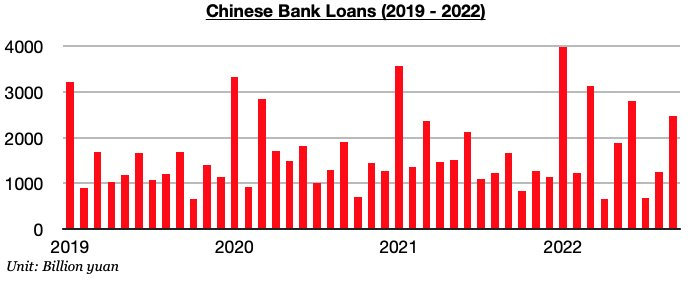
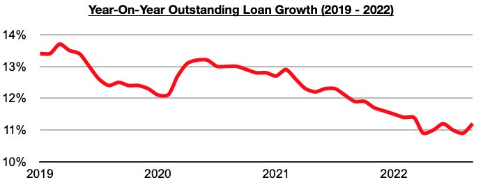

# Shift In China Continues

**Date:** October 25, 2022  
**Publisher:** Breakwave Advisors | **Category:** Market Insights  
**Original URL:** [https://www.breakwaveadvisors.com/insights/2022/10/25/shift-in-china-continues](https://www.breakwaveadvisors.com/insights/2022/10/25/shift-in-china-continues)  

---

*By*[*Jeffrey Landsberg*](https://www.linkedin.com/in/jeffrey-landsberg-70ab957/)

Chinese banks issued 2.47 trillion yuan in new loans in September. This marks a month-on-month increase of 1.22 trillion yuan (98%) and a year-on-year increase of 810 billion yuan (49%). China’s new loans have each now increased on both a month-on-month and year-on-year basis during four of the last five months. Last month’s 2.47 trillion yuan in new loans has also marked the largest total seen since June.

> **Figure 1: Chart 1 (57)**  
> [Local Asset](file:///C:/Users/Dell/Github/Shipping/corpus/03-breakwave/insights/2022/assets/2022-10-25_shift-in-china-continues_img_chart1285729_0e1a2a564e4b.jpg)

Also of note is that outstanding loan growth has finally rebounded. Outstanding loan growth last month came in at 11.2%. Previously, it came in at only 10.9% in August, which matched the low seen in April. Prior to April, it had been over ten years since outstanding low growth came in at 10.9% or lower. It is certainly encouraging that growth has improved.

> **Figure 2: Chart 2 (49)**  
> [Local Asset](file:///C:/Users/Dell/Github/Shipping/corpus/03-breakwave/insights/2022/assets/2022-10-25_shift-in-china-continues_img_chart2284929_049025aa3fdd.jpg)

As we have been discussing in Commodore's Weekly China Reports in the last few months, we have been of the opinion that lending had been likely to increase. China remains only one of three nations that has actually cut rates this year, and its central and regional governments are continuing to work on stimulating the economy. Going forward, we expect that the strength will continue. However, as we have also been stressing recently, the housing market remains in contraction and Chinese banks are still having difficulty in having lendees to actually lend to. During prior stimulating periods in China, the housing market and related sectors have accounted for over half of total loan generation. There are still only so many eligible projects to be funded at present, and the ongoing contraction in Chinese home sales remains a very significant issue. There remains a chance that lending could end up coming in at disappointing levels in the near term.
