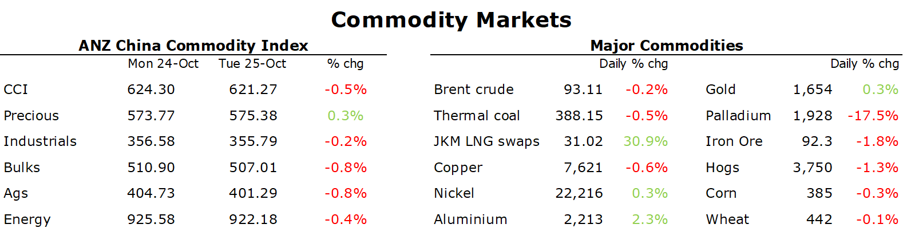

# European gas falls as warm weather eases concerns of shortages

**Date:** October 26, 2022  
**Publisher:** Breakwave Advisors | **Category:** Market Insights  
**Original URL:** [https://www.breakwaveadvisors.com/insights/2022/10/26/european-gas-falls-as-warm-weather-eases-concerns-of-shortages](https://www.breakwaveadvisors.com/insights/2022/10/26/european-gas-falls-as-warm-weather-eases-concerns-of-shortages)  

---

*By*[*Daniel Hynes*](https://www.linkedin.com/in/dahynes/)

Sentiment remained weak in commodity markets as concerns over Chinese growth remain elevated. This was offset somewhat by a weaker USD, which helped support investor demand.

> **Figure 1: 1666731684581**  
> **Interactive Data & Source:** [Linkedin](https://www.linkedin.com/newsletters/commodities-wrap-6692196755876012032/?fbclid=IwAR3kiXJqZdxmp9ZcRwBNI7FsBySI-XSC0pfPur1qzjt7OZp7PTE59Tsl1QI) | [Local Asset](file:///C:/Users/Dell/Github/Shipping/corpus/03-breakwave/insights/2022/assets/2022-10-26_european-gas-falls-as-warm-weather-eases-concerns-of-shortages_img_1666731684581_aa44067284ed.png)

**Crude oil**remained heavily influenced by broader market trends and shifts in the USD. The prospect of a global economic slowdown and tighter monetary policy has been outweighing the spectre of supply reductions in recent weeks. The weak economic data out of China on Monday also lingered over the market. The likely adherence to its zero-COVID strategy will keep pressure on crude oil demand as travel remains heavily restricted. A weaker USD helped drive Brent crude and WTI early in the session. Nevertheless, the supply side issues continue to hang over the market. IEA Executive Director Fatih Birol said the recent OPEC+ supply cut was unfortunate and said its members may tap oil reserves if supply is disrupted. Saudi Arabia’s energy minister Prince Abdulaziz bin Salman countered that it was justified by a weak economic outlook and the need to preserve spare buffers. Demand of some refined products remains strong. Diesel appears scarce heading into the Northern Hemisphere winter. The US gasoline market also firmed.

**European natural gas**steadied just below EUR100/MWh as warm weather continues to ease concerns of shortages this winter. High temperatures are likely to persist into November. A total of 29 heating-degree days is expected next week, well below the 10-year average of 45 for this time of the year. Coupled with the strong inflows into storage facilities helped by LNG deliveries, the market is essentially pricing out the risk of a supply shortage this winter. Nevertheless, risks still lie ahead. Inventories only hold six weeks of supply, meaning any further supply disruptions or a cold snap could see them drained quickly. EU ministers meet in Luxemburg to discuss its third batch of emergency measures. Officials have reached an agreement to pursue joint gas purchases, and there are signs it’s moving closer to a price control mechanism for wholesale gas contracts.**North Asia LNG**edged lower as the glut of LNG cargoes heading to Europe weighed on prices globally. Nevertheless, IEA warned that LNG prices could increase significantly next year amid growing demand in Europe and a potential rebound in China’s economy. This comes against a backdrop of limited supply.

**Base metals**remained under pressure as economic weakness in China weighs on sentiment. A rout in Chinese equities earlier this week reflected broader concerns about the nation’s economic prospects after President Xi strengthened his control. These concerns are outweighing signs of tightness in physical markets. Copper inventories in LME warehouses plunged to its lowest level since April, driven by declines in Asia. Spot premiums also remain high. Aluminium bucked the trend, gaining nearly 2% amid increasing fears of sanctions on Russian supplies. Norsk Hydro said that US and EU should stop importing Russian aluminium. This comes as the LME continues to look into a proposal to stop expecting Russian metal into its warehouses.

**Iron ore**futures extended losses on pessimism over the demand outlook in China. Major steel mills in China have seen their stockpiles rise by 8.6% m/m in October amid subdued demand and rising output. Sentiment remains fragile as concerns persist over the property sector. Home prices in major cities fell for the 13th consecutive month, despite government policies to support the market.

The weaker USD helped push**gold**higher. Focus is now switching to the Fed, who are expected to raise rate by 75bps next week.

Data source:[Commodities Wrap](https://www.linkedin.com/newsletters/commodities-wrap-6692196755876012032/?fbclid=IwAR3kiXJqZdxmp9ZcRwBNI7FsBySI-XSC0pfPur1qzjt7OZp7PTE59Tsl1QI)
