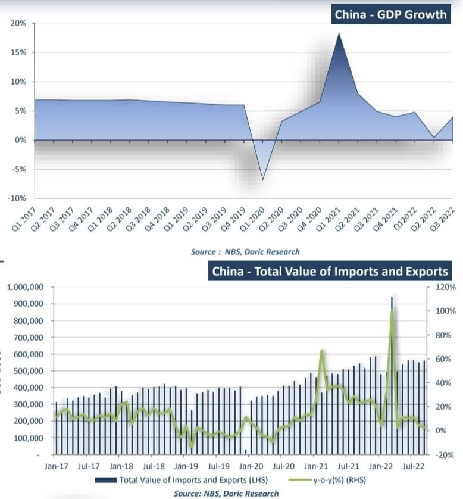
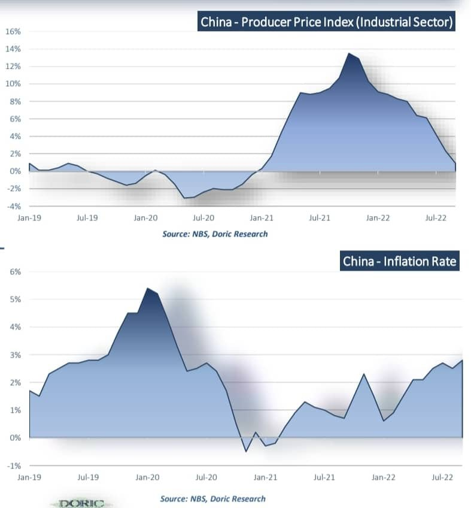
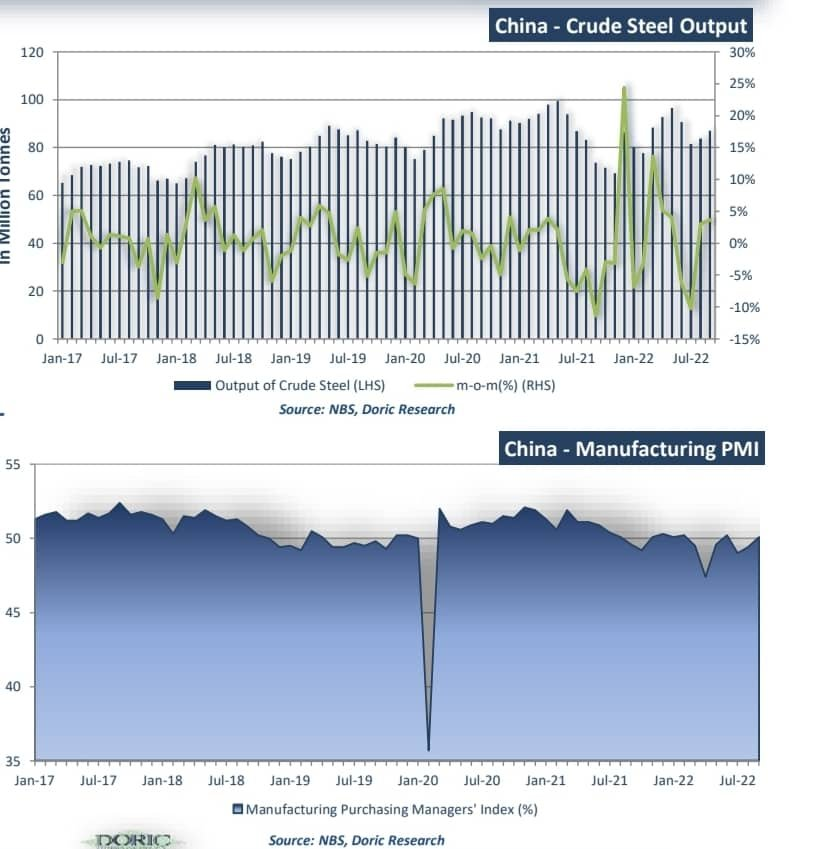
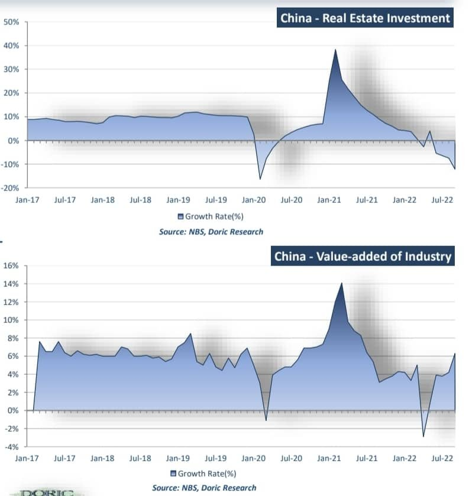
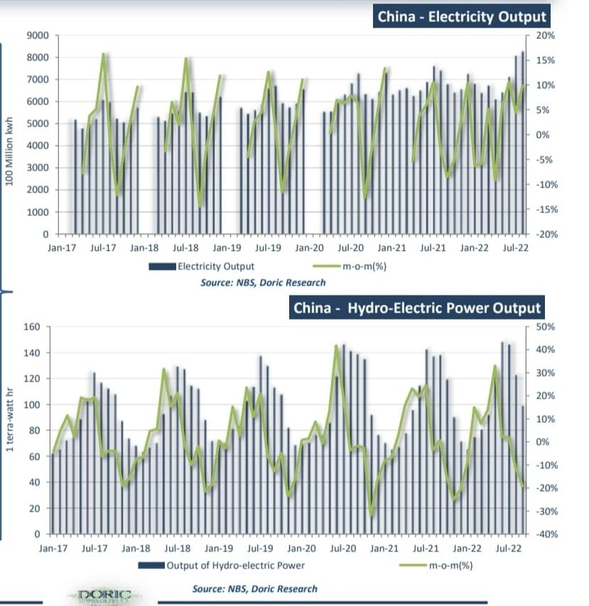
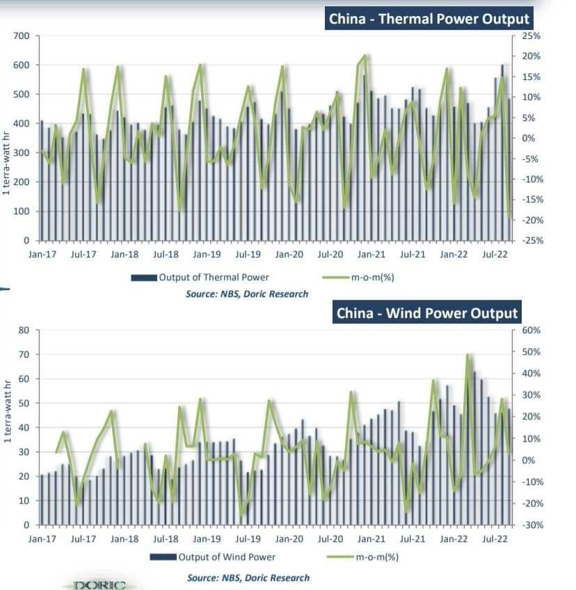

# Doric-China Barometer part 1/2

**Date:** October 27, 2022  
**Publisher:** Breakwave Advisors | **Category:** Market Insights  
**Original URL:** [https://www.breakwaveadvisors.com/insights/2022/10/27/nwaxmddcazat9qsh0nwvgehqq1oajo](https://www.breakwaveadvisors.com/insights/2022/10/27/nwaxmddcazat9qsh0nwvgehqq1oajo)  

---

*By*[*Michalis Voutsinas*](https://www.linkedin.com/in/michalis-voutsinas-587544163/)*and Helen Vlassi*

### Macro Environment

China’s GDP rose by 3.9 percent in the third quarter of 2022, compared with the same period a year earlier, rebounding from the almost stagnant growth of 0.4 percent pace during the second quarter. Despite the rebound, the economy faces challenges on multiple fronts at home and abroad. China’s zero-COVID strategy and strife in its crucial property sector have exacerbated the external pressure from the Ukraine crisis and a global slowdown due to interest rate hikes The China’s central bank announced a cut of interest rate for housing provident fund loans. MACRO ENVIRONMENT OCTOBER 2022. Exports form China witnessed a rise of 5.7 percent year-on-year in September to USD 322.76 billion, decelerating from a gain of 7.0 percent in previous month. Imports to China rose by 0.3 percent yearon-year in September to USD 238.01 billion, recovering from August’s 0.2 percent contraction. China posted a total trade surplus of USD 84.75 billion in September, compared with a USD 79.39 billion surplus in the previous months.

> **Figure 1: 313109424 519148390075432 3185757337252782014 N**  
> **Interactive Data & Source:** [Doric](https://www.doric.gr) | [Local Asset](file:///C:/Users/Dell/Github/Shipping/corpus/03-breakwave/insights/2022/assets/2022-10-27_nwaxmddcazat9qsh0nwvgehqq1oajo_img_313109424-519148390075432-3185757337_2050bd2b9d92.jpg)

### Price Environment

China’s producer-price index rose by 0.9 percent from a year earlier in September, marking its slowest pace since January 2021. China’s factory-gate prices slowed in September, with the country still grappling with Covid-19 curbs and a drop in prices of oil and commodities. On a monthly basis, China’s producer price index eased by 0.1 percent in September, marking its third consecutive month of decline. PRICE ENVIRONMENT OCTOBER 2022. China’s consumer price index inched up by 2.8 percent in September from a year earlier, accelerating from a gain of 2.5 percent in August and climbing at its fastest pace since April 2020. Non-food prices rose by 1.5 percent year-on-year in September, lifting the yearly consumer inflation by circa 1.2 percentage points. On a monthly basis, September’s consumer price index stood 0.3 percent higher than August’s reading.

> **Figure 2: 312921025 660267678819076 1230870583928261128 N**  
> **Interactive Data & Source:** [Doric](https://www.doric.gr) | [Local Asset](file:///C:/Users/Dell/Github/Shipping/corpus/03-breakwave/insights/2022/assets/2022-10-27_nwaxmddcazat9qsh0nwvgehqq1oajo_img_312921025-660267678819076-1230870583_76c9d61abb02.jpg)

### Manufacturing 1/2

China’s production of crude steel increased by 17.6 percent from a year earlier in September, to 86.95 million tonnes . Average daily output in September stood at 2.9 million tonnes, accelerating from a reading of 2.71 million tonnes produced in August. During the first nine months of 2022, China churned out 780.83 million tonnes of crude steel, or down 3.4 percent from a year earlier. MANUFACTURING 1/2 OCTOBER 2022 . The official manufacturing Purchasing Manager's Index (PMI) edged up to 50.1 in September, up 0.7 percentage points month-on-month. The sub-index measuring total new orders increased to 49.8 percent, up 1.7 percentage points from previous month. China’s Purchasing Manager’s Index (PMI) bounced back to the expansion territory, signalling an improvement in manufacturing sector operating conditions from the previous month.

> **Figure 3: 313120261 1251157895740974 1447794218823391772 N**  
> **Interactive Data & Source:** [Doric](https://www.doric.gr) | [Local Asset](file:///C:/Users/Dell/Github/Shipping/corpus/03-breakwave/insights/2022/assets/2022-10-27_nwaxmddcazat9qsh0nwvgehqq1oajo_img_313120261-1251157895740974-144779421_592b3c030a7e.jpg)

### Manufacturing 2/2

China’s real estate investment dropped by 12.1 percent year-on-year in September, slightly narrowing from a 13.8 percent fall in August. Property sales by floor area declined for the 14th consecutive month in September by circa 16.5 percent year-on-year, from a slump of 22.58 percent in previous month. Goldman Sachs launched a joint venture in China with local logistics company in an effort to boost investment in infrastructure real estate assets, while new home prices in September declined at its fastest pace since August 2015. MANUFACTURING 2/2 OCTOBER 2022 .September’s total value added of industrial enterprises above the designated size increased by 6.3 percent over the previous year. During the first nine months of 2022, the added value of industries grew by circa 3.9 percent year-on-year. In terms of sectors, the value added of mining increased by 7.2 percent year-onyear; that of manufacturing increased by 6.4 percent year-on-year.

> **Figure 4: 313121698 621794816396303 3345453875298806439 N (1)**  
> **Interactive Data & Source:** [Doric](https://www.doric.gr) | [Local Asset](file:///C:/Users/Dell/Github/Shipping/corpus/03-breakwave/insights/2022/assets/2022-10-27_nwaxmddcazat9qsh0nwvgehqq1oajo_img_313121698-621794816396303-3345453875_1934ed6282f8.jpg)

### Energy 1/2

Electricity production in China reached circa 682 billion kwh in September, or a marginal year-on-year increase of 0.4 percent. From January to September, the power generation was 6.3 trillion kwh, up by circa 2.2 percent year-on-year. In terms of varieties, the growth rate of solar power accelerated by 18.9 percent in September compared to a year earlier, while the growth of nuclear power stood 2.7 percentage points lower than August’s figure. ENERGY 1/2 OCTOBER 2022 China‘s hydropower output decreased by 30.0 percent year-on-year in September to 98.62 billion kwh. September’s hydropower output in China stood circa 20.0 percent lower than August’s reading. China’s solar power generation increased by 18.9 percent year-on-year, accelerating by 8.0 percentage points from a reading of 10.9 percent rise in previous month.

> **Figure 5: 313090916 799472167945016 575209594685074012 N (1)**  
> **Interactive Data & Source:** [Doric](https://www.doric.gr) | [Local Asset](file:///C:/Users/Dell/Github/Shipping/corpus/03-breakwave/insights/2022/assets/2022-10-27_nwaxmddcazat9qsh0nwvgehqq1oajo_img_313090916-799472167945016-5752095946_f3159384f8a3.jpg)

### Energy 2/2

Electricity generated from thermal power in China balanced at circa 479.72 terawatthours in the previous month. China ‘s thermal power output increased by 6.1 percent year-on-year in September. September’s figure stood 8.7 percentage points lower than that of previous month. ENERGY 2/2 OCTOBER 2022 During September, China generated circa 42.81 terawatt-hoursfrom wind power. Wind power electricity generation during the past month increased by circa 25.8 percent year-on-year. During the past month, nuclear power generation decreased by 2.7 percent form a year earlier, while it stood 2.1 percentage points higher than last month.

> **Figure 6: 313083169 1097431050874637 791576494195243118 N**  
> **Interactive Data & Source:** [Doric](https://www.doric.gr) | [Local Asset](file:///C:/Users/Dell/Github/Shipping/corpus/03-breakwave/insights/2022/assets/2022-10-27_nwaxmddcazat9qsh0nwvgehqq1oajo_img_313083169-1097431050874637-791576494_5683aa9c296a.jpg)

Part 2/2 will be published tomorrow.

Data source:[Doric](https://www.doric.gr)
