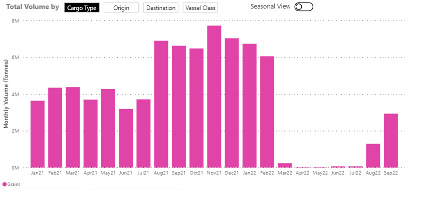
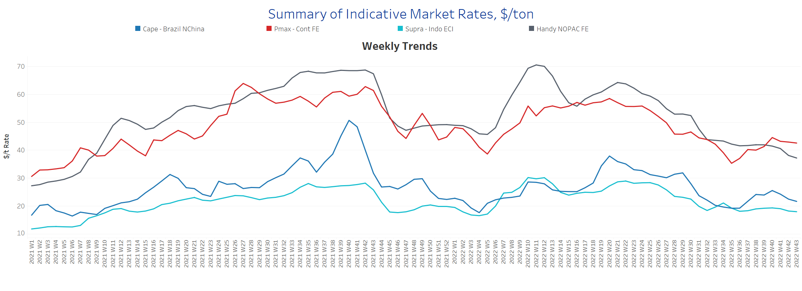
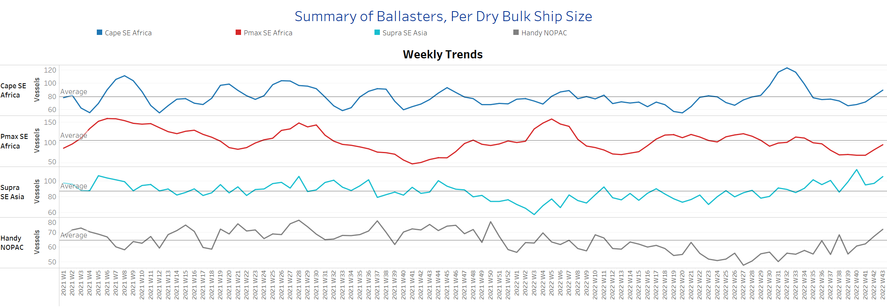
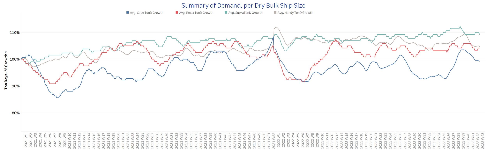
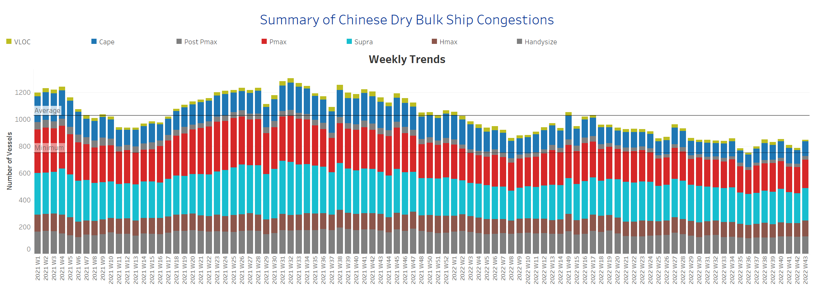

# Signal Dry Bulk Weekly Report

**Date:** October 27, 2022  
**Publisher:** Breakwave Advisors | **Category:** Market Insights  
**Original URL:** [https://www.breakwaveadvisors.com/insights/2022/10/27/signal-dry-bulk-weekly-report](https://www.breakwaveadvisors.com/insights/2022/10/27/signal-dry-bulk-weekly-report)  

---

Freight rate dynamics remain weak, but there are signs of firming in the Panamax segment. The number of ships in ballast increased for the second week in a row, while the largest upward movement was seen in handysize. Discussions on the Black Sea Grain Corridors have been in the spotlight in recent days as the Black Sea Grain Initiative expires in the second half of November. It can be extended beyond the original 120 days, but only with the consent of all parties.

Meanwhile, the United Nations Conference on Trade and Development (UNCTAD) has analyzed the positive impact of the Black Sea Grain Initiative on global food security, as well as the increased volume of grain exports from Ukraine and the impact on world agricultural prices.

The chart below shows the monthly volume of shipments of agricultural commodities from Ukraine to all destinations in the current year and the impact of the Black Sea Grains Initiative on higher volumes in August-September compared to the stall in activity at the beginning of the second quarter.

### Chart of the Week Dry Bulk Flows: From Ukraine to All Destinations

> **Figure 1: Grain Corridors: Increase in Monthly Shipments in August-September**  
> **Interactive Data & Source:** [Signal Ocean Platform](https://go.signalocean.com/e/983831/dry-reports-drybulkflows/2kl767/281467707?h=ussVaYMHcbuLcIrR0vocoSheaQFMXR3ayLnXbr6GCUQ) | [Local Asset](file:///C:/Users/Dell/Github/Shipping/corpus/03-breakwave/insights/2022/assets/2022-10-27_signal-dry-bulk-weekly-report_img_unnamed-2022-10-27t132306367_bc5262239e1e.png)

Data Source: The Signal Ocean Platform, Dry Bulk Flows

## Section 1/ Freight -Market Rates ($/T) Weaker

‘The Big Picture’ - Capesize and Panamax Bulkers and Smaller Ship Sizes

> **Figure 2: Market Chart 2**  
> **Interactive Data & Source:** [Signal Ocean Platform](https://www.thesignalgroup.com/signal-ocean-platform) | [Local Asset](file:///C:/Users/Dell/Github/Shipping/corpus/03-breakwave/insights/2022/assets/2022-10-27_signal-dry-bulk-weekly-report_img_unnamed-2022-10-27t132515235_d64bb97e1162.png)

In the last week of October, the downward trend of the previous week continued in all size classes, with Panamax rates remaining stable.

- **Capesize**freight rates from Brazil to North China fell to $21.57/tonne, down nearly $4/tonne from week 40.
- **Panamax**freight rates from the Continent to the Far East remained stable at around $42/tonne, down $2/t from the week 40 peak.
- **Supramax**freight rates for the Indo-ECI route fell to $18/tonne, which appears to be the lowest since the end of week 37.
- **Handysize**freight rates from NOPAC to the Far East fell to $37/tonne, down 42% from the week 21 peak.

## Section 2/ Supply -Ballasters (# Vessels) Increasing

> **Figure 3: Supply Trend Lines for Key Load Areas**  
> **Interactive Data & Source:** [Signal Ocean Platform](https://www.thesignalgroup.com/signal-ocean-platform) | [Local Asset](file:///C:/Users/Dell/Github/Shipping/corpus/03-breakwave/insights/2022/assets/2022-10-27_signal-dry-bulk-weekly-report_img_unnamed-2022-10-27t160424593_fedac74e042d.png)

The number of ships in ballast was below the annual average for the Panamax size, while the trend for the other size classes is upward, and there is a clear upward trend for the Handysize size.

- **Capesize**SE Africa: The number of vessels increased to 90, up 36% from the low in week 39 and 10 above the annual average of 79 vessels.
- **Panamax**SE Africa: The number of vessels is 95, which is only 10 vessels below the annual average of 105.
- **Supramax**SE Asia: Vessel count is up to 106, 11 more than the previous week.
- **Handysize**NOPAC: The number of vessels has increased to 106, 11 more than the previous week.

## Section 3/ Demand -TonDays Decreasing

> **Figure 4: TonDays Decreasing**  
> **Interactive Data & Source:** [Signal Ocean Platform](https://www.thesignalgroup.com/signal-ocean-platform) | [Local Asset](file:///C:/Users/Dell/Github/Shipping/corpus/03-breakwave/insights/2022/assets/2022-10-27_signal-dry-bulk-weekly-report_img_unnamed-2022-10-27t132649165_2438d84821c9.png)

October will end with a downward trend after a significant upswing in Capesize in the previous month. However, Capesize demand growth is still higher than in the second quarter, while Panamax remains relatively stable.

- **Capesize**demand ton-days: The percentage increase continued the declining pace of previous weeks, while freight rates have yet to show an upswing. It remains to be seen whether November will see stronger growth.
- **Panamax**demand ton-days: There are signs of stronger growth, albeit with strong fluctuations, with the last peak reached in week 10.
- **Supramax**demand ton-days: There is still slower growth rate and no immediate signs of a short-term upturn.
- **Handysize**demand ton-days: The decline has continued since week 40, and there are no signs of recovery yet.

## Section 4/ Port Congestion -No of Vesselsincreasing

> **Figure 5: Dry Bulk Ships Congested at Chinese Ports**  
> **Interactive Data & Source:** [Signal Ocean Platform](https://www.thesignalgroup.com/signal-ocean-platform) | [Local Asset](file:///C:/Users/Dell/Github/Shipping/corpus/03-breakwave/insights/2022/assets/2022-10-27_signal-dry-bulk-weekly-report_img_unnamed-2022-10-27t132818049_5100ba9a1bed.png)

The number of congested vessels has increased again after the downward trend observed in the previous week.

- **Capesize:**The number of vessels increased to 108, 7 more than the previous week.
- **Panamax:**The number of vessels is still high at more than 200, compared to the low of 178 vessels in week 36.
- **Supramax:**The number of congested vessels increased to 240, 20 more than the previous week.
- **Handysize**: The number of congested vessels was 130, 4 more than the previous week.

Data Source:[Signal Ocean Platform](https://www.thesignalgroup.com/signal-ocean-platform)
