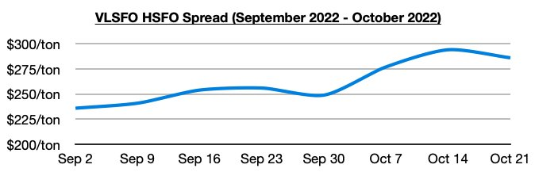

# Critical Scrubber Study Released

**Date:** October 28, 2022  
**Publisher:** Breakwave Advisors | **Category:** Market Insights  
**Original URL:** [https://www.breakwaveadvisors.com/insights/2022/10/27/critical-scrubber-study-released](https://www.breakwaveadvisors.com/insights/2022/10/27/critical-scrubber-study-released)  

---

*By*[*Jeffrey Landsberg*](https://www.linkedin.com/in/jeffrey-landsberg-70ab957/)

Marine Pollution Bulletin has published a new study from Chalmers University of Technology in Sweden claiming that discharge water from vessel scrubber exhaust gas treatment systems “is responsible for up to 9% of certain emissions of carcinogenic and environmentally harmful substances… this is considerably more than was previously known… and the number of ships equipped with scrubbers has tripled since the study was carried out”. The lead researcher behind the study has also stated “shipping accounts for a significant proportion of hazardous substances to the Baltic Sea, above all through antifouling paints and discharge of wash water from open loop scrubbers… data was collected in 2018… since then, these ships have increased significantly and in 2021 there were almost 600 ships equipped with scrubbers in the Baltic Sea”.

As a result of this study, the Swedish Transport Agency and the Swedish Agency for Marine and Water Management have proposed a new ban on vessels using scrubbers in the internal waters of the Baltic Sea. Similar bans are already in place in various countries, including China, for which the use of open-loop scrubber systems (sucking in seawater, spraying it into the exhaust, and discharging it overboard) are not allowed when in certain proximity from shoreline and inland bodies of water. Overall, this study is a reminder of possible unforeseen regulations hanging over the head of the dry bulk market — but the use of scrubbers remains extremely unlikely to be fully banned. As we have been stressing in our Weekly Dry Bulk Reports this year, the decision to fit dry bulk vessels with scrubbers has proven to be a very wise decision economically. Most recently, the VLSFO-HSFO spread ended last week at approximately $286/ton. At the start of this year, the spread stood at only approximately $141/ton.

> **Figure 1: Chart 1 (58)**  
> [Local Asset](file:///C:/Users/Dell/Github/Shipping/corpus/03-breakwave/insights/2022/assets/2022-10-28_critical-scrubber-study-released_img_chart1285829_5326edd26d4d.jpg)
