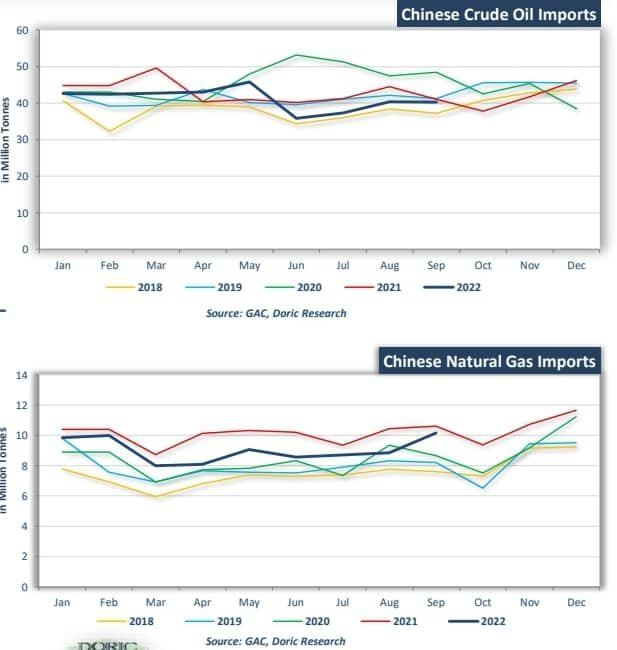
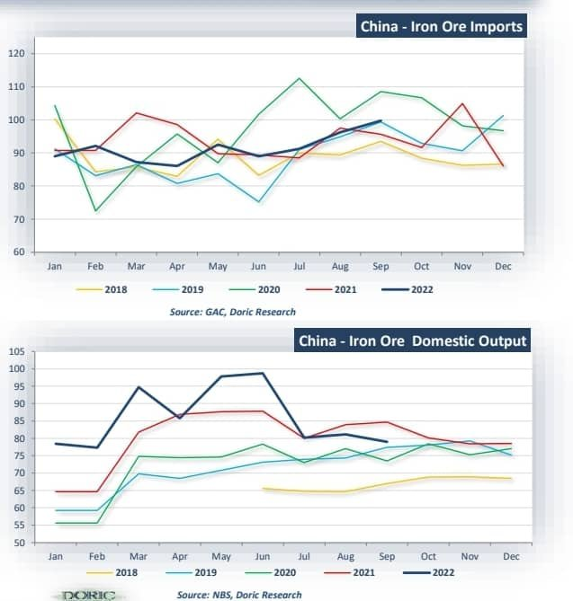
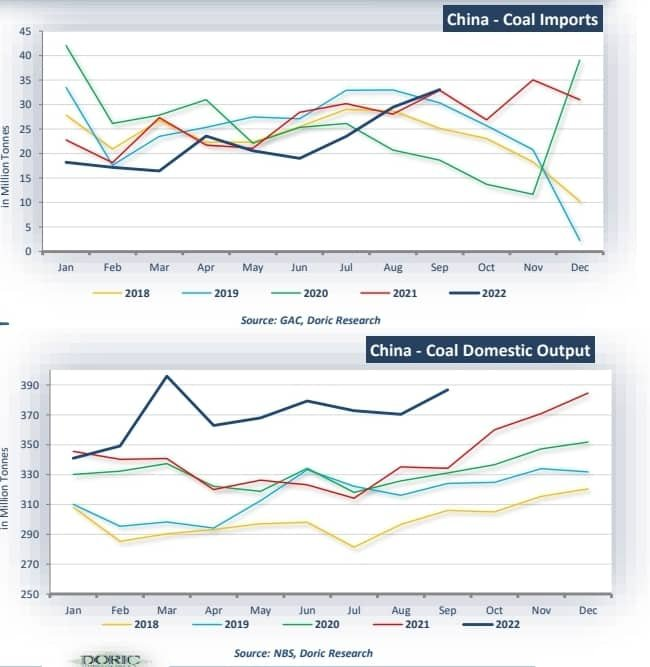
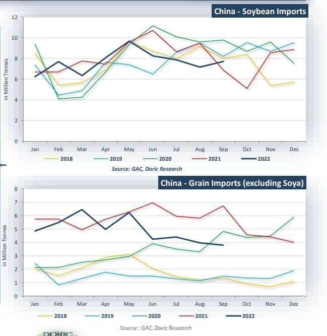
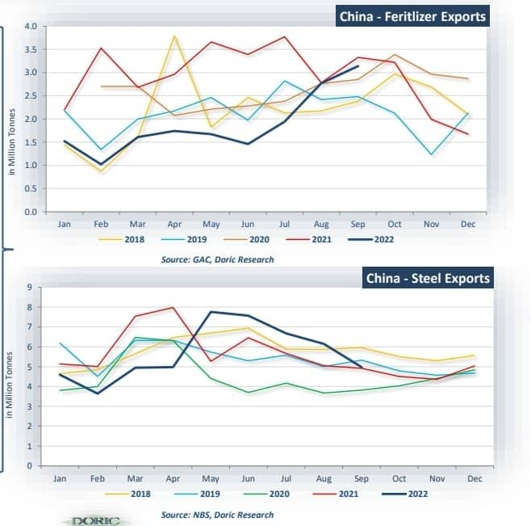
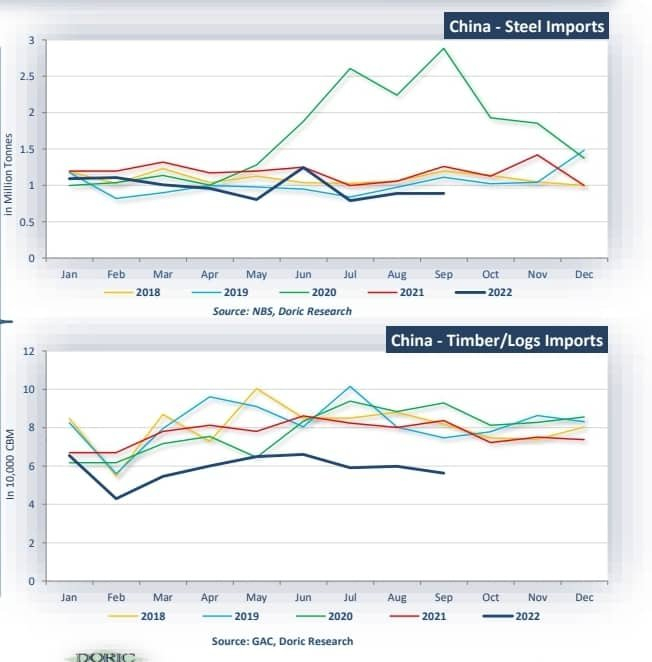

# Doric- China Βarometer part 2/2

**Date:** October 28, 2022  
**Publisher:** Breakwave Advisors | **Category:** Market Insights  
**Original URL:** [https://www.breakwaveadvisors.com/insights/2022/10/27/doric-china-arometer-part-22](https://www.breakwaveadvisors.com/insights/2022/10/27/doric-china-arometer-part-22)  

---

*By*[*Michalis Voutsinas*](https://www.linkedin.com/in/michalis-voutsinas-587544163/)*and Helen Vlassi*

### Crude Oil/natural Gas

China brought in 40.24 million tonnes of crude oil in September, equivalent to 9.79 million barrels per day, or circa 2.0 percent down from a year earlier. Decreasing by 0.3 percent from a month earlier, September’s reading altered the upward trend of the last two months, as independent refiners curbed throughput amid thin margins and lacklustre demand. From January to September, crude imports totalled 370.41 million tonnes, down circa 4.3 percent from a year earlier. China’s record imports of low-priced Russian crude oil rose by 55.0 percent year-on-year. CRUDE OIL/NATURAL GAS OCTOBER 2022 China’s imports of natural gas increased by circa 14.7 percent year-on-year to 10.15 million tonnes in September , marking their highest pace since January 2022. From January to September, China totalled 370.41 million tonnes, down circa 4.3 percent from a year earlier.

> **Figure 1: 312743598 1294225891409422 9132729132029421665 N**  
> **Interactive Data & Source:** [Doric](https://www.doric.gr/) | [Local Asset](file:///C:/Users/Dell/Github/Shipping/corpus/03-breakwave/insights/2022/assets/2022-10-28_doric-china-arometer-part-22_img_312743598-1294225891409422-913272913_81ae9530e55b.jpg)

### Iron Ore

China brought in 99.71 million tonnes of iron ore in September, up by circa 4.3 percent year-on-year. During the first nine months of 2022, China imported 822.54 million tonnes of iron ore, a dive of 2.3 percent from 841.56 million tonnes reported in the same period a year earlier. Iron ore shipments increased mainly during the traditional peak season , as steel mills typically stocked up in advance. IRON ORE OCTOBER 2022. During September, 78.98 million metric tonnes of crude iron ore has been extracted in China, or down circa 7.1 percent year-on-year. On a monthly basis, iron ore output decreased by 2.6 percent in September, down from 81.13 million tonnes reported in August. From January to September, 773.16 million metric tonnes of crude iron ore has been extracted in China, or up circa 7.1 percent year-on-year.

> **Figure 2: 313042627 808540117079281 3535964050080517098 N**  
> **Interactive Data & Source:** [Doric](https://www.doric.gr/) | [Local Asset](file:///C:/Users/Dell/Github/Shipping/corpus/03-breakwave/insights/2022/assets/2022-10-28_doric-china-arometer-part-22_img_313042627-808540117079281-3535964050_be5ea8c25ed3.jpg)

### Coal

China imported 33.05 million tonnes of coal in September, up 0.5 percent yearon-year. On a monthly basis, China’s coal imports stood 12.2 percent higher. Chinese government ordered its utilities to build up inventory sufficient for at least 20 days of use to ensure power supply, pushing up domestic prices. Russian seaborne coal deliveries surged to 6.95 million tonnes in September, down 18.6 percent month-on-month COAL OCTOBER 2022 . Reporting a rise of 12.3 percent year-onyear, China’s domestic coal output balanced at 386.71 million tonnes in September, or 12.89 million tonnes per day. China’s domestic coal output during first nine months of 2022 rose by circa 11.2 percent from a year earlier to 3.32 billion metric tonnes. China’s daily coal output reached record average daily levels as mines resumed operation after heavy rainfall in the summer months.

> **Figure 3: 312450382 816051136275460 5539327618896555777 N**  
> **Interactive Data & Source:** [Doric](https://www.doric.gr/) | [Local Asset](file:///C:/Users/Dell/Github/Shipping/corpus/03-breakwave/insights/2022/assets/2022-10-28_doric-china-arometer-part-22_img_312450382-816051136275460-5539327618_80750ba52f79.jpg)

### Grains

China’s soybean imports in September rose by 12.0 percent from a year earlier to 7.72 million tonnes. China’s September imports stood 7.7 percent higher than a reading of 7.17 million tonnes in the previous month, reversing last five-month trend of low arrivals. During the first nine months of 2022, China’s total imports of soybean totalled 69.04 million tonnes, or circa 6.6 percent lower than a year ago. GRAINS OCTOBER 2022 . China’s corn imports balanced at 1.53 million tonnes in September, down by circa 56.6 percent year-on-year. China’s wheat imports in September declined significantly by 42.2 percent from a year earlier, to 0.37 million tonnes. China imported circa 3.8 million tonnes of grains on top of soybean imports in September, or circa 43.6 percent down year-on-year.

> **Figure 4: 312501969 645551017162116 2440458580085802273 N (1)**  
> **Interactive Data & Source:** [Doric](https://www.doric.gr/) | [Local Asset](file:///C:/Users/Dell/Github/Shipping/corpus/03-breakwave/insights/2022/assets/2022-10-28_doric-china-arometer-part-22_img_312501969-645551017162116-2440458580_87e97b6d5331.jpg)

### Minors (Exports)

China fertilizer exports in September increased to 3.14 million tonnes, yet still remaining 5.7 percent lower year-onyear. During the first nine months of 2022, China exported circa 16.9 million tonnes of fertilizers, down by circa 40.3 percent year-on-year. Chinese authorities are imposing new hurdles for fertilizer exporters amid growing concerns over surging power prices and food production. MINORS (EXPORTS) OCTOBER 2022 . China’s total finished steel exports rose by 1.2 percent year-on-year in September, to 4.98 million tonnes. Chinese steel exports during the first nine months of 2022, lay at 51.3 million tonnes or down by 3.3 percent year-on-year. September’s steel exports stood circa 19.0 percent lower than a reading of 6.15 million tonnes a month earlier.

> **Figure 5: 313090250 437639828484844 5133826140888729006 N (1)**  
> **Interactive Data & Source:** [Doric](https://www.doric.gr/) | [Local Asset](file:///C:/Users/Dell/Github/Shipping/corpus/03-breakwave/insights/2022/assets/2022-10-28_doric-china-arometer-part-22_img_313090250-437639828484844-5133826140_e9db51be2386.jpg)

### Minors (Imports)

China’s steel imports during September fell by 29.3 percent year-on-year to 0.9 million tonnes. From January to September, Chinese steel imports stood 22.1 percent down from the respective period a year earlier, or at 8.34 million tonnes. On a monthly basis, China’s September imports remained flat. MINORS (IMPORTS) OCTOBER 2022 . In September, Chinese timber imports balanced at 5.63 million CBM . On a year-on-year basis, September’s timber imports decreased by circa 32.8 percent lower. From January to September, China brought in 52.9 million CBM of timber and logs, or down circa 24.8 percent year-on-year.

> **Figure 6: 313060525 482660347144186 8558869259883321803 N (2)**  
> **Interactive Data & Source:** [Doric](https://www.doric.gr/) | [Local Asset](file:///C:/Users/Dell/Github/Shipping/corpus/03-breakwave/insights/2022/assets/2022-10-28_doric-china-arometer-part-22_img_313060525-482660347144186-8558869259_33c22633f1f7.jpg)

Data source:[Doric](https://www.doric.gr/)
