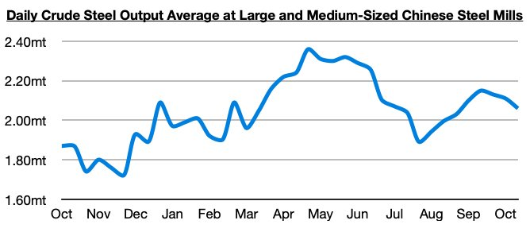
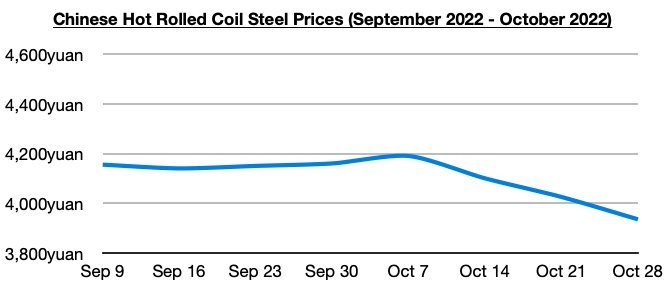

# Recent Decline in Chinese Coastal Coal Freight Rates and Steel Prices

**Date:** November 03, 2022  
**Publisher:** Breakwave Advisors | **Category:** Market Insights  
**Original URL:** [https://www.breakwaveadvisors.com/insights/2022/11/3/recent-decline-in-chinese-coastal-coal-freight-rates-and-steel-prices](https://www.breakwaveadvisors.com/insights/2022/11/3/recent-decline-in-chinese-coastal-coal-freight-rates-and-steel-prices)  

---

*By*[*Jeffrey Landsberg*](https://www.linkedin.com/in/jeffrey-landsberg-70ab957/)

Recently released data shows that daily crude output at large and medium-sized mills in China averaged 2.06 million tons during October 11 - 20. This is 2% less than was seen during the prior ten days but is up year-on-year by 10%. Overall, it remains encouraging that China’s steel output has remained well above last year’s level.

> **Figure 1: Chart 1 (59)**  
> [Local Asset](file:///C:/Users/Dell/Github/Shipping/corpus/03-breakwave/insights/2022/assets/2022-11-03_recent-decline-in-chinese-coastal-coal-freight-rates-and-steel-prices_img_chart1285929_c65c4d0d7f39.jpg)

We remain of our view that China’s steel output very likely bottomed in late July. Less positive, though, is that some previously improving segments in Chinese commodity markets have recently come under new pressure. As we discussed in our most recent Weekly Dry Bulk Report and Weekly China Report, Chinese coastal coal freight rates have come under renewed pressure and last week saw rates suffer their largest decline since late August. Chinese steel prices have also continued to decline. Chinese steel prices have now fallen for three straight weeks, with last week marking the largest decline since mid-August.

> **Figure 2: Chart 2 (50)**  
> [Local Asset](file:///C:/Users/Dell/Github/Shipping/corpus/03-breakwave/insights/2022/assets/2022-11-03_recent-decline-in-chinese-coastal-coal-freight-rates-and-steel-prices_img_chart2285029_a734915a0fa6.jpg)
