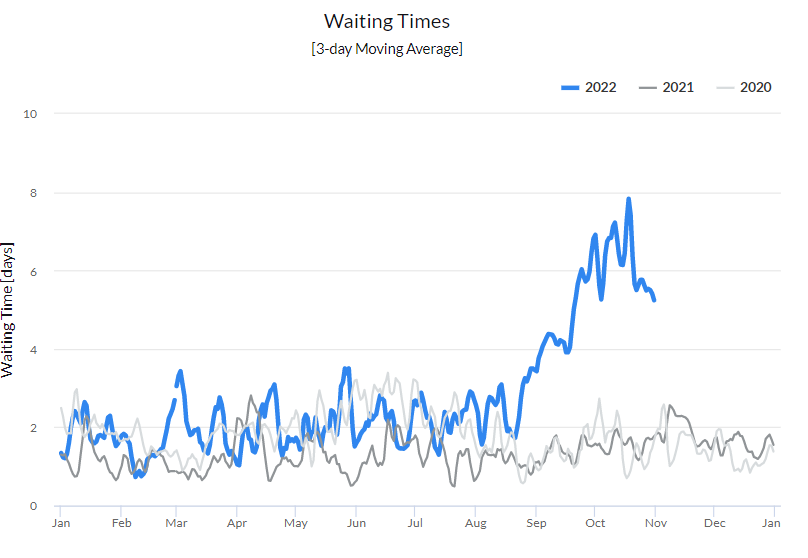
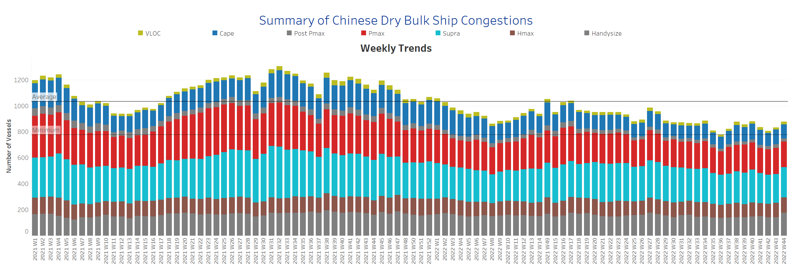

# Signal Dry Bulk Weekly Report

**Date:** November 03, 2022  
**Publisher:** Breakwave Advisors | **Category:** Market Insights  
**Original URL:** [https://www.breakwaveadvisors.com/insights/2022/11/3/signal-dry-bulk-weekly-report](https://www.breakwaveadvisors.com/insights/2022/11/3/signal-dry-bulk-weekly-report)  

---

Τhe first days of November are marked by heightened geopolitical uncertainty after the Russian Federation suspended its participation in the Black Sea Grains Initiative. Meanwhile, Western governments are trying to persuade Russia to reverse its suspension of the grain agreement, while more grain ships appear to be leaving Ukrainian ports.

Congestion in ports and channels around the Baltic and Black Sea increased in late October, with the 3-day moving average in the Bosporus Strait rising significantly (see graph below). The United Nations (UN) has proposed to continue inspecting vessels for cargo exports from Ukraine, despite Russia's decision to suspend its participation in the Black Sea Grains Initiative (BSGI). The recent decision to continue ship inspections without Russian participation has led to a reduction in port congestion, although it is still significantly higher than last year's levels.

Freight rates remained weaker in all size classes, with a gradual decrease in the number of ships in ballast in the Capesize and Panamax segments, while the trend of demand growth continues to show negative dynamics. The lower trend in the number of ships in ballast for large ship classes is a sign that freight rates may firm up in the coming days. However, the challenge for the industry remains the slower Chinese economic growth, which is dampening steel demand growth.

### Chart of the Week Dry Bulk Canals Congestion: Bosphorus Straitsurprising Annual Spike in Waiting Time 3-Day Moving Average

> **Figure 1: Chart of the Week Dry Bulk Canals Congestion: Bosphorus Strait**  
> **Interactive Data & Source:** [Signal Ocean Platform](https://go.signalocean.com/e/983831/dry-reports-canals-congestion/2kr3zq/282835533?h=r4ekYn80fTNwrIi_DvmpYQgqSulkrQxuoML-Za9gJio) | [Local Asset](file:///C:/Users/Dell/Github/Shipping/corpus/03-breakwave/insights/2022/assets/2022-11-03_signal-dry-bulk-weekly-report_img_unnamed-2022-11-03t120432710_c914e6cdda08.png)

Data Source: The Signal Ocean Platform, Dry Bulk Canals Congestion

## Section 1/ Freight -Market Rates ($/T) Weaker

‘The Big Picture’ - Capesize and Panamax Bulkers and Smaller Ship Sizes

> **Figure 2: Market Chart 2**  
> **Interactive Data & Source:** [Signal Ocean Platform](https://www.thesignalgroup.com/signal-ocean-platform) | [Local Asset](file:///C:/Users/Dell/Github/Shipping/corpus/03-breakwave/insights/2022/assets/2022-11-03_signal-dry-bulk-weekly-report_img_unnamed-2022-11-03t120432710_c914e6cdda08.png)

In the first days of November, the downward trend continued in all size classes, with the Capesize and Panamax segments showing a strong downward correction and the last peak being reached in week 40.

- **Capesize**freight rates from Brazil to North China fell below $20/tonne, down nearly $6/tonne from week 40.
- **Panamax**freight rates fromtheContinent to the Far East followed a downward incline and fell to $39/tonne, down almost $5/t from the week 40 peak.
- **Supramax**freight rates for the Indo-ECI route accelerated their decline, falling to $15/tonne, down nearly $7/tonne from the week 34 peak.
- **Handysize**freight rates from NOPAC to the Far East fell to $34/tonne, down 47% from the week 21 peak.

## Section 2/ Supply -Ballasters (# Vessels) Increasing

> **Figure 3: Supply Trend Lines for Key Load Areas**  
> **Interactive Data & Source:** [Signal Ocean Platform](https://www.thesignalgroup.com/signal-ocean-platform) | [Local Asset](file:///C:/Users/Dell/Github/Shipping/corpus/03-breakwave/insights/2022/assets/2022-11-03_signal-dry-bulk-weekly-report_img_unnamed-2022-11-03t120432710_c914e6cdda08.png)

The number of ships in ballast remained above the annual average for the smaller ship categories, while the Capesize and Panamax segments showed a downward correction.

- **Capesize**SE Africa: The number of vessels increased to 89, up 34% from the low in week 39, and also above the annual average for the last two weeks.
- **Panamax**SE Africa: The number of ships was 84, with a downward trend in the coming days, while the current numbers are below the annual average of 105.
- **Supramax**SE Asia: The has increased to 100, 7 more than the previous week and 13 more than the annual average.
- **Handysize**NOPAC: The number of vessels has accelerated to a level above the annual average of 65, and there are signs of a further increase in the coming days.

## Section 3/ Demand -TonDays Decreasing

> **Figure 4: TonDays Decreasing**  
> **Interactive Data & Source:** [Signal Ocean Platform](https://www.thesignalgroup.com/signal-ocean-platform) | [Local Asset](file:///C:/Users/Dell/Github/Shipping/corpus/03-breakwave/insights/2022/assets/2022-11-03_signal-dry-bulk-weekly-report_img_unnamed-2022-11-03t120432710_c914e6cdda08.png)

Growth in demanded tonnage has been highly volatile, particularly in the Panamax and Surpamax size classes, while Capesize and Handysize vessels have seen a significant downward trend.

- **Capesize**demand ton-days: The percentage increase that followed the decline of the previous weeks remained almost unchanged, while there seems to be no sign of an imminent upturn in the coming days.
- **Panamax**demand ton-days: Strong volatility with a downward trend in November.
- **Supramax**demand ton-days: The overall trend is similar to the previous days, with no upswing visible and freight rates maintaining their downward trend.
- **Handysize**demand ton-days: The decline continued and there were signs of a further downward trend in the coming November days.

## Section 4/ Port Congestion -No of Vesselsincreasing

> **Figure 5: Dry Bulk Ships Congested at Chinese Ports**  
> **Interactive Data & Source:** [Signal Ocean Platform](https://www.thesignalgroup.com/signal-ocean-platform) | [Local Asset](file:///C:/Users/Dell/Github/Shipping/corpus/03-breakwave/insights/2022/assets/2022-11-03_signal-dry-bulk-weekly-report_img_unnamed-2022-11-03t120914691_ffd42452f206.png)

The number of congested vessels continued the upward trend from late October, with congestion in the Supramax and Handysize segments rising to very firm levels in the first days of November.

- **Capesize:**The number of vessels decreased to 107, down 7 from the previous week.
- **Panamax:**The number of vessels finally fell below 200, but still with an increasing trend.
- **Supramax:**The number of congested vessels increased to 233, 10 more than the previous week.
- **Handysize**: The number of congested vessels was 176, 20% more than the previous week.

Data Source:[Signal Ocean Platform](https://www.thesignalgroup.com/signal-ocean-platform)
