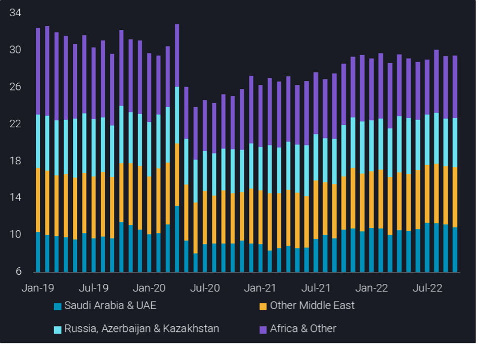
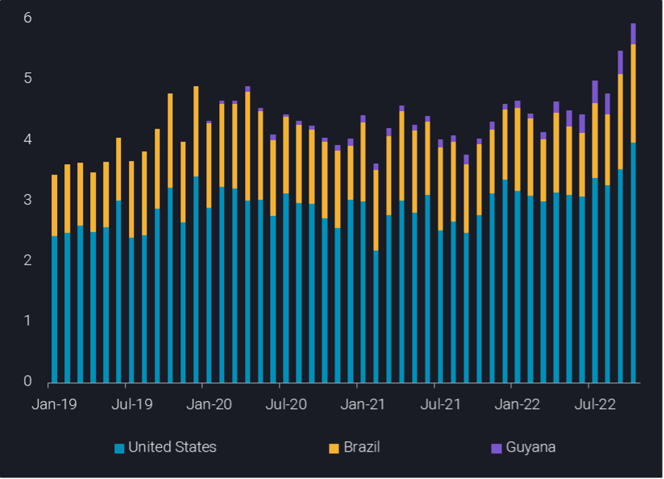

# OPEC+ crude/condensate loadings flat as drop from Saudi Arabia offset by other Middle East and Africa

**Date:** November 04, 2022  
**Publisher:** Breakwave Advisors | **Category:** Market Insights  
**Original URL:** [https://www.breakwaveadvisors.com/insights/2022/11/4/opec-crudecondensate-loadings-flat-as-drop-from-saudi-arabia-offset-by-other-middle-east-and-africa-1](https://www.breakwaveadvisors.com/insights/2022/11/4/opec-crudecondensate-loadings-flat-as-drop-from-saudi-arabia-offset-by-other-middle-east-and-africa-1)  

---

*By*[*Jay Maroo*](https://www.linkedin.com/in/jay-m-336a3633/)

Total OPEC+ crude/condensate loadings in October stood at around 29.5, of which OPEC Middle East’s contributed 18.5mbd – both totals show little change from September. But within the Middle East, the m-o-m change in Saudi loadings showed a sharp contrast to those elsewhere in the region.

> **Figure 1: Jay Chart 1**  
> **Interactive Data & Source:** [Analytics Vortexa](https://analytics.vortexa.com/?dateRange=2019-01-01T00%3A00%3A00.000Z__2022-10-31T23%3A59%3A59.999Z&filtersEnabled=%5B%22p%22%2C%22o%22%2C%22d%22%2C%22d_r%22%2C%22v%22%2C%22intra%22%2C%22sts_o%22%2C%22c_o%22%2C%22w%22%5D&from=%5B%221c47e09ebf73cbb0fda6e36ffc125d4be50936d17888e0a7d2acb17a439db108%22%5D&geoBreakdownOriginGlobal=region&intraMovementFilter=0&metric=bpd&page=Flows&products=%5B%2254af755a090118dcf9b0724c9a4e9f14745c26165385ffa7f1445bc768f06f11%22%5D&productsBreakdown=category&tabId=04aac2e8-27e0-4f10-905a-bfabfb029395&timeSeriesHiddenSeries=%5B%22seasonal_comparison_24%22%2C%22seasonal_comparison_12%22%5D&timeSeriesProperty=origin_region) | [Local Asset](file:///C:/Users/Dell/Github/Shipping/corpus/03-breakwave/insights/2022/assets/2022-11-04_opec-crudecondensate-loadings-flat-as-drop-from-saudi-arabia-offset-by-other-mid_img_jay-chart-1_035fd80b0f42.png)

Saudi loadings fell by 570kbd on the month in October, the largest drop observed since March 2022. The drop in loadings is unusual both given its magnitude and the direction as Saudi Aramco was reported (Argus Media) to be supplying full contract volumes in November. The drop in Saudi loadings is offset by significant increases in loadings from the UAE, Iraq and Oman – up by combined total of around 440kbd.

Elsewhere in the producer group, exports from African nations, led by Nigeria and Algeria, grew by an impressive 470kbd from the previous month. Total OPEC+ Africa loadings reached 5.1mbd in August, the highest total for this subgroup since December 2021. Driving this recent growth are a combination of factors:

- Resumed loadings from Nigeria’s Forcados terminal, after months of outages

1. Sustained high levels of Libyan exports, suggesting a full recovery after the lows seen in July
2. A sharp uptick in Algerian loadings coinciding with sharp drawdowns in crude inventories

This (quite surprising) increase in African supply should be a boon for European refiners as they continue to wean themselves of Russian oil before the December 5 deadline. However, crude differentials do not suggest prompt physical demand is rising, even despite record high diesel crack spreads. Wider macroeconomic concerns bleeding into lower expectations for demand is the key factor here. But it may simply also be that demand is solid, but simply outpaced by even healthier supplies.

Loadings of Russian grades actually showed a slight uptick in October (+130kbd) but at 3.4mbd, it is matching the July-October average. A similar level of stability is also seen with non-Russian (i.e. Kazah) crude loadings from Russian ports, which were flat m-o-m and generally showed little changes since August.

Outside the OPEC+ group, the case for calling the Atlantic Basin crude market as currently well supplied is made even stronger by the fact that loadings from just three countries – the US, Brazil and Guyana – have added another 300kbd in supply in October. This is an extension of a trend which has meant almost 1mbd more crude has been loaded since August (see chart below).

> **Figure 2: Jay Chart 2**  
> **Interactive Data & Source:** [Analytics Vortexa](https://analytics.vortexa.com/?dateRange=2019-01-01T00%3A00%3A00.000Z__2022-10-31T23%3A59%3A59.999Z&filtersEnabled=%5B%22p%22%2C%22o%22%2C%22d%22%2C%22d_r%22%2C%22v%22%2C%22intra%22%2C%22sts_o%22%2C%22w%22%5D&from=%5B%222d92cc08f22524dba59f6a7e340f132a9da0ce9573cca968eb8e3752ef17a963%22%2C%22b903eceaae4690fafdc2fd76c23d1e44faf31bf0d1398078b967dcba01a11e6a%22%2C%226ac49669e238276d51719480fddfee2e18cf265f43678ed995071d363ee943f5%22%5D&metric=bpd&page=Flows&products=%5B%2254af755a090118dcf9b0724c9a4e9f14745c26165385ffa7f1445bc768f06f11%22%5D&sortField=quantity&tabId=44b866c3-a4a7-48f2-8dbc-d035fe34a1a9&timeSeriesProperty=origin_country) | [Local Asset](file:///C:/Users/Dell/Github/Shipping/corpus/03-breakwave/insights/2022/assets/2022-11-04_opec-crudecondensate-loadings-flat-as-drop-from-saudi-arabia-offset-by-other-mid_img_jay-chart-2_69728abd33b2.png)

Looking ahead, the combination of what looks like an amply supplied prompt crude market, still high diesel crack spreads and uncertainty over the implementation of a price cap on Russian oil combine to give a lack of clear direction going forwards. The latter factor is likely to be decisive in how smooth the necessary redistribution of crude and product flows will be as we move towards the turn of the year defined by EU sanctions on Russia.

Data Source:[Vortexa](https://www.vortexa.com//oil-gas-data-traders-analysts-data-scientists?gclid=Cj0KCQjw8_qRBhCXARIsAE2AtRZKOvMnbilZ_6_91d7huSFFy71pWLrnPwGwOHVzXsmsG-1a1mZnQw8aAt89EALw_wcB&hsa_acc=1782073842&hsa_ad=548425387665&hsa_cam=14746637662&hsa_grp=125038601902&hsa_kw=&hsa_mt=&hsa_net=adwords&hsa_src=g&hsa_tgt=dsa-1431852288425&hsa_ver=3&utm_campaign=%5BCD%5D%20-%20DSA%20-%20EMEA&utm_medium=cpc&utm_medium=ppc&utm_source=google&utm_source=adwords&utm_term=)
